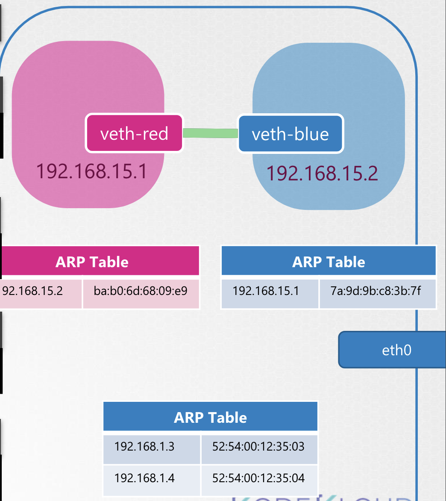
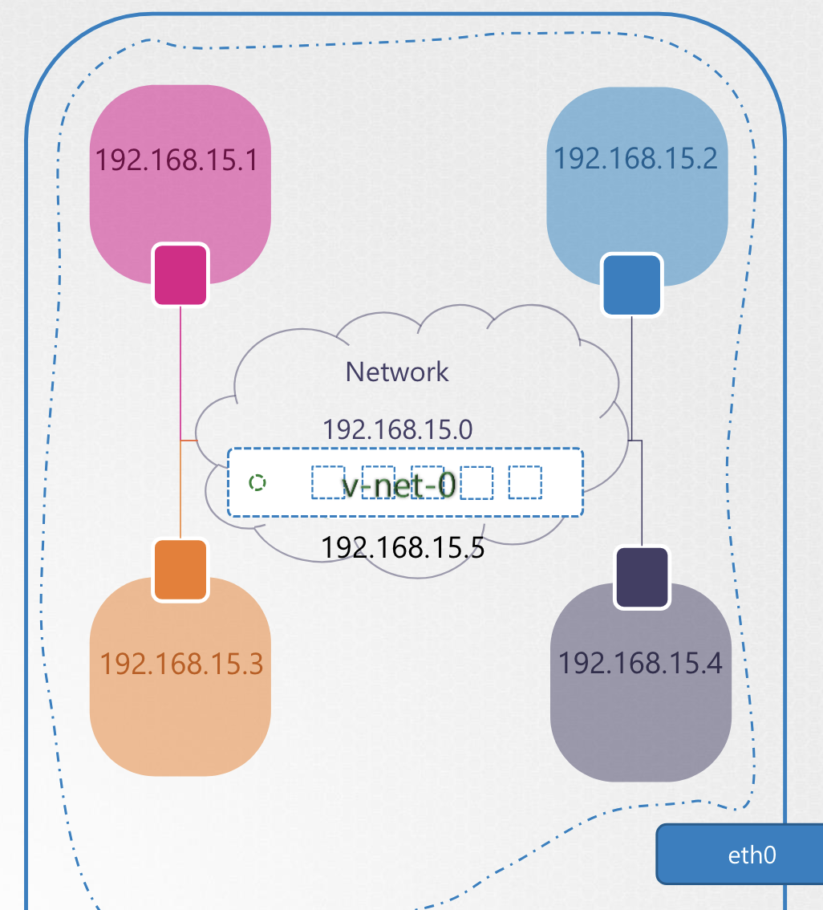
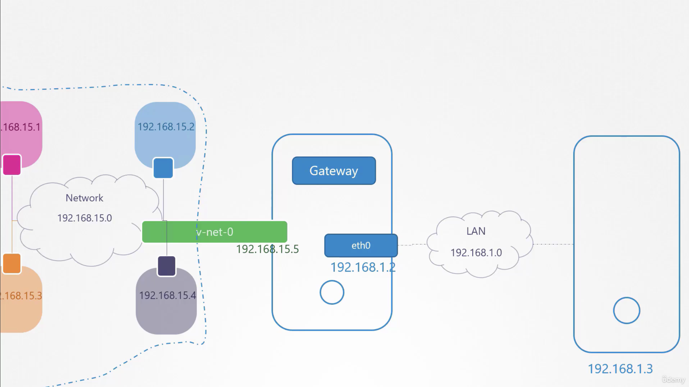
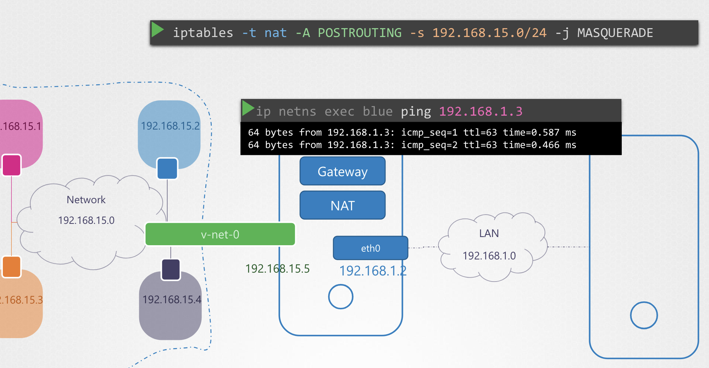

# Network Namespaces

## Namespace

Network Namespace는 Docker 와 같은 컨테이너에 의해 구현된 Network Isolation 임

컨테이너는 호스트에서 Namespace로 분리된 공간

호스트가 하나의 집이라면, 네임스페이스는 자식들이 할당되는 공간임

```
+----------------------------+
|   +-------+   +-------+    |
|   |   👶🏻  |   |   👧🏻  |    |
|   |       |   |       |    |
|   +-------+   +-------+    |
|   +--------+   +------+    |
|   |   🧒🏻  |    |  👦🏻  |    |
|   |       |    |      |    |
|   +--------+   +------+    |
|                            |
|        👩🏼‍🦰👨🏽‍🦰 Parent         |
+----------------------------+
```

각 방들은 각 아이들이 개인 공간을 보장해 주는 공간으로, 각자의 영역을 볼 수 없음

마치 각 아이들이 그 방이 전체의 집인 것처럼 느끼게 해줌

하지만, 부모는 해당 방들을 포함한 모든 공간을 볼 수 있음

이 때 두 방을 연결하고 싶다면?

<br>

### Process Namespace

Namespace를 통해서 이 연결을 위한 새로운 공간을 생성하고, 이 공간은 호스트 위 다른 공간이나 컨테이너를 볼 수 없음

이 공간은 오직 해당 공간에서 일어나는 프로세싱만을 볼 수 있으며, 해당 공간이 호스트 그 자체라고 고려할 수 있게 됨

하지만 실제 호스트는 모든 프로세스 진행 사항을 볼 수 있음 

`ps aux` 명령어를 통해 실행되는 프로세스를 확인 가능

<br>

**✔️ On the Container**

```bash
❯ ps aux
USER               PID  %CPU %MEM      VSZ    RSS   TTY  STAT STARTED      TIME COMMAND
root                 1   0.0  0.0     4238    828   ?    Ss   03:06        0:00 nginx
```

**✔️ On the Host**

<pre><code lang="bash">❯ ps aux
USER               PID  %CPU %MEM      VSZ    RSS   TTY  STAT STARTED      TIME COMMAND
project           3270   0.1  0.1    99580   4916   ?    R    06:06        0:00 sshd: project@pts/0
project           3225   0.0  0.1    95196   4916   ?    S    06:06        0:00 sshd: project@ notty
project           3270   0.1  0.1    21352   4916   ?    Ss   06:06        0:00 -bash
<b>root              3816   1.0  0.1     4528    828   ?    Ss   06:06        0:00 nginx</b>
</code></pre>

각 Container에서 실행되는 프로세스를 모두 확인할 수 있음

이 때, 컨테이너와 호스트 상에서 실행되는 PID (Process ID) 가 서로 다름을 알 수 있음 → Namespace 가 수행되는 방식

---

호스트 자체의 네트워크 인터페이스가 로컬 네트워크에 연결되어 있고,
호스트 자체에서 네트워크에 대한 정보를 가진 라우팅 테이블과 ARP 테이블을 갖고 있을 때


컨테이너가 생성될 때는 해당 컨테이너 자체의 라우팅 테이블과 ARP 테이블이 생성됨

그리고 그 컨테이너만의 네트워크 인터페이스를 가짐

```
+-----------------------------------------+
|                   Host                  |
|                                         |
|     +----------------------------+      |
|     |          Container         |      |
|     |                            |      |
|     |  +---------+ +-------+     |      |
|     |  | Rouitng | |  ARP  |     |      |
|     |  |  Table  | | Table |  [veth0]   |
|     |  +---------+ +-------+     |      |
|     |                            |      |                      +----------------+
|     +----------------------------+      |                      |                |
|                                         |  192.168.1.2         |      LAN       |
|                                       [eth0]-------------------+   192.168.1.0  |
|       +---------+ +-------+             |                      |                |
|       | Rouitng | |  ARP  |             |                      +----------------+
|       |  Table  | | Table |             |
|       +---------+ +-------+             |
+-----------------------------------------+
```

---

<br>

### Create Network NS

Linux Host 에서 Network Namespace를 생성하려면 `ip netns add` 명령어 사용

```bash
$ ip netns add <<network_namespace_name>>
# example
ip netns add red
ip netns add blue
```

Network Namespace 목록을 확인하려면 `ip netns` 명령어 사용

```bash
$ ip netns
red
blue
```

Network 인터페이스를 확인하고자 한다면 `ip link` 명령어를 사용할 수 있음

```bash
ip link
```

<br>

### Exec in Network NS

그럼 호스트가 가진 loopback 인터페이스와 `eth0` 를 확인할 수 있음

생성한 Network Namespace 내에서 이 모든 것을 확인하고 싶을 때는 두 가지 방법이 있음

<br>

**✔️ 1. `ip netns exec <<ns_name>> ...`**

명령어 앞에 prefix 로 `ip netns exec <<ns_name>> ` 입력 후 호스트에서 입력하는 것과 동일하게 사용

가령, `red` 라는 네트워크 네임스페이스 내에서 Network 인터페이스를 확인하고 싶다면, 아래와 같이 입력

<pre><code lang="bash">❯ <b>ip netns exec red</b> ip link
</code></pre>

<br>

**✔️ 2. `ip -n <<ns_name>> ...`**

혹은 `-n` 옵션을 지정

<pre><code lang="bash">❯ ip <b>-n red</b> link
</code></pre>

위 명령어는 네트워크 네임스페이스 내에서 실행되며, loopback 인터페이스만 확인 가능하고, eth0 인터페이스는 확인 불가

ARP와 Routing Table 도 동일하게 작동

```bash
❯ arp
...
❯ route
...
```

네임스페이스 내에서 `arp` 나 `route` 명령어를 실행하면 어떤 데이터도 보이지 않음

---

그래서 초기 컨테이너들은 처음에 연결이 불가 (Connectivity ❌)

```
+----------------------------------------+
|                  Host                  |
|                                        |
|   +----------+         +-----------+   |
|   |          |         |           |   |
|   |          |         |           |   |
|   |          |         |           |   |
|   +----------+         +-----------+   |
|                                      [eth0]
|                                        |
+----------------------------------------+
```

연결하고자 한다면, 네임스페이스를 사이의 연결이 가능하도록 설정

물리 컴퓨터를 연결하는 것과 비슷한 방식으로 Virtual Ethernet Pair` 이나 Virtual cable (Pipe) 을 사용할 수 있음

<br>

**✔️ 1. 케이블 생성**

서로 연결된 한 쌍의 veth 생성

<pre><code lang="bash">❯ ip link add <b>veth-red</b> type veth peer name <b>veth-blue</b></code></pre>

```
+----------------------------------------+
|                  Host                  |
|   +----------+         +-----------+   |
|   |          |         |           |   |
|   |          |         |           |   |
|   |          |         |           |   |
|   +----------+  Ready  +-----------+   |
|        [veth-red]----[veth-blue]     [eth0]
+----------------------------------------+
```

<br>

**✔️ 2. 네트워크 Namespace 할당**

그 다음 생성한 veth를 각각의 네트워크 Namespace에 할당

<pre><code lang="bash">
❯ ip link set <b>veth-red</b> netns <b>red</b>
❯ ip link set <b>veth-blue</b> netns <b>blue</b>
</code></pre>

```
+-----------------------------------------+
|                   Host                  |
|   +-----------+         +-----------+   |
|   |           |  Ready  |           |   |
|   |    [veth-red]-----[veth-blue]   |   |
|   |           |         |           |   |
|   +-----------+         +-----------+   |
|                                       [eth0]
+-----------------------------------------+
```

<br>

**✔️ 3. 네트워크 Namespace 에 IP 할당**

<pre><code lang="bash">
❯ ip -n <b>red</b> addr add 192.168.15.1 dev <b>veth-red</b>
❯ ip -n <b>blue</b> addr add 192.168.15.2 dev <b>veth-blue</b>
</code></pre>

```
+------------------------------------------------------+
|                          Host                        |
|   +----------------+            +----------------+   |
|   |                |    Ready   |                |   |
|   |          [veth-red]-------[veth-blue]        |   |
|   |   192.168.15.1 |            |  192.168.15.2  |   |
|   +----------------+            +----------------+   |
|                                                    [eth0]
+------------------------------------------------------+
```

<br>

**✔️ 4. link set up**

각 네임스페이스 내의 각 장치에 대해 ip link setup 명령을 사용하여 인터페이스를 시작

링크가 올라왔고 이제 이름 공간이 서로 연결될 수 있음

<pre><code lang="bash">
❯ ip -n <b>red</b> addr add 192.168.15.1 dev <b>veth-red</b>
❯ ip -n <b>blue</b> addr add 192.168.15.2 dev <b>veth-blue</b>
</code></pre>

```
+------------------------------------------------------+
|                          Host                        |
|   +----------------+            +----------------+   |
|   |                |  🔗Active  |                |   |
|   |          [veth-red]=======[veth-blue]         |   |
|   |   192.168.15.1 |            |  192.168.15.2  |   |
|   +----------------+            +----------------+   |
|                                                    [eth0]
+------------------------------------------------------+
```

이제 서로에게 접근할 수 있음

<br>

**✔️ 5. connection test**

서로 접근 가능하다는 사실을 테스트

```
❯ ping netns exec red ping 192.168.15.2
PING 192.168.15.2(192.168.15.2) 56 data bytes
64 bytes from 192.168.15.2: icmp_seq=1 ttl=56 time=0.056 ms
```

또한, red와 blue에서 각각 arp 를 확인해보면 서로의 MAC Address를 등록하고 있음

```
❯ ping netns exec red arp
Address         HWtype  HWaddress           Flags Mask      Iface
192.168.15.2    ether   ba:b0:6d:68:09:e9   C               veth-red
```

```
❯ ping netns exec blue arp
Address         HWtype  HWaddress           Flags Mask      Iface
192.168.15.2    ether   ba:b0:6d:68:09:e9   C               veth-red
```

하지만 호스트의 ARP 를 살펴보면 아무것도 알고 있지 않음

```
❯ arp
Address         HWtype  HWaddress           Flags Mask      Iface
192.168.1.3     ether   52:54:00:12:35:03   C               eth0
192.168.1.4     ether   52:54:00:12:35:04   C               eth0
```

<td></td>

### Delete Link

생성한 링크 삭제

링크의 한 쪽만 삭제해도 다른 하나는 자동으로 삭제됨 

```Bash
ip -n red link del veth-red
```

`veth-red` 를 제거했기 때문에, 연결되어 있던 `veth-blue` 는 자동으로 제거됨

---

더 많은 가상 환경이 연결하고자 할 때는 가상 Switch를 사용할 수 있음 

Linux bridge, Open V switch 같은 가상 스위치를 제공하는 다양한 솔루션이 존재

Linux bridge 로 살펴보면 아래의 과정을 따름

<br>

**✔️ 1. 새로운 인터페이스 생성**

`v-net-0` 라는 가상 인터페이스 생성

```
❯ ip link add v-net-0 type bridge
```

이는 ip link 에서 노출되는 brige 타입의 네트워크 인터페이스임 

```
❯ ip link
1: lo: <LOOPBACK,UP,LOWER_UP> mtu 65536 qdisc noqueue state
UNKNOWN mode DEFAULT group default qlen 1000
    link/loopback 00:00:00:00:00:00 brd 00:00:00:00:00:00
2: eth0: <BROADCAST,MULTICAST,UP,LOWER_UP> mtu 1500 qdisc
fq_codel state UP mode DEFAULT group default qlen 1000
    link/ether 02:0d:31:14:c7:a7 brd ff:ff:ff:ff:ff:ff
6: v-net-0: <BROADCAST,MULTICAST> mtu 1500 qdisc noop state DOWN
mode DEFAULT group default qlen 1000
    link/ether 06:9d:69:52:6f:61 brd ff:ff:ff:ff:ff:ff
```

<br>

**✔️ 1. 인터페이스 set up**

<pre><code>❯ ip link set <b>v-net-0</b> up</code></pre>

이를 네임스페이스를 위한 하나의 Switch 로 볼 것임

```
+------------------------------------------------------------------------------------+
|                                          Host                                      |
|   +----------------+            +----------------+            +----------------+   |
|   |       Red      |            |  192.168.15.0  |            |      Blue      |   |
|   |                |            |     v-net-0    |            |                |   |
|   |                |            |                |            |                |   |
|   +----------------+            +----------------+            +----------------+   |
|                                                                                  [eth0]
+------------------------------------------------------------------------------------+
```

<br>

**✔️ 2. Virtual Bridge 연결할 새로운 veth 쌍 생성**

<pre><code>❯ ip link add <b>veth-red</b> type veth peer name <b>veth-red-br</b>
❯ ip link add <b>veth-blue</b> type veth peer name <b>veth-blue-br</b>
</code></pre>

```
+------------------------------------------------------------------------------------+
|                                          Host                                      |
|   +----------------+            +----------------+            +----------------+   |
|   |       Red      |            |  192.168.15.0  |            |      Blue      |   |
|   |                |            |     v-net-0    |            |                |   |
|   |                |            |                |            |                |   |
|   +----------------+            +----------------+            +----------------+   |
|             [veth-red]----[veth-red-br]   [veth-blue-br]----[veth-blue]            |
|                                                                                  [eth0]
+------------------------------------------------------------------------------------+
```

<br>

**✔️ 3. veth 연결**

<pre><code>❯ ip link set <b>veth-red</b> netns <b>red</b>
❯ ip link set <b>veth-red-br</b> netns <b>v-net-0</b>
❯ ip link set <b>veth-blue</b> netns <b>blue</b>
❯ ip link set <b>veth-blue-br</b> netns <b>v-net-0</b>
</code></pre>

```
+------------------------------------------------------------------------------------+
|                                          Host                                      |
|   +----------------+            +----------------+            +----------------+   |
|   |       Red      |            |  192.168.15.0  |            |      Blue      |   |
|   |                |            |     v-net-0    |            |                |   |
|   |                |            |                |            |                |   |
|   |        [veth-red]----[veth-red-br]     [veth-blue-br]----[veth-blue]       |   |
|   +----------------+            +----------------+            +----------------+   |
|                                                                                  [eth0]
+------------------------------------------------------------------------------------+
```

<br>

**✔️ 4. IP 할당**

<pre><code>❯ ip -n <b>red</b> add <b>192.168.15.1</b> dev <b>veth-red</b>
❯ ip -n <b>blue</b> add <b>192.168.15.2</b> dev <b>veth-blue</b>
</code></pre>

```
+------------------------------------------------------------------------------------+
|                                          Host                                      |
|   +----------------+            +----------------+            +----------------+   |
|   |       Red      |            |  192.168.15.0  |            |      Blue      |   |
|   |                |            |     v-net-0    |            |                |   |
|   |   192.168.15.1 |            |                |            | 192.168.15.2   |   |
|   |        [veth-red]----[veth-red-br]     [veth-blue-br]----[veth-blue]       |   |
|   +----------------+            +----------------+            +----------------+   |
|                                                                                  [eth0]
+------------------------------------------------------------------------------------+
```

<br>

**✔️ 4. link set up**

<pre><code>❯ ip -n <b>red</b> link set <b>veth-red</b> up
❯ ip -n <b>blue</b> link set <b>veth-blue</b> up
</code></pre>

```
+------------------------------------------------------------------------------------+
|                                          Host                                      |
|   +----------------+            +----------------+            +----------------+   |
|   |       Red      |            |  192.168.15.0  |            |      Blue      |   |
|   |                |            |     v-net-0    |            |                |   |
|   |   192.168.15.1 |  Active    |                |    Active  | 192.168.15.2   |   |
|   |        [veth-red]=====[veth-red-br]   [veth-blue-br]====[veth-blue]        |   |
|   +----------------+            +----------------+            +----------------+   |
|                                                                                  [eth0]
+------------------------------------------------------------------------------------+
```

모든 네임스페이스로 분리한 환경을 모두 연결할 수 있음

<br><br>

`v-net-0` 는 실제 호스트에서 생성한 인터페이스이기 때문에, 이제 로컬 호스트에서도 가상 환경에 접근할 수 있음

```Bash
❯ ping 192.168.15.1
PING 192.168.15.1 (192.168.15.1) 56(84) bytes of data.
64 bytes from 192.168.15.1: icmp_seq=1 ttl=64 time=0.026 ms
```

하지만, 아직 이 네트워크 구성은 로컬 호스트에 한해 제한적으로 오픈되어 있으며, 외부와는 연결되어 있지 않음

---

LAN 밖의 외부 컴퓨터에서 이 가상 환경에 접근하는 것은 불가능

```Bash
❯ ip netns exec blue ping 192.168.1.3
Connect: Network is unreachable

❯ ip netns exec blue route
Destination     Gateway         Genmask         Flags   Metric  Ref   Use   Iface
192.168.15.0    0.0.0.0         255.255.255.0   U       0       0       0   veth-blue
```

이 때, 라우터를 이용해 외부 환경과 연결할 수 있음

<br><br>

이제 blue 네임스페이스 환경에서 게이트웨이를 거쳐 밖에 연결될 수 있도록 설정

```Bash
❯ ip netns exec blue ip route add 192.168.1.0/24 via 192.168.15.5
Destination     Gateway         Genmask         Flags   Metric  Ref   Use   Iface
192.168.15.0    0.0.0.0         255.255.255.0   U       0       0       0   veth-blue
192.168.1.0     192.168.15.5    255.255.255.0   UG      0       0       0   veth-blue
```

`192.168.15.5` 를 경유해서  `192.168.1.0/24` 대역에 접근하도록 설정

blue 에서 밖으로 향하는 네트워크를 열었고, 이제 반대로 인입되는 네트워크를 열어야 함

```Bash
❯ iptables -t nat -A POSTROUTING -s 192.168.15.0/24 -j MASQUERADE
```

`192.168.15.0/24` 네트워크에서 나가는 패킷들의 출발지 IP 주소를, 라우터의 퍼블릭 IP 주소로 변경하는 NAT 규칙을 추가

이를 통해 내부 네트워크의 여러 장치가 하나의 공인 IP 주소를 통해 인터넷에 접속할 수 있음

- `iptables`: 리눅스 방화벽 설정 관리 명령어
- `-t nat`: NAT 테이블 지정 (NAT 테이블은 패킷 주소 변환에 사용)
- `-A POSTROUTING`: POSTROUTING 체인에 규칙을 추가. `POSTROUTING` 체인은 패킷이 네트워크 인터페이스를 통해 나가는 시점에 적용.
- `-s 192.168.15.0/24`: 출발지 주소가 `192.168.15.0/24` 네트워크에 속하는 패킷에 대해 이 규칙을 적용
- `-j MASQUERADE`: 패킷의 출발지 IP 주소를 변경하도록 지정. `MASQUERADE`는 동적으로 IP 주소를 변환하여, 주로 동적 IP 할당 환경에서 사용.

<br><br>

이제 호스트가 닿을 수 있는 외부 환경에 모두 접근할 수 있음

하지만, 외부에서 컨테이너에 직접 연결할 방법은 없음 → 호스트를 통해야함

**외부에서 특정 네임스페이스 환경에 닿을 수 있는 두 가지 방법**

1. 호스트 IP에 접근하면 특정 가상 환경 IP 를 매칭해 전달
2. Port forwarding: `iptables -t nat -A PREROUTING --dport 80 --to-destination 192.168.15.2:80 -j DNAT`


Network Namespace를 테스트하는 동안 한 네임스페이스에서 다른 네임스페이스의 ping을 수행할 수 없는 문제가 발생하면,
IP Address를 설정의 `NETMASK`를 확인. 
즉, 192.168.1.10/24

```
ip -n red addr add 192.168.1.10/24 dev veth-red
```

혹은 FirewallD/IP Table 규칙 확인

한 네임스페이스에서 다른 네임스페이스로 트래픽을 허용하기 위해
IP Table에 규칙을 추가하거나 IP Table을 모두 비활성화 (실습 한정)


