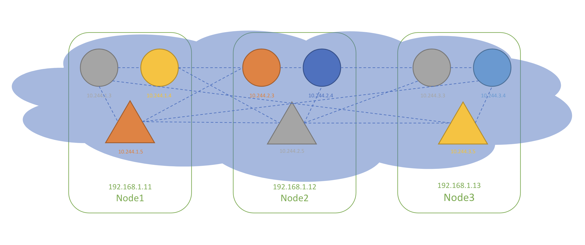
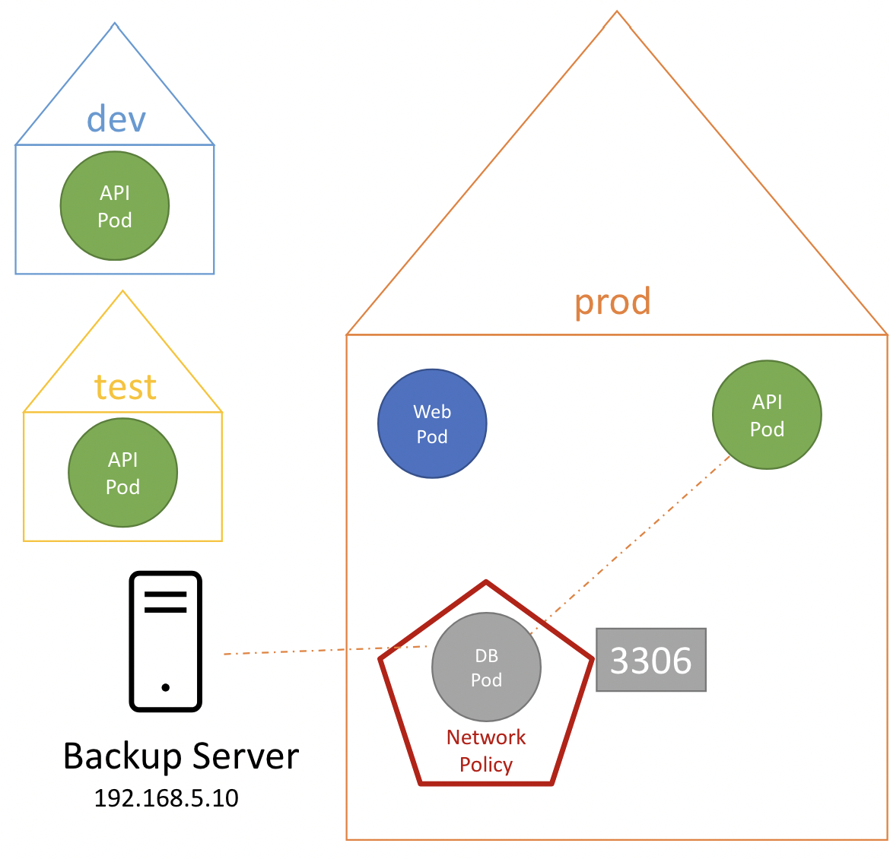
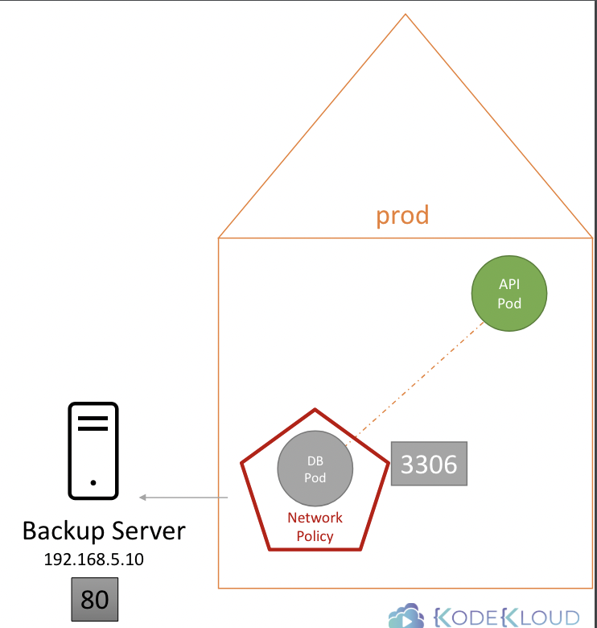

# Network Policy

[🔗 link](https://kubernetes.io/docs/concepts/services-networking/network-policies/)

웹부터 시작해서 데이터베이스 서버까지 트래픽을 살펴보면, 
사용자에게 프런트 엔드를 서비스하는 웹 서버와 백엔드 API를 서비스하는 앱 서버 데이터베이스 서버가 있음

간략하게 설명하면, 다음과 같음

1. 사용자는 포트 80에 있는 `웹 서버`에 요청을 보냄
2. `웹 서버`는 백엔드의 `API 서버`에 요청을 보냄
3. `API 서버`는 포트 3306의 `데이터베이스 서버`에서 데이터를 패치
4. 사용자에게 데이터를 다시 보냄

여기엔 두 가지 유형의 트래픽이 있음: Ingress & Egress

예를 들어, 웹 서버로 들어오는 사용자의 요청 트래픽은 Ingress Traffic 임

```
 +--------------------- INGRESS --------------------+
 |          80          5000         3306           |
 |   User  ---→   Web   ---→   API   ---→    DB     |
 |               Server       Server       Server   |
 +--------------------------------------------------+
```

반대로 앱 서버에서 사용자에게 요청이 나가는 트래픽은 Egress Traffic 임 

```
 +--------------------- EGRESS --------------------+
 |          80          5000         3306           |
 |   User  ←---   Web   ←---   API   ←---    DB     |
 |               Server       Server       Server   |
 +--------------------------------------------------+
```

여기서, 각 트래픽 방향에 따라 포트를 따로 설정해야 함 

```
 +---------+
 |   Web   |  Ingress : 80 
 | Server  |  Egress  : 5000
 +---------+
 +---------+
 |   API   |  Ingress : 5000 
 | Server  |  Egress  : 3306
 +---------+
 +---------+
 |    DB   |  Ingress : 3306 
 |  Server |
 +---------+
```

---

### Network Security


Pod와 서비스를 호스팅하는 노드 집합의 클러스터가 있을 때,
각 Node 마다 IP 주소를 가진 Pod와 서비스도 있음

쿠버네티스 네트워킹은 Pod가 서로 통신할 수 있어야 함

이 때, 네트워킹의 조건은 추가적인 경로 설정을 구성할 필요 없어야 함 

가령, 아래 가상 프라이빗 네트워크는 클러스터 내 모든 노드에 걸쳐 연결되어 있음

<br><br>

```
+----------------+   +----------------+    +----------------+ 
| 🟠: 10.244.1.3 | ↔ | 🟠: 10.244.2.3 | ↔ | 🟠: 10.244.3.3 |
| 🟣: 10.244.1.4 | ↔ | 🟣: 10.244.2.4 | ↔ | 🟣: 10.244.3.4 |   
| 🟩: 10.244.1.5 | ↔ | 🟩: 10.244.2.5 | ↔ | 🟩: 10.244.3.5 |   
+----------------+   +----------------+    +----------------+   
   Node 1 - Web         Node 2 - API          Node 3 - DB
   192.168.1.11         193.168.1.12          193.168.1.13 
```

위 네트워크에서는 기본적으로 서로를 Pod 이름이나 특정 목적으로 구성된 서비스, 혹은 IP로 호출 가능

쿠버네티스에서는 기본적으로 "All Allow" 규칙을 따르는데, 즉, 어떤 Pod 나 서비스든 모든 트래픽을 허용함 

기본적으로 모든 네트워크를 허용하기 때문에, 특정 경로로 들어오는 트래픽을 관리하려면 추가적인 설정이 필요

이 때, label 를 이용함 

가령, DB Pod 경우, API 서버로 오는 트래픽만을 받게 하기 위한다고 가정하면 아래와 같이 설정할 수 있음


<table>
<tr>
<th>Pod</th>
<th>Network Policy</th>
</tr>
<tr>
<td>

```
labels:
  role: db
```

</td>
<td>

```
policyTypes:
- Ingress               // ① allow only **Ingress**
ingress:
- from:                 // ② traffic from API Pod
  - podSelector:
      matchLabels:
        name: api-pod
  ports:
  - protocol: TCP
    port: 3306          // ③ on port 3306
```

</td>
</tr>
</table>

전체 Yaml 파일을 확인해보면 아래와 같음

```yaml
apiVersion: networking.k8s.io/v1
kind: NetworkPolicy
metadata:
  name: db-policy
spec:
  podSelector:
    matchLabels:
      role: db
  policyTypes:
  - Ingress
  ingress:
  - from:
    - podSelector:
        matchLabels:
          role: api0pod
    ports:
    - protocol: TCP
      port: 3306
```

```Bash
kubectl create -f policy-definition.yaml
```

이 때, `policyTypes` 에 명시한 타입을 기준으로 명시된 타입의 필드 명세를 가져오는데, 
가령 위에서는 Ingress 를 명시했기 때문에 `ingress` 필드만을 참조함

즉, 모든 Ingress 트래픽만 해당 조건을 참조하며, Egress 인 경우에는 아무런 영향을 받지 않아 여전히 "All Allow" 상태라는 의미

만약 둘 다 명시하고 싶다면 아래와 같이 적용할 수 있음 

```yaml
apiVersion: networking.k8s.io/v1
kind: NetworkPolicy
metadata:
  name: test-network-policy
  namespace: default
spec:
  podSelector:
    matchLabels:
      role: db
  policyTypes:
  - Ingress
  - Egress
  ingress:
  - from:
    - ipBlock:
        cidr: 172.17.0.0/16
        except:
        - 172.17.1.0/24
    - namespaceSelector:
        matchLabels:
          project: myproject
    - podSelector:
        matchLabels:
          role: frontend
    ports:
    - protocol: TCP
      port: 6379
  egress:
  - to:
    - ipBlock:
        cidr: 10.0.0.0/24
    ports:
    - protocol: TCP
      port: 5978
```

<br>

모든 네트워크 솔루션이 네트워크 정책을 지원하는 건 아님

- Kube-router
- Calico
- Romana
- Weave-net


네트워크 솔루션 중 하나인 Flannel은 네트워크 정책을 지원하지 않는데, 
이 때 지원되지 않는 네트워크 정책을 적용해도 아무런 오류를 보여주진 않음 

<br>

---

## Developing Networking Policies

Network Policy 설정: NetworkPolicy Object 생성

<br>

### 1. Policy Type 지정

NetworkPolicy 에는 2가지 종류의 타입이 존재: Ingress / Egress

둘 중 하나를 설정할 수도, 둘 다 설정할 수도 있음

가령, API 서버의 통신을 받는 DB 서버의 경우, 3306 포트를 열어 들어오는 트래픽을 허용하는 Ingress 규칙을 정의할 수 있음

이 때, API 서버 Pod로의 응답을 위한 별도의 규칙은 따로 필요하지 않음

Ingress 트래픽을 허용하면 트래픽에 대한 응답이나 회신이 자동으로 허용됨

그래서 항상 DB포드의 관점에서 바라보면 됨

<br><pre><code lang="yaml">apiVersion: networking.k8s.io/v1
kind: NetworkPolicy
metadata:
  name: test-network-policy
  namespace: default
spec:
  podSelector:
    matchLabels:
      role: db
  <b>policyTypes:
  - Ingress</b>

</code></pre><br>

<br>

### 2. 지정한 Policy Type 명세

#### ✔️ `podSelector`

`podSelector`를 설정해서 특정 Pod에 해당 네트워크 정책을 적용할 수 있음

<br><pre><code lang="yaml">apiVersion: networking.k8s.io/v1
kind: NetworkPolicy
metadata:
  name: test-network-policy
  namespace: default
spec:
  podSelector:
    matchLabels:
      role: db
  policyTypes:
  - Ingress
  <b>ingress:
  - from:
    - podSelector:
        matchLabels:
          name: api-pod
    ports:
    - protocol: TCP
      port: 3306</b>
</code></pre><br>

모든 Namespace의 Pod 들 중에서 label이 매칭되는 Pod에 적용됨

<br>

#### ✔️ `namespaceSelector`

만약, `dev`, `test`, `prod`의 네임스페이스로 구분된 환경에 동일한 Label을 가진 Pod가 존재하고 있을 때, 
각 횐경 별로 구분하고 싶다면 `namespcaeSelector` 를 지정할 수 있음

<br><pre><code lang="yaml">...
  ingress:
  - from:
    - podSelector:
        matchLabels:
          name: api-pod
      <b>namespaceSelector:
        matchLabels:
          name: prod</b>
    ports:
    - protocol: TCP
      port: 3306
</code></pre><br>

단, 해당 namespace 에 해당 Label 을 먼저 지정해야만 함

만약 아래와 같이 `namespaceSelector` 만 정의되어 있다면, 

<br><pre><code lang="yaml">...
  <b>ingress:
  - from:
      namespaceSelector:
        matchLabels:
          name: prod</b>
    ports:
    - protocol: TCP
      port: 3306
</code></pre><br>

해당 namespace 에 존재하는 Pod에 대해서만 해당 NetworkPolicy가 적용됨

<br>

#### ✔️ `ipBlock`

만약 쿠버네티스 클러스터 외부의 백업 서버에 DB Pod 연결을 허용하고 싶다면?

<br><br>

이 때에는, 백업 서버의 IP를 직접 명시할 수 있음

<br><pre><code lang="yaml">...
  ingress:
  - from:
    - podSelector:
      matchLabels:
      name: api-pod
      namespaceSelector:
        matchLabels:
          name: prod
      <b>ipBlock:
        cidr: 192.168.5.10/32</b>
    ports:
    - protocol: TCP
      port: 3306
</code></pre><br>

<br>

위의 Yaml 정의 문서에는 총 두 가지의 규칙이 정의되었다고 볼 수 있음

- `podSelector` AND `namespaceSelector`
- `ipBlock`

위 둘은 OR 연산자처럼 동작함

두 번째 규칙 같은 경우에는 해당 범위 내의 IP 는 모두 받아 들이지만,
첫 번째 규칙 같은 경우에는 `podSelector` 와 `namespaceSelector` 규칙을 모두 만족하는 대상만 허용

위 모든 내용은 Egress 에 대해서 동일하게 적용할 수 있음 

<br>

### Egress

만약 반대로 외부 Backend Server 로 부터 데이터를 받고 싶다고 할 때,

<br><br>

`egress` 필드를 추가할 수 있음

<br><pre><code lang="yaml">spec:
  podSelector:
    matchLabels:
      role: db
  policyTypes:
  - Ingress
  - Egress
  ingress:
  - from:
    - podSelector:
        matchLabels:
          name: api-pod
    ports:
    - protocol: TCP
      port: 3306
  <b>egress:
  - to:
    - ipBlock:
        cidr: 192.168.5.10/32
    ports:
    - protocol: TCP
      port: 80</b>
</code></pre><br>


