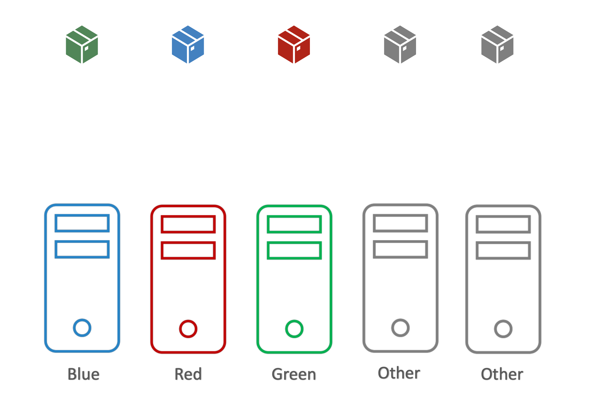
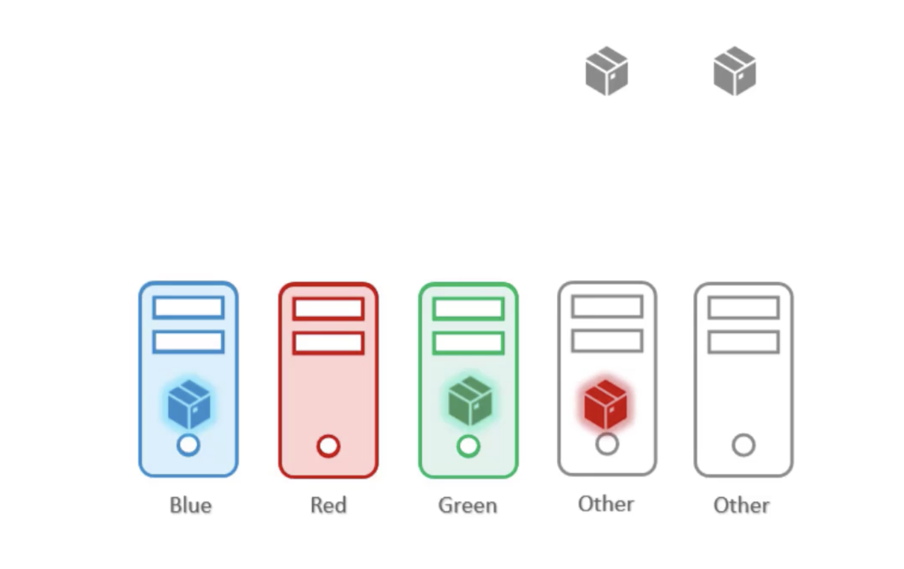
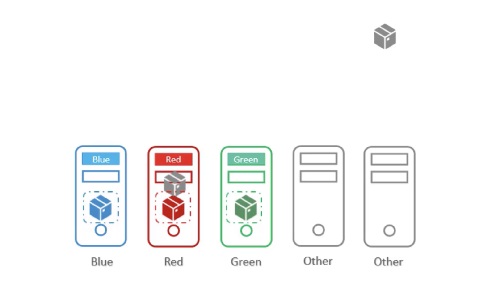
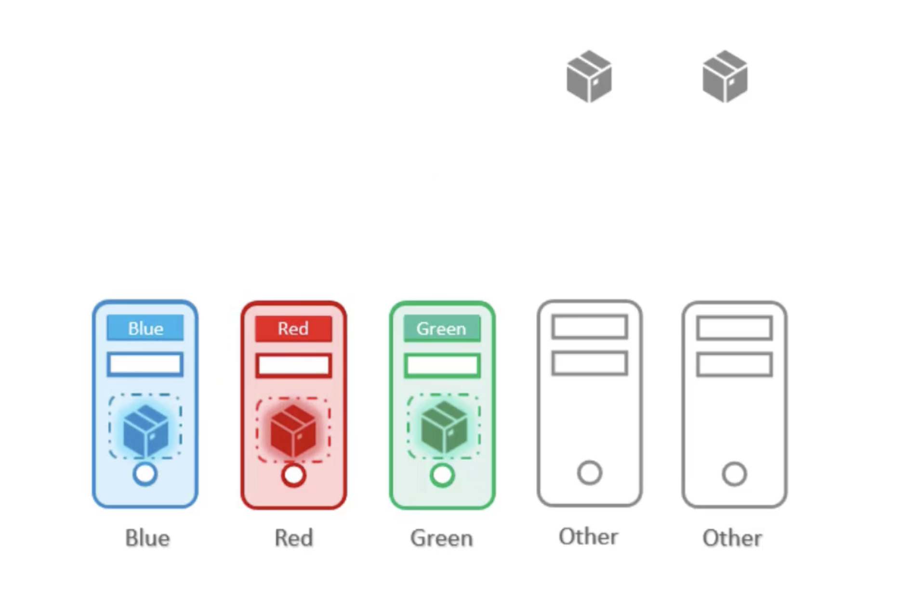

# Node Affinity vs. Taints and Tolerations

세 개의 노드 `blue`, `red`, `green` 와 세 개의 Pod `blue`, `red`, `green`가 있다고 가정

  

또한, 다른 팀들과 같은 쿠버네츠 클러스터를 공유하고 있어서, 두 개의 Node와 두 개의 Pod를 추가로 존재

궁극적인 목표는, 각 Node가 동일한 색생의 Pod 만을 가지는 것

다른 포드가 우리 노드에 놓여서는 안되고, 우리 포드가 다른 팀 노드에 있는 것도 안됨

 

**1. Taints and Tolerations**

  

먼저, Node에 각 색상 별 Taint를 추가 시킴

이후, 각 Pod의 배치를 허용할 수 있도록 하는 Tolerate 를 색상 별로 설정

그럼 의도대로 `blue` 노드에는 `blue` Pod가, `green` 노드에는 `green` Pod가 **배치될 수 있음**

즉, 가능성이 있는 것. 해당 노드만을 선호한다는 보장은 없음

따라서 `red` Pod가 다른 팀의 노드(회색 노드)에 배치될 수 있음

 

**2. Affinity**

  

먼저, 각 노드에 Label을 붙임

그 다음, 각 Pod에 `nodeSelector`를 설정해 해당 Pod가 특정 Node에 배치되도록 유도

그럼 의도대로 `blue`, `red`, `green` Pod가 각각의 노드에 배치될 것 

하지만, 다른 포드가 그 노드에 없다는 보장이 없음

즉, 다른 Pod가 우리 팀의 노드에 올 가능성이 있음

 

**3. Taints and Tolerations + Node Affinity**

두 방식을 결합해서 사용하면 의도하는 동작을 정확히 수행 가능

  

처음에는 Taint 와 Toleration 를 사용해 다른 팀의 Pod가 우리 노드에 놓이는 것을 막음

이후, Node Affinity 를 통해 우리 포드가 다른 팀 노드에 놓이는 것을 막음

