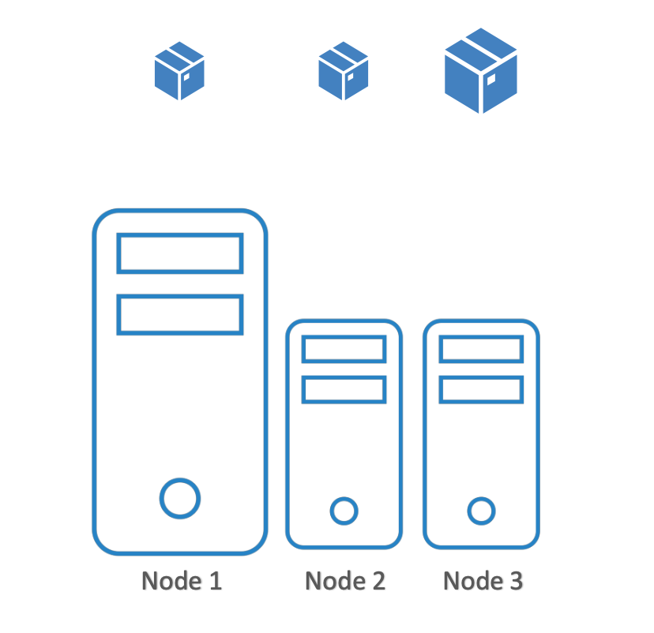

# Node Selectors

가령, 아래와 같이 큰 리소스를 가지는 하나의 하드웨어와 더 작은 리소스를 갖는 두 개의 하드웨어가 있다고 가정

<br/><br/>

클러스터에는 각자 다른 종류의 작업들이 실행되고 있는데,
리소스 한계 문제로 데이터 프로세싱 처리 애플리케이션을 가장 큰 리소스를 가진 노드에 배치해야 함.

이 조건을 만족하기 위해서는 두 가지 방법이 존재: `Node Selector`, `Node Affinity`.

**`Node Selector`**

<pre><code lang="yaml">apiVersion: v1
kind: Pod
metadata:
  name: myapp-pod
spec:
  containers:
  - name: data-processor
    image: data-processor
  <b>nodeSelector:
    size: Large</b>
</code></pre>

이와 같은 `nodeSelector`을 사용하려면 Pod를 생성하기 전에 먼저 노드에 레이블을 지정해야 함

<br/>

**노드에 Label을 붙이는 방법**


```Bash
❯ kubectl label nodes <node-name> <label-key>=<label-value>

# Example.
❯ kubectl label nodes node-1 size=Large
```

NodeSelector은 특정 Pod가 특정 Node에 배치되는 것을 충족시켜주긴 하지만, 
가령, Large 혹은 Medium 레이블에 지정 / Small 이라는 Label이 붙지 않은 노드에 배치해달라고 하는,
더 복잡한 요구 사항이 있을 때 대응하지 못함

이 때에는 **Node Affinity**를 사용할 수 있음.


