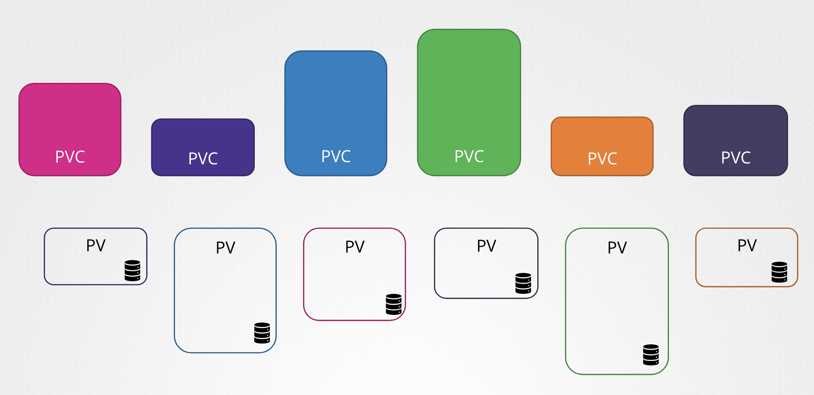
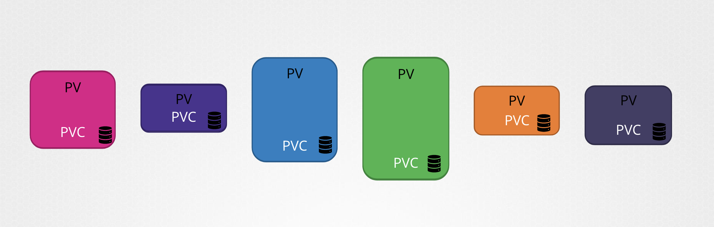
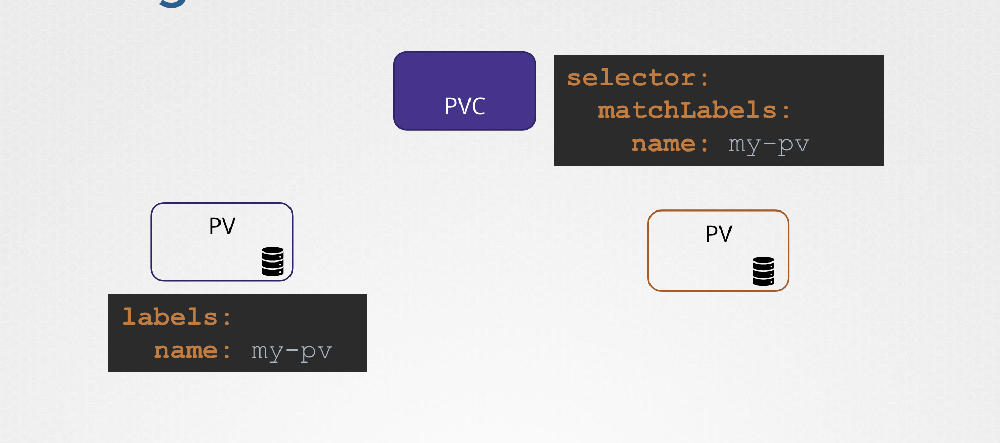

# Persistent Volume Claims

<pre><i>A PersistentVolume (PV) is a piece of storage in the cluster that has been provisioned by an administrator or dynamically provisioned using Storage Classes. It is a resource in the cluster just like a node is a cluster resource. PVs are volume plugins like Volumes, but have a lifecycle independent of any individual Pod that uses the PV. This API object captures the details of the implementation of the storage, be that NFS, iSCSI, or a cloud-provider-specific storage system.
A PersistentVolumeClaim (PVC) is a request for storage by a user. It is similar to a Pod. Pods consume node resources and PVCs consume PV resources. Pods can request specific levels of resources (CPU and Memory). Claims can request specific size and access modes (e.g., they can be mounted ReadWriteOnce, ReadOnlyMany, ReadWriteMany, or ReadWriteOncePod, see AccessModes).
</i>

PV(Persistent Volume)는 클러스터 내의 리소스로, 관리자가 프로비저닝했거나 스토리지 클래스를 사용하여 동적으로 프로비저닝한 클러스터 내의 스토리지.

PV는 Volumes와 같은 볼륨 플러그인이지만 PV를 사용하는 개별 Pod와 독립적인 라이프사이클을 가지고 있음. 
이 API 개체는 NFS, iSCSI 또는 클라우드 제공자 전용 스토리지 시스템 등 스토리지 구현에 대한 세부 정보를 캡처함.
PVC(Persistent Volume Claim)는 사용자에 의한 저장 요청. 
클레임은 특정 크기 및 액세스 모드를 요청할 수 있는데, 가령, <code>ReadWriteOnce</code>, <code>ReadOnlyMany</code>, <code>ReadWriteMany</code> 또는 <code>ReadWriteOncePod</code>를 마운트할 수 있음

<code>PV</code> 와 <code>PVC</code>는 각각 <code>Node 리소스</code>와 <code>Pod</code> 의 관계와 비슷함
- PV: 노드가 클러스터 리소스인 것과 동일하게 클러스터 내 리소스
- PVC: Pod와 유사한데, Pod가 노드 리소스를 소비한다면, PVC는 PV 자원을 소비함
    - Pod는 특정 레벨의 자원(CPU 및 메모리)을 요청할 수 있음
    - PVC는 특정 크기 및 액세스 모드를 요청할 수 있음
</pre>

Persistent Volume 과 Persistent Volume Claim은 쿠버네테스 네임스페이스 상에 존재하는 두 개의 다른 개체임

관리자는 persistent volume 세트를 만들고, 사용자는 해당 저장소를 사용하기 위해 persistent volume claims을 생성

<br><br>

persistent volume claims 이 생성되면 쿠버네테스가
볼륨에 설정된 요청과 속성에 따라 claims 에 persistent volume을 묶음

<br><br>

모든 PVC은 단일 PV 로 묶임

바인딩 과정에서 쿠버네티스는 사용자의 요청 만큼 PV가 충분한 용량을 가졌는지 확인 

Sufficient Capacity, Access Modes, Volume Modes, Storage Class 등  

만약, 단일 클레임에 매치 가능한 게 여러 개 있는데, 특정 볼륨을 지정하고 싶다면 Label을 사용할 수 있음

<br><br>

마지막으로, 다른 모든 매칭 조건이 일치하고 더 나은 옵션이 없는 경우, 더 작은 Claim이 더 큰 Volume 으로 묶일 수 있음

Claim과 Volume 은 일대일 관계이기 때문에, 다른 클레임은 볼륨의 남은 용량을 활용할 수 없음

<br>

```
+------ PV -----+
|  +-- PVC --+  |
|  |         |  |
|  |         |  |
|  +---------+  |
|               |
+---------------+
```

<br>

사용 가능한 PV가 없다면, PVC는 새로운 볼륨을 사용할 수 있을 때까지 보류 상태로 대기

새 볼륨이 사용 가능해지면, PVC는 자동으로 새로 사용 가능한 PV에 바인딩 됨

---

```yaml
apiVersion: v1
kind: PersistentVolumeClaim
metadata:
  name: myclaim
spec:
  accessModes:
    - ReadWriteOnce
  resources:
    requests:
      storage: 500Mi
```

작성 후 읽기 모드(`ReadWriteOnce`)로 설정 및 리소스를 설정해 500Mi의 저장 공간 요청

이후 `kubectl get persistentvolumeclaim` 명령어로 PVC를 생성 

```yaml
❯ kubectl create -f pvc-definition.yaml
persistentvolumeclaim/myclaim created

❯ kubectl get persistentvolumeclaim
NAME      STATUS    VOLUME   CAPACITY   ACCESS MODES   STORAGECLASS   VOLUMEATTRIBUTESCLASS   AGE
myclaim   Pending                                      standard       <unset>                 9s
```

이 전에 생성한 pv-vol1을 보면, `accessModes`가 일치함

`capacity.storage` 가 `1Gi` 인데, 사용 가능한 다른 볼륨이 없기 때문에 해당 스토리지로 볼륨으로 매칭할 수 있음

PVC를 삭제하려면 kubectl delete 명령어를 사용할 수 있음

```Bash
❯ kubectl delete persistentvolumeclaim myclaim
```

클레임이 삭제되면 PV를 어떻게 처리할지는 `persistentVolumeReclaimPolicy` 에 정의할 수 있음 

[🔗 kubernetes.io - Persistent Volumes: Reclaiming](https://kubernetes.io/docs/concepts/storage/persistent-volumes/#reclaiming)

- `Retain`: Default. 유지되다가 수동으로 관리자가 수동으로 삭제할 때까지 지속적인 볼륨이 남음. 다른 클레임에 의해 재사용될 수 없음
- `Delete`: 클레임이 삭제되는 순간 자동으로 볼륨에서도 삭제. 그래서 단말 저장소 공간도 비움 (freeing up storage on the end storage device). 
- `Recycle`: Deprecated. 볼륨에 대해 기본 스크럽(`rm -rf /thevolume/*`)을 수행하고 새 클레임에 대해 다시 사용할 수 있도록 합니다.

> The `Recycle` reclaim policy is deprecated. Instead, the recommended approach is to use dynamic provisioning.
