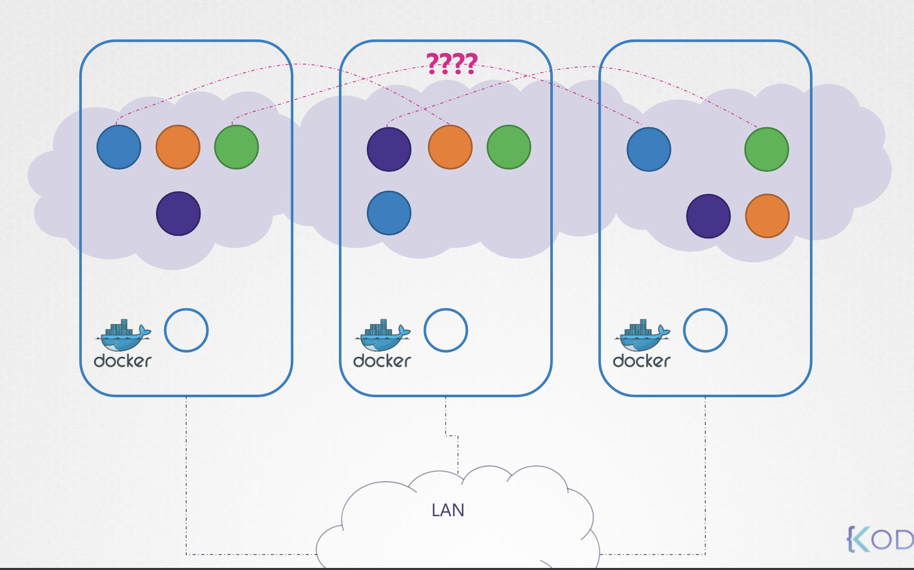
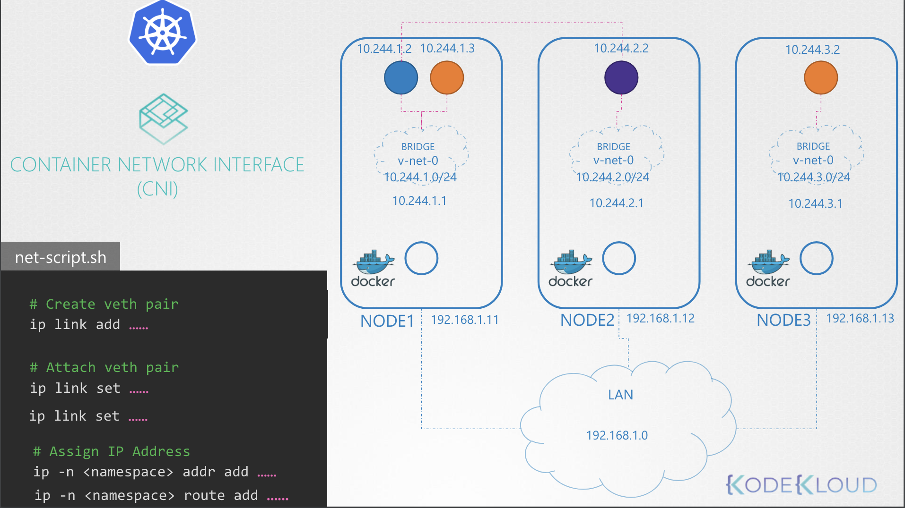
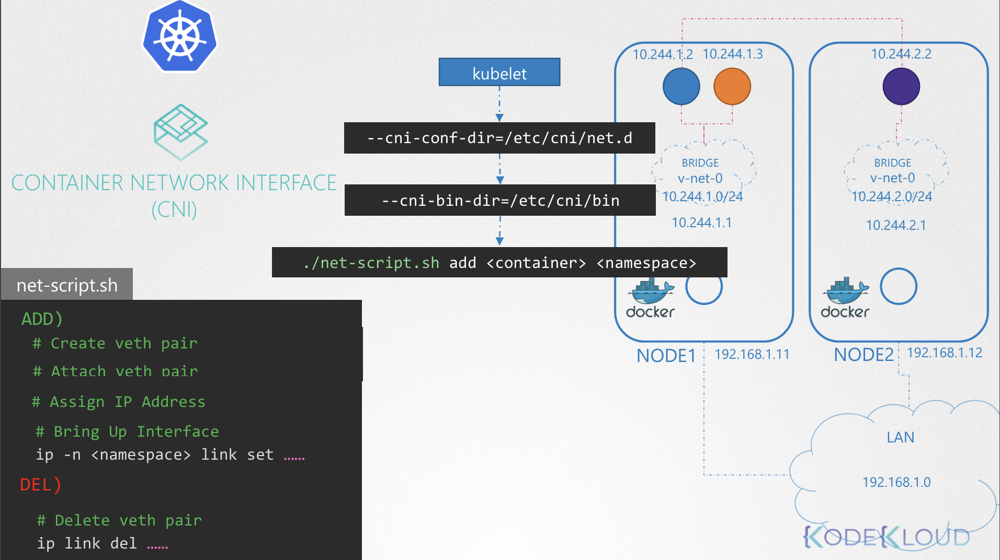

# Pod Networking

Kubernetes 내에 있는 Master 노드와 Worker 노드들은 서로 네트워킹할 수 있게 설정되어 있음

그치만, 노드 사이의 네트워크 통신을 원활하게 한다고 해서 모든 준비가 되는 건 아님 → Pod 사이의 네트워킹 설정이 필요

쿠버네티스 내에는 수 많은 Pod 를 가질 수 있고, 이 Po 들이 통신할 수 있도록 해야함 

쿠버네티스는 이를 위한 해결을 Built-in 서비스로 해결하지 않고, 사용자가 직접 구현해서 해결하도록 함

하지만, Kubernetes는 Pod 네트워킹에 대한 요구 사항을 명확하게 제시함

<br><br>

쿠버네티스는 모든 Pod가 유니크 한 IP 주소를 갖고 동일 노드 내에 다른 Pod 와 통신할 때 해당 IP를 사용하도록 하며,
모든 Pod는 해당 IP를 사용해서 다른 노드에 있는 모든 Pod에 접근할 수 있어야 함

> - Every POD should have an IP Address.
> - Every POD should be able to communicate with every other POD in the same node.
> - Every POD should be able to communicate with every other POD on other nodes without NAT.


어떤 IP 대역을 갖고 있는지, 어떤 Subnet을 속하는지 중요하지 않음

IP 주소를 자동으로 할당하고 노드의 포드와 다른 노드의 포드 간에 연결을 설정하는 솔루션을 구현할 수 있다면, 기본 규칙을 따로 구성할 필요 없음

- [Flannel](https://github.com/flannel-io/flannel)
- [Cilium](https://cilium.io/)
- [vmware NSX](https://www.vmware.com/products/nsx.html)
- [Calico](https://docs.tigera.io/calico/latest/about/)

---

3개의 노드가 있다고 가정 (Master Node 인지 Woker Node 인지 중요하지 않음)

각 노드는 외부 네트워크와 연결되어 있으며, `192.168.1.11`, `192.168.1.12`, `192.168.1.13` 의 IP 주소를 갖고 있음

다음, 컨테이너가 생성될 때, 쿠버네티스는 각 노드를 위한 Network Namespace 를 생성

각 컨테이너가 통신하도록 설정하기 위해서, 생성한 Namespace 를 붙임

노드 내 Namespace 와 연결할 수 있는 Bridge 네트워크를 각 노드마다 생성


<br>

```
+----- Node -----+     +----- Node -----+     +----- Node -----+
|                |     |                |     |                |    
|     🟩  🟧     |     |       🟪       |     |       🟧       |    
|                |     |                |     |                |    
+-------+--------+     +--------+-------+     +---------+------+
   192.168.1.11            192.168.1.12          192.168.1.13
        |                       |                       |
        |         +-------------+--------------+        | 
        +---------+     LAN : 192.169.1.0      +--------+
                  +----------------------------+
```

1. ip link add v-net-0 type bridge (Each Node)
2. ip link set v-net-0 up (Each Node)

<br>

```
+----- Node -----+     +----- Node -----+     +----- Node -----+
|                |     |                |     |                |    
|     🟩  🟧     |     |       🟪       |     |       🟧       |    
|                |     |                |     |                |    
|    (bridge)    |     |    (bridge)    |     |    (bridge)    |    
|    v-net-0     |     |    v-net-0     |     |    v-net-0     |    
|                |     |                |     |                |    
+----------------+     +----------------+     +----------------+
   192.168.1.11            192.168.1.12          192.168.1.13
        |                       |                       |
        |         +-------------+--------------+        | 
        +---------+     LAN : 192.169.1.0      +--------+
                  +----------------------------+
```

Bridge 네트워크를 생성했으니, 이제 각 컨테이너에 연결해야함 

그럼, 어떤 IP 주소를 할당해야 할까?

각 bridge network가 각 노드들의 subnet에 있다고 하고,
private 주소 대역을 선택 (아무거나, 예를 들어 `10.244.1.1` ~ `10.244.3.1`)

Container를 네트워크에 연결하기 위해서는 Pipe 나 Virtual Network 가 필요함 → `ip link add` Command 사용 

<br>

_net-script.sh_

```Bash
# Create veth pair
ip link add ……

# Attach veth pair
ip link set ……
ip link set ……

# Assign IP Address
ip -n <namespace> addr add ……
ip -n <namespace> route add ……

# Bring Up Interface
ip -n <namespace> link set ……
```

마지막 Container에 IP를 할당 시, 할당 IP는 직접 관리하거나 Database 같은 곳에 저장해야 함

가령, 사용 가능한 서브넷 IP 인 `10.244.1.2` 라고 가정할 수 있음

<br>

```
+---------- Node ----------+ 
|                          |     
|  10.244.1.2  10.244.1.3  |     
|       🟩        🟧       |     
|       |          |       |
|       +-(bridge)-+       |        ...                     ...     
|         v-net-0          |     
|                          |     
+--------------------------+ 
       192.168.1.11          
             |                       |                       |
             |         +-------------+--------------+        | 
             +---------+     LAN : 192.169.1.0      +--------+
                       +----------------------------+
```

이제 두 Container (🟩, 🟧)는 통신할 수 있음

이제 나머지 Node 에도 위 스크립트를 실행해 모든 컨테이너가 노드 내에서 통신 가능하도록 만들면 됨

이제 모든 Pod 는 Unique한 IP 주소를 갖으면서 서로 통신 가능한 상태임

```
+---------- Node ----------+  +------ Node ------+  +------ Node ------+ 
|                          |  |                  |  |                  |     
|  10.244.1.2  10.244.1.3  |  |    10.244.2.2    |  |    10.244.3.2    |     
|       🟩        🟧       |  |        🟪         |  |        🟧        |     
|       |          |       |  |        |         |  |        |         |
|       +-(bridge)-+       |  |     (bridge)     |  |     (bridge)     |
|          v-net-0         |  |      v-net-0     |  |     v-net-0      |
|       10.244.1.0/24      |  |   10.244.2.0/24  |  |  10.244.3.0/24   |
|                          |  |                  |  |                  |
+--------------------------+  +------------------+  +------------------+
       192.168.1.11               192.168.1.12           192.168.1.11          
             |                        |                       |
             |        +---------------+--------------+        | 
             +--------|    NETWORK    |   GATEWAY    |--------+
                      |  ------------ | ------------ |
                      | 10.244.1.0/24 | 192.168.1.11 |
                      | 10.244.2.0/24 | 192.168.1.12 |
                      | 10.244.3.0/24 | 192.168.1.13 |
                      +---------------+--------------+ 
```

하지만 아직 다른 노드에 위치한 Pod에는 닿을 수 없음

```
🟩$ ping 10.244.2.2
Connect: Network is unreadchable
```

Pod의 IP를 해당 Node 라우팅 테이블에 추가해주어야 함

```Bash
$ ip route add 10.244.2.2 via 192.168.1.12
```

그렇게 모든 Pod 에 대해 IP 설정을 해야 함

```Bash
$ ip route add 10.244.2.2 via 192.168.1.12
$ ip route add 10.244.3.2 via 192.168.1.13
$ ip route add 10.244.1.2 via 192.168.1.11
...
```

이렇게 각 서버에 Route를 설정하는 것 대신, 네트워크에 Router를 갖고 있고 모든 호스트들이 이를 default gateway 로 사용하도록 만드는 게 더 나음

각 노드에 개별로 생성한 Virtual Network는 이제 하나의 큰 Network가 되고 `10.244.0.0/16` 를 가짐

각 Pod가 생성될 때마다 virtual cable을 생성하고 IP를 설정한 후 연결하는 일련의 과정을 작은 규모가 아닌 클러스터에서 수행하려면 어떻게 할까?

이 때 CNI가 가운데서 이를 가능하게 해줌

<br>
<table>
<tr>
    <th>Before</th>
    <th>After</th>
</tr>
<tr>
    <td>
    
    </td>
    <td>
    
    </td>
</tr>
</table>
<br>

CNI가 쿠버네티스에게 Container가 생성되면 어떤 스크립트를 호출해야 하는지를 알려줌

```Bash
ADD)
# Create veth pair
# Attach veth pair
# Assign IP Address
# Bring Up Interface
ip -n <namespace> link set ……

DEL)
# Delete veth pair
ip link del ……
```

Container Runtime은 Container를 생성할 책임을 갖고 있는데,
Container가 생성될 때 Container Runtime 은 옵션으로 CNI 설정이 포함되어 있는지 확인함

그리곤 bin 디렉토리에 설정된 CNI 구성 스크립트 파일을 찾아 실행

| Function | Command | Configuration File | Description |
|---|---|---|---|
| Path of the binary file of the CNI network plug-in | `--cni-bin-dir` | `"cni-bin-dir": "",` |  The default value is `/opt/cni/bin`. |
| Path of the CNI network configuration file | `--cni-conf-dir` | `"cni-conf-dir": "",` | The system traverses all files with the extension .conf, .conflist, or .json in the directory. The default value is `/etc/cni/net.d`. |
| Network mode | `--network-plugin` | `"network-plugin": "",` | Specifies a network plug-in. The value is a null character by default, indicating that no network configuration is available and the created sandbox has only the loop NIC. The CNI and null characters are supported. Other invalid values will cause iSulad startup failure. |


**Container Runtime**

\1. CNI 플러그인 확인

`--cni-conf-dir=/etc/cni/net.d`을 전달 받아, `/etc/cni/net.d/net-script.conflist` 디렉터리를 확인

\2. `cni-bin-dir` 옵션으로 스크립트 파일 찾아감

`--cni-bin-dir=/etc/cni/bin` 

`/opt/cni/bin/net-script.sh` 파일을 찾음


\3. 발견한 스크립트 실행 

`./net-script.sh add <container> <namespace>`

