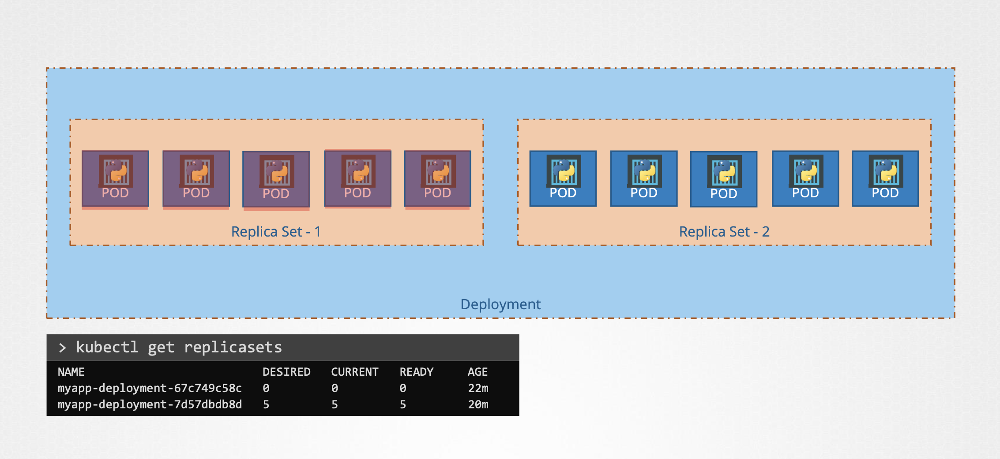
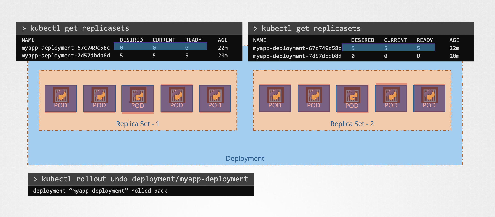

## Rolling Updates and Rollbacks

### ✔️ Rollout

처음 `Deployment`를 생성할 때, 한 `Rollout`을 발생시키는데, 이는 새로운 배포 `Revision`을 생성

이후, 업데이트를 위해 새로운 `Deployment`를 생성하면, 
즉, 새로운 버전을 배포한다면,
새로운 `Rollout`을 발생 시키고, 이는 새로운 배포 `Revision`을 생성

배포 변화를 추적할 수 있고, 필요할 때 이전 배포 버전으로 쉽게 되돌릴 수 있음

**1. Rollout 상태 확인**

```Bash
❯ kubectl rollout status deployment/myapp-deployment
```

<br/>

**2. Rollout 내역 확인**

```Bash
❯ kubectl rollout history deployment/myapp-deployment
```

<br/>

### Deployment Strategy

배포 방법에는 2가지가 존재

<br/>

**첫 번째, Recreate: 배포 앱 모두 제거 후 새로운 버전 앱 생성**

가령, 배포된 이전 앱 5개를 모두 지우고 난 후, 새로운 앱 5개를 새로 띄우는 것

```
    ️  ️Old Version   ️    ⬆️️    ⬆️️    ⬆️️    ⬆️
   🔴    🔴    🔴    🔴    🟠    🟠    🟠    🟠 
   ⬇️    ⬇️    ⬇️    ⬇️        New Version
```
 
문제는 모든 배포 앱을 다운시키고 나서 새로운 앱이 업로드 될 때까지 사용자 접근 불가

<br/>

**두 번째, Rolling Update: 제거 및 생성을 부분적으로 점차 진행**

Deployment 생성 시 디폴트 배포 전략

구 버전을 부분적으로 내려 그 만큼의 새 버전을 배포하며 모두 새 버전이 될 때까지 반복

```
              ⬆️️    ⬆️️
   🔴    🔴    🟠    🟠  →   🔴    🔴
   ⬇️    ⬇️ 
```

```
                           ⬆️️    ⬆️️
   🟠    🟠  →   🔴    🔴   🟠    🟠 
                ⬇️    ⬇️
```

앱이 다운되지 않고 업데이트 가능

---

업데이트를 진행하는 방법은 두 가지가 존재

**첫 번째**, 필요한 내용 수정 후 `kubectl apply` 명령어로 변경 사항 반영

```Bash
❯ kubectl apply -f deployment-definition.yml
```

새로운 Rollout이 트리거되고, Deployment의 새로운 Revision 가 생성

<br/>

**두 번째**, 필요한 내용 수정 후 `kubectl set image` 명령 사용

```Bash
❯ kubectl set image deployment/myapp-deployment nginx-container=nginx:1.9.1
```

Application의 이미지를 업데이트를 함으로써 해당 변경을 적용
 
이 방식은 배포 정의 파일의 구성을 달라짐

그래서, 동일한 정의 파일을 변경하고 싶을 때 주의해야 함


---

<br/><br/>

실제 서로 다른 두 방식의 Deployment의 변경 사항을 보면, 
그 차이를 느낄 수 있음

Recreate 같은 경우엔, ReplicaSet을 0 에서 새로운 ReplicaSet를 5까지 Scale Up/Down 한 것을 볼 수 있음

RollingUpdate 같은 경우엔, 기존 ReplicaSet을 조금씩 축소하고 새 ReplicaSet을 조금씩 생성하는 것을 확인할 수 있음 

---

### Update
실제 Update 시 Pod 들에 어떤 변화가 있을까?

가령, 새로운 앱 5개를 배포한다고 할 때,
먼저 자동으로 ReplicaSet를 생성하고, 이후 ReplicaSet에 따라 여러 개의 Pod가 생성

쿠버네테스 Deployment 객체가 내부적으로 새 ReplicaSet을 만들고 컨테이너를 배포하기 시작 

<br/><br/>

`kubectl get replicasets` 명령어를 확인해보면, 이전 ReplicaSet은 0개, 새로운 ReplicaSet은 5개 임을 확인할 수 있음 

<br/>

### Rollback

업데이트 이후 새로운 버전에서 문제를 발견하면 어떻게 될까?

쿠버네티스 Deployment는 **이전 Revision으로의 롤백** 지원

`kubectl rollout undo` 명령어 뒤 배포 이름을 명시해서 롤백할 수 있음

```Bash
❯ kubectl rollout undo deployment/myapp-deployment
```

새 ReplicaSet의 Deployment는 새 ReplicaSet의 Pod를 파괴하고, 옛날 ReplicaSet의 예전 Pod를 불러옴

해당 앱은 이전 버전으로 돌아감

<br/><br/>

`kubectl get replicasets` 명령어를 확인해보면, 다시 이전 버전의 Pod가 5개로 늘어난 것을 확인

<br/><br/>

```Bash
# Create
❯ kubectl create -f deployment-definition.yml

# Get
❯ kubectl get deployments

# Update
❯ kubectl apply -f deployment-definition.yml

# Update
❯ kubectl set image deployment/myapp-deployment nginx=nginx:1.9.1

# Status
❯ kubectl rollout status deployment/myapp-deployment

# Status
❯ kubectl rollout history deployment/myapp-deployment

# Rollback
❯ kubectl rollout undo deployment/myapp-deployment
```


