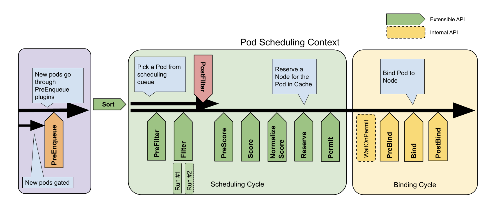

## Scheduler Profile

### How does Kubernetes Scheduler work?

_pod-definition.yaml_

<pre><code lang="yaml">apiVersion: v1 
kind: Pod
metadata:
  name: simple-webapp-color
spec:
  priorityClassName: high-priority
  containers:
  - name: simple-webapp-color
    image: simple-webapp-color
    resource:
      requests:
        memory: "1Gi"
        <b>cpu: 10</b>
</code></pre>

위의 Pod 정의 파일로 `simple-webapp-color` 를 생성한다고 했을 때, Scheduler는 어떤 노드에 배치시킬까

```
🟠 : simple-webapp-color (🔋10)

         ▫️         ▫️        ◻️         ⬜️
       Node 1    Node 2   Node 3    Node 4
CPU :   🔋4       🔋4      🔋12       🔋16   
```

위와 같이 4개의 노드가 있고, 각각 CPU 사용량이 4, 4, 12, 16 이라고 가정해보자.

<br/>

**1. Scheduling Queue**

가장 먼저 Pod 가 생성되면 Pod 는 Scheduling Queue 끝에 추가되어, 스케줄링 될 때까지 대기

이 때, 큐 내의 Pod 들은 Priority 에 따라 정렬됨

Priority는 아래와 같이 정의해서 Pod에 적용할 수 있음

```yaml
apiVersion: scheduling.k8s.io/v1
kind: PriorityClass
metadata:
  name: high-priority
value: 1000000
globalDefault: false
description: "This priority class should be used for XYZ service pods only."
```

```
Scheduling Queue
1. ⚪️ ⚪️ ⚪️      ← 🟢
2. ⚪️ ⚪️ ⚪ 🟢   ← sorting based on the priority defined on the pods 
3. 🟢 ⚪️ ⚪️ ⚪
```

<br/>

**2. Filtering**

Pod를 실행할 수 없는 노드는 여기서 걸러짐

```
🟠 : simple-webapp-color (🔋10)

         ▫️         ▫️        ◻️         ⬜️
       Node 1    Node 2   Node 3    Node 4
CPU :   ❌4        ❌4      🔋12       🔋16   
```

CPU 10 성능을 요구하는 `simple-webapp-color` 에게 앞 두 노드는 리소스가 부족해 필터링 됨

```
🟠 : simple-webapp-color (🔋10)

         ◻️         ⬜️
        Node 3    Node 4
CPU :   🔋12       🔋16   
```

<br/>

**3. Scoring**

스케줄러는 각 노드에 해당 Pod에 필요한 CPU를 사용한 후 남은 공간을 수치로 점수를 매김


```
🟠 : simple-webapp-color (🔋10)

         ◻️         ⬜️
        Node 3    Node 4
CPU :   🔋12       🔋16
Weight:   2        👑 6  
```

첫 번째 노드는 2, 두 번째 노드는 6 남음

두 번째 노드가 더 높은 점수를 받아 선택됨

<br/>

**4. Binding**

실제 Pod가 가장 높은 점수를 가진 노드에 바인딩됨


---

위 모든 작업은 특정 플러그 인으로 이루어짐

<br/>

#### Scheduling Queue

**PrioritySort**
:Pod에서 우선순위로 설정된 기준에 따라 순서대로 정렬

<br/>

#### Filtering

**NodeResourcesFit**
: Pod에서 요구하는 자원이 충분한 노드를 식별하고 부족한 노드를 필터링

**NodeName**
: Pod spec 에서 언급된 노드 이름이 있는지 확인하고 이름과 일치하지 않는 모든 노드를 필터링

**NodeUnschedulable**
: `Unschedulable` flag 값이 `true`로 설정된 노드를 필터링

하지만 기본 설정은 모두 `true`, 해당 노드에 `false`로 설정된 Pod가 없다는 걸 보장함

<br/>

#### Scoring

**NodeResourceFit**
: Pod에 할당된 후 사용 가능한 노드 리소스 수치를 기반으로 각 노드에 점수를 매김

**ImageLocality**
: 각 노드에서 사용되는 컨테이너 이미지를 가진 노드에 높은 점수를 줌

특정 노드의 Pod를 거부하지 않지만,
(가령, 이미지 지역 노드의 경우 이미 이미지가 있는 노드에 Pod를 배치할 수 있음)
하지만 사용할 수 있는 노드가 없다면 Pod는 이미지가 없는 노드에 배치될 것

<br/>

#### Binding


**DefaultBinder**
: Binding 메커니즘을 제공하는 기본 Binder


---

#### Extension Points

[link](https://kubernetes.io/docs/concepts/scheduling-eviction/scheduling-framework/)


<br/><br/>

쿠버네티스는 확장성이 매우 뛰어난데, Extension Point를 통해 플러그인을 자유롭게 커스터마이징하여 배치할 수 있음

각 단계마다 플러그인이 연결될 수 있는 확장 지점이 존재

```
**Scheduling plugins**
link: https://kubernetes.io/docs/reference/scheduling/config/

다음 플러그인은 기본적으로 사용하도록 설정되어, Extension point 중 하나 이상을 구현:

PrioritySort: Provides the default priority based sorting. Extension points: queueSort.
NodeResourcesFit: Checks if the node has all the resources that the Pod is requesting. The score can use one of three strategies: LeastAllocated (default), MostAllocated and RequestedToCapacityRatio. Extension points: preFilter, filter, score.

ImageLocality: Favors nodes that already have the container images that the Pod runs. Extension points: score.
TaintToleration: Implements taints and tolerations. Implements extension points: filter, preScore, score.
NodeName: Checks if a Pod spec node name matches the current node. Extension points: filter.
NodePorts: Checks if a node has free ports for the requested Pod ports. Extension points: preFilter, filter.
NodeAffinity: Implements node selectors and node affinity. Extension points: filter, score.
PodTopologySpread: Implements Pod topology spread. Extension points: preFilter, filter, preScore, score.
NodeUnschedulable: Filters out nodes that have .spec.unschedulable set to true. Extension points: filter.
NodeResourcesBalancedAllocation: Favors nodes that would obtain a more balanced resource usage if the Pod is scheduled there. Extension points: score.
VolumeBinding: Checks if the node has or if it can bind the requested volumes. Extension points: preFilter, filter, reserve, preBind, score.
Note: score extension point is enabled when VolumeCapacityPriority feature is enabled. It prioritizes the smallest PVs that can fit the requested volume size.
VolumeRestrictions: Checks that volumes mounted in the node satisfy restrictions that are specific to the volume provider. Extension points: filter.
VolumeZone: Checks that volumes requested satisfy any zone requirements they might have. Extension points: filter.
NodeVolumeLimits: Checks that CSI volume limits can be satisfied for the node. Extension points: filter.
EBSLimits: Checks that AWS EBS volume limits can be satisfied for the node. Extension points: filter.
GCEPDLimits: Checks that GCP-PD volume limits can be satisfied for the node. Extension points: filter.
AzureDiskLimits: Checks that Azure disk volume limits can be satisfied for the node. Extension points: filter.
InterPodAffinity: Implements inter-Pod affinity and anti-affinity. Extension points: preFilter, filter, preScore, score.

DefaultBinder: Provides the default binding mechanism. Extension points: bind.
DefaultPreemption: Provides the default preemption mechanism. Extension points: postFilter.
You can also enable the following plugins, through the component config APIs, that are not enabled by default:

CinderLimits: Checks that OpenStack Cinder volume limits can be satisfied for the node. Extension points: filter.
```


---

### 

이것들은 모두 3개의 분리된 스케줄러 바이너리로 각각과 연관된 분리된 스케줄러 구성 파일로 실행되죠
다중 스케쥴러를 배포하는 한 가지 방법이죠


문제는 각각 다른 프로세스이기 때문에 각각의 프로세스를 유지하기 위한 추가적인 노력이 필요하다는 것

그리고 더 중요한 것은 각각 다른 프로세스이기 때문에 결정 일정에 차질이 생길 수 있다는 것

가령, 한 일정 관리자는 어떤 노드에서 작업을 스케쥴링할 때 다른 일정 관리자가 동시에 같은 노드에서 작업 스케줄링을 하는 것을 모름

쿠버네티스 1.18 릴리즈에서 하나의 Scheduler에 대한 Multiple Profile 소개함

이제 한 scheduler 설정 파일 내에 다수의 프로파일을 구성할 수 있음

<br/>

__my-scheduler-config.yaml__

```yaml
apiVersion: kubescheduler.config.k8s.io/v1
kind: KubeSchedulerConfiguration
profiles:
  - schedulerName: my-scheduler-1
  - schedulerName: my-scheduler-2
  - schedulerName: my-scheduler-3
```

여러 개의 스케줄러가 하나의 바이너리로 실행되는 것일 뿐, 각각의 스케줄러 자체도 분리된 스케줄러처럼 작동함

<br/>

**다르게 작동하도록 구성하는 법**

[🔗 link](https://kubernetes.io/docs/reference/scheduling/config/#multiple-profiles)

각 스케줄러 프로파일 하에서 우리가 원하는 방식으로 플러그 인을 구성할 수 있어요

```yaml
apiVersion: kubescheduler.config.k8s.io/v1
kind: KubeSchedulerConfiguration
profiles:
  - schedulerName: my-scheduler-2
    plugins:
      score:
        disabled:
          - name: TaintToleration
        enabled:
          - name: <<CustomPluginA>>
          - name: <<CustomPluginB>>
  - schedulerName: no-scoring-scheduler
    plugins:
      preScore:
        disabled:
          - name: '*'
      score:
        disabled:
          - name: '*'
```

가령, 스케줄러 2 프로파일의 경우 TaintToleration 같은 특정 플러그인을 비활성화하고, CustomPluginA, CustomPluginB 를 활성화

`no-scoring-scheduler`를 정의해서 모든 preScore 플러그 인을 비활성화

플러그인 아래를 보시면 확장 지점을 지정하고 이름이나 패턴으로 플러그인을 사용하거나 비활성화할 수 있음

---

### References

- https://github.com/kubernetes/community/blob/master/contributors/devel/sig-scheduling/scheduling_code_hierarchy_overview.md
- https://kubernetes.io/blog/2017/03/advanced-scheduling-in-kubernetes/
- https://jvns.ca/blog/2017/07/27/how-does-the-kubernetes-scheduler-work/
- https://stackoverflow.com/questions/28857993/how-does-kubernetes-scheduler-work
