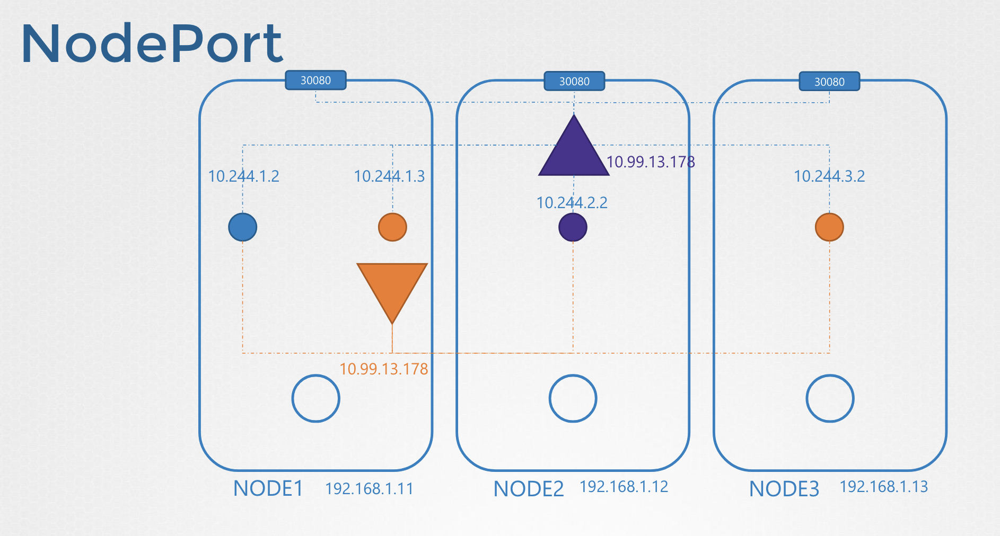
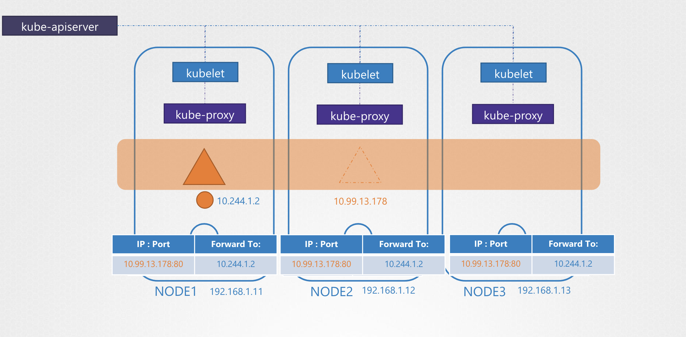

# Service Networking

서비스는 두 Pod의 네트워크 연결을 가능하게 해주는 역할

힌 노드에 Pod 🟠와 Pod 🔵를 연결하기 위해 서비스를 만들고, 서비스는 IP 주소나 혹은 할당된 이름을 얻음

Pod 🔵는 IP나 이름을 통해 Pod 🟠에 엑세스할 수 있음

이 때, 서비스의 범위를 살펴보면,
서비스는 클러스터 내에 어떤 노드에 배치되었건 간에 모든 Pod 에서 접근할 수 있음 

Pod 는 Node 범위라면, 서비스는 클러스터 범위임

이런 종류의 서비스를 Cluster IP 라고 함

만약 Web Application 인 Pod 가 Cluster 밖에 접근하고자 한다면 NodePort 타입 서비스가 필요

<br><br>

Cluster IP 와 동일하게 모든 Pod에 IP를 할당하고, Pod는 서비스의 IP로 접근 가능하지만,
추가적으로 Pod들은 클러스터 내 모든 노드 포트를 통해 외부로 연결됨 

그래서 외부 유저들이나 애플리케이션이 해당 서비스에 접근할 수 있음

---

### Service Networking

비어있는 클러스터를 생각해보자

각 노드에는 kubelet 들이 실행되고 있고, 해당 Node의 변화들을 kube-api-server를 보고함

Pod가 생성될 때마다 해당 Pod의 네트워크 설정을 위해 CNI 플러그인을 호출

비슷하게, 각 노드에 또 다른 kube-proxy 와 같은 다른 구성요소가 실행되면 

kube-proxy는 kube-api-server 를 통해 클러스터 내의 변화를 지켜보고, 새로운 Service가 생성되면 행동을 취함

Service는 이들과는 다르게, 클러스터 범위로 생성되고 컨테이너와 같은 실제 실행되는 동작없이 가상의 객체일 뿐임

그래서 Service는 미리 지정해둔 특정 IP 주소를 할당 받고, 각 노드의 kube-proxy는 그 IP를 가져와 Forwarding 규칙을 생성함 

<br><br>

서비스의 IP와 특정 Port로 오는 트래픽은 포드의 IP로 가야 한다고 말하는 것

그럼 서비스의 `IP:Port`에 접근 할 때마다 Pod의 IP 주소로 전달됨

서비스가 생성되거나 삭제됨에 따라 kube-proxy 또한 이 룰을 생성/삭제함

---

### kube-proxy

kube-proxy가 iptables 를 설정 및 확인하는 방법

먼저, db 라는 이름의 Pod를 하나 생성하고, `10.244.1.2` IP를 가진다고 해보자

이후 ClusterIP 타입의 Service 를 생성하면 쿠버네티스가 IP를 할당해주는데, `10.103.132.104` 라고 하자

IP 대역은 kube-api-server에 `service-cluster-ip-range` 옵션으로 설정할 수 있는데, 기본 값은 `10.0.0.0/24` 임

```Bash
$ kube-api-server --service-cluster-ip-range ipNet

$ ps aux | grep kube-api-server
kube-apiserver --authorization-mode=Node,RBAC --service-cluster-iprange=10.96.0.0/12
```

위 처럼 `10.96.0.0/12` 로 설정되어 있다면, `10.96.0.0` ~ `10.111.255.255` 의 범위로 할당할 수 있음

단, 그 어떤 서비스와 Pod 사이에는 동일한 IP 주소가 할당되는 일은 없음

`iptables` 를 확인해보면 NAT table에 서비스 이름을 검색해볼 수 있고,
`kube-proxy`가 생성한 모든 규칙에는 서비스 이름이 적힌 주석이 있음

```bash
$ iptables –L –t net | grep db-service
KUBE-SVC-XA5OGUC7YRHOS3PU   tcp -- anywhere 10.103.132.104  /* default/db-service: cluster IP */ tcp dpt:3306
DNAT                        tcp -- anywhere anywhere        /* default/db-service: */ tcp to:10.244.1.2:3306
KUBE-SEP-JBWCWHHQM57V2WN7   all -- anywhere anywhere        /* default/db-service: */
```

위 규칙을 해석해보면 `10.103.132.104` (서비스 IP)의 `3306` 포트로 들어오는 요청은,
DNAT 규칙에 의해 `10.244.1.2:3306` 로 보내라는 의미

마찬가지로 NodePort 유형의 서비스를 생성할 때,
kube-proxy는 IP 테이블 규칙을 생성하여 모든 노드의 포트에 들어오는 모든 트래픽을 해당 백엔드 부분으로 전달

kube-proxy 로그에서도 해당 내용을 확인할 수 있음

<pre><code lang="bash">$ cat /var/log/kube-proxy.log
I0307 04:29:29.883941 1 server_others.go:140] <b>Using iptables Proxier.</b>
I0307 04:29:29.912037 1 server_others.go:174] Tearing down inactive rules.
I0307 04:29:30.027360 1 server.go:448] Version: v1.11.8
I0307 04:29:30.049773 1 conntrack.go:98] Set sysctl 'net/netfilter/nf_conntrack_max' to 131072
I0307 04:29:30.049945 1 conntrack.go:52] Setting nf_conntrack_max to 131072
I0307 04:29:30.050701 1 conntrack.go:83] Setting conntrack hashsize to 32768
I0307 04:29:30.050701 1 proxier.go:294] <b>Adding new service “default/db-service:3306" at 10.103.132.104:3306/TCP</b>
</code></pre>

첫 번째와 마지막 줄을 보면, iptables Proxier를 사용해 새 서비스인 `db-service`를 추가하는 항목을 추가

이 파일의 위치는 설치에 따라 다를 수 있음


---

설정된 `service-cluster-ip-range` 를 확인하고 싶다면, kube-api-server manifest 파일을 확인하면 됨

<pre><code lang="bash">$ controlplane ~ ➜   /etc/kubernetes/manifest/

controlplane /etc/kubernetes/manifests ➜  ls 
etcd.yaml  kube-apiserver.yaml  kube-controller-manager.yaml  kube-scheduler.yaml

controlplane /etc/kubernetes/manifests ➜  cat kube-apiserver.yaml
apiVersion: v1
kind: Pod
metadata:
  ...
spec:
  containers:
  - command:
    - kube-apiserver
    ...
    - <b>--service-cluster-ip-range=10.96.0.0/12</b>
</code></pre>
