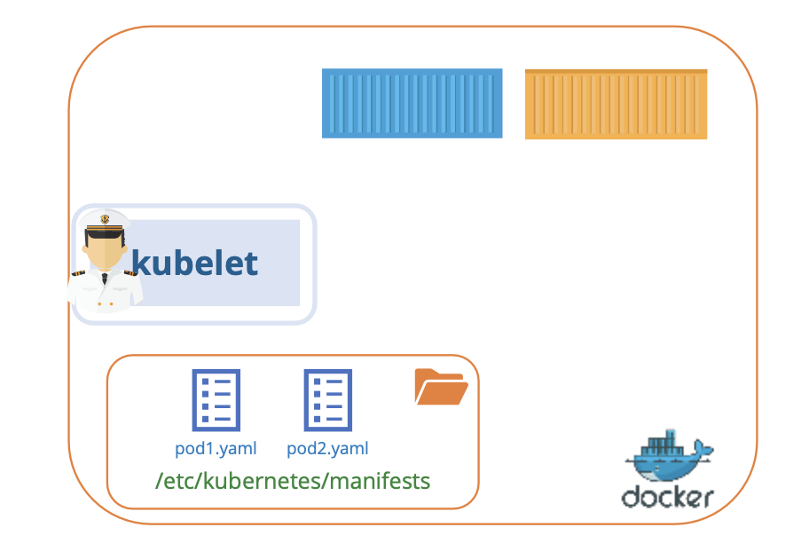
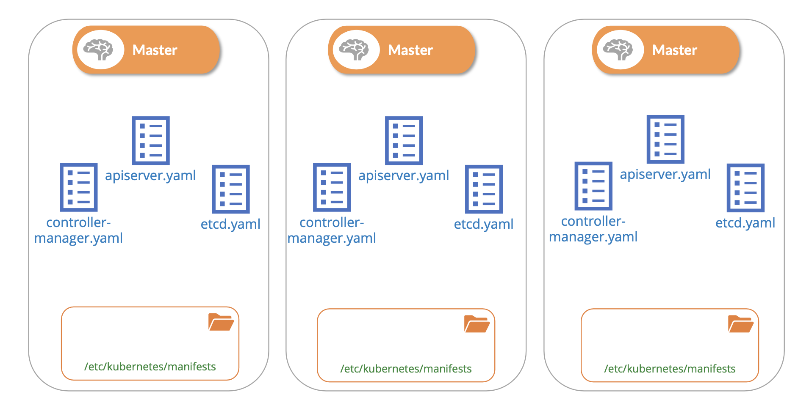

## Static Pods


kubelet은 kube-apiserver 에 의존해, 해당 kubelet가 위치한 노드에 어떤 Pod를 배치할지 지시를 받음

kube-scheduler 판단에 결정되고, 이후 데이터 저장소에 저장됨

### What If

만약, Master가 존재하지 않고 (kube-apiserver, kube-scheduler, controllers, etcd cluster, etc) 다른 노드가 없다면?

하나의 Node가 독립적으로 실행될 수 있을까?

그렇다면, 누가 Pod 생성 지시를 내릴 수 있을까?

kubelet은 노드를 독립적으로 관리할 수 있음

_즉, 하나의 Node가 독립적으로 실행될 수 있을까? → Yes_

하지만, **Pod 상세 정보**를 제공해줄 API 서버가 없음

kube-apiserver 없이 Pod definition 파일을 전달하는 방법은, 

**kubelet 이 Pod 상세 정보를 파일을 읽어오게 설정할 수 있음**

_**즉, Pod에 관한 정보를 저장하는 서버 디렉터리에 관리하고,
kubelet을 설정하면 해당 Pod 정의 파일을 읽을 수 있음**_

<br/><br/>

kubelet은 주기적으로 디렉터리 하위의 파일을 읽고 Pod를 생성

뿐만 아니라 Pod가 죽지 않게 보장

앱이 고장 나면 kubelet가 재시작 시도

디렉터리 내 파일을 조금이라도 변경되면 kubelet이 Pod를 재생성하여 변경이 적용됨

파일을 제거하면 Pod가 자동으로 삭제됨


API 서버의 간섭이나 쿠버네티스 클러스터 구성 요소의 간섭 없이,
kubelet이 스스로 만든 Pod를 **정적 Pod**라고 함

kubelet은 오직 Pod에 대한 내용 밖에 모르기 때문에,
ReplicaSet, Deployment, Service를 통해 배치될 수 없고,
지정된 디렉토리에 정의 파일을 배치하는 방식으로만 Pod를 만들 수 있음

<br/>

### Designated Directory

지정된 폴더는 무엇이고 어떻게 구성할까요?

1. Specifying Configuration Option to `kubelet.service` file 

호스트의 어떤 디렉터리든 될 수 있고,
디렉터리 위치는 서비스를 실행하는 동안 kubelet에 옵션으로 전달됨

옵션은 `pod-manifest-path` 값으로 입력할 수 있고,
현재 `etc/kubernetes/manifests` 폴더로 설정돼 있는 것을 확인할 수 있음

<br/>

2. Specifying Configuration File to `kubelet.service` file

`kubelet.service`에 설정 파일 제공: `--config=kubeconfig.yaml`

_kubeconfig.yaml_

```yaml
staticPodPath: /etc/kubernetes/manifest
```

<pre>
정적 Pod 생성을 원할 땐, 가장 먼저 kubelet 옵션을 살펴볼 필요가 있음
option `pod-manifest-path` 확인 후, 정적 Pod 정의 파일을 어디에 둘지 알 수 있음
</pre>

정적 Pod 들이 생성되고 나면, `docker ps` 명령어를 통해 확인할 수 있음

<pre>
다른 런타임에서는 아래 명령어 실행
- cri-o: crictl ps
- containerd: nerdctl ps
</pre>

---

그럼, 노드가 클러스터의 일부로, Pod 생성을 요청하는 API 서버가 있을 때는?

kubelet은 두 종류의 Pod를 동시에 만들 수 있음: 정적 Pod과 API 서버로 부터 요청된 Pod

API 서버는 정적 파일로 생성된 Pod의 존재를 알고 있음 

`kubectl get pods` 명령어를 입력하면, 정적 Pod가 출력되는 것을 통해 확인 가능

클러스터의 일부일 때, kubelet이 정적 Pod를 만들 때 `kube-apiserver` 에도 Mirror 객체를 생성함

Mirror 객체는 readonly 객체로, 읽을 수는 있지만 수정하거나 삭제 불가능

수정/삭제하는 방법은 오직 노드 manifest 폴더에서 파일을 수정/삭제해야만 반영

<br/>

### Use Case

정적 Pod를 이용해 Control Plane의 구성 요소, 그 자체를 노드에 있는 Pod으로 배포할 수 있음

<br/><br/>

모든 마스터 노드에 kubelet을 설치해서 시작할 때, Control Plane 의 Pod 정의 파일을 생성

<br/><br/>

가령, kube-apiserver나 controller, etcd server 등 정의 파일을 지정된 manifest folder에 저장

그럼 kubelet이 파일을 읽어 Control Plane 컴포넌트들을 노드의 Pod과 동일하게 컨트롤

바이너리를 다운로드하거나 서비스를 구성할 필요가 없고, 
서비스가 다운될까 걱정할 필요도 없음

한 Pod라도 다운되면, 정적 Pod이기 때문에, kubelet이 자동으로 재시작 함

_kube-system 네임스페이스에 Pod를 확인하면, 정적 Pod이기 때문에, 컨트롤 플레인 구성 요소를 Pod로 볼 수 있음_

---

#### Static PODs vs DaemonSets

<table>
<tr>
<th></th>
<th>Static PODs</th>
<th>DaemonSets</th>
</tr>
<tr>
<th>Created By</th>
<td>Kubelet</td>
<td>Kube-API server (DaemonSet Controller)</td>
</tr>
<tr>
<th>Use Cases</th>
<td>Control Plane components</td>
<td>노드 내 Monitoring Agents, Logging Agents 등</td>
</tr>
<tr>
<th>Common Thing</th>
<td colspan="2">Kube-Scheduler 에 영향을 받지 않음</td>
</tr>
</table>


---

<br/><br/>

#### 📌 Static Pod 구분 방법

**1. 이름을 통한 추측**

```Bash
controlplane ~ ➜  k get pods -A
NAMESPACE      NAME                                   READY   STATUS    RESTARTS   AGE
kube-flannel   kube-flannel-ds-b4j9z                  1/1     Running   0          12m
kube-flannel   kube-flannel-ds-xbkr4                  1/1     Running   0          11m
kube-system    coredns-69f9c977-8v7km                 1/1     Running   0          12m
kube-system    coredns-69f9c977-gg67n                 1/1     Running   0          12m
kube-system    etcd-controlplane                      1/1     Running   0          12m
kube-system    kube-apiserver-controlplane            1/1     Running   0          12m
kube-system    kube-controller-manager-controlplane   1/1     Running   0          12m
kube-system    kube-proxy-j6rwp                       1/1     Running   0          12m
kube-system    kube-proxy-vx95c                       1/1     Running   0          11m
kube-system    kube-scheduler-controlplane            1/1     Running   0          12m
```

Static Pod는 생성 시, 이름 뒤에 노드 이름이 붙음

Ex. `etcd-controlplane`, `kube-apiserver-controlplane`, `kube-controller-manager-controlplane`, `kube-scheduler-controlplane` 

`Q. How many static pods exist in this cluster in all namespaces?` 질문에 대응 가능


**2. 각 Pod 상세 조회**

**✔️ Static Pod**: `.metadata.ownerReferences.kind` → `Node`

<pre><code lang="yaml">
controlplane ~ ➜  k get pods kube-controller-manager-controlplane -n kube-system -o yaml
apiVersion: v1
kind: Pod
metadata:
  ...
  name: kube-controller-manager-controlplane
  namespace: kube-system
  ownerReferences:
    - apiVersion: v1
      controller: true
      <b>kind: Node</b>
      name: controlplane
      uid: 07cf24ac-9926-4125-9f64-f501d99ddd95
</code></pre>

**✔️ Control Plane을 통해 관리되는 Pod**: `.metadata.ownerReferences.kind` → `ReplicaSet`

<pre><code lang="yaml">
controlplane ~ ➜  k get pods coredns-69f9c977-8v7km -n kube-system -o yaml 
apiVersion: v1
kind: Pod
metadata:
  ...
  name: coredns-69f9c977-8v7km
  ownerReferences:
  - apiVersion: apps/v1
    blockOwnerDeletion: true
    controller: true
    <b>kind: ReplicaSet</b>
    name: coredns-69f9c977
    uid: 2d54c431-233c-4fdc-9734-f90bb46dcdc5
</code></pre>

<br/><br/>

#### 📌 ✔️ 다른 Node 에서 생성된 Static Pod 제거

<br/>

**1. 제거하려는 Pod가 어느 노드에 배치되어 있는지 확인**

```Bash
controlplane / ➜  k get pods
NAME                          READY   STATUS    RESTARTS   AGE
static-busybox-controlplane   1/1     Running   0          7m35s
static-greenbox-<b>node01</b>        1/1     Running   0          6m58s
```

<br/>

**2. 해당 노드 조회 및 접근 가능한 IP (INTERNAL-IP) 확인**

<pre><code lang="yaml">
controlplane / ➜ k get nodes -o wide
NAME           STATUS   ROLES           AGE   VERSION   INTERNAL-IP    EXTERNAL-IP   OS-IMAGE             KERNEL-VERSION   CONTAINER-RUNTIME
controlplane   Ready    control-plane   59m   v1.29.0   192.6.249.9    <none>        Ubuntu 22.04.3 LTS   5.4.0-1106-gcp   containerd://1.6.26
node01         Ready    <none>          58m   v1.29.0   <b>192.6.249.11</b>   <none>        Ubuntu 22.04.3 LTS   5.4.0-1106-gcp   containerd://1.6.26
</code></pre>

<br/>

**3. 노드 접속**

```Bash
controlplane / ➜  ssh 192.6.249.11
The authenticity of host '192.6.249.11 (192.6.249.11)' can't be established.
ED25519 key fingerprint is SHA256:CkBMQQl8A+bWoSfepHCxTVEDl/x8UOBX9rknJd2al7w.
This host key is known by the following other names/addresses:
    ~/.ssh/known_hosts:1: [hashed name]
Are you sure you want to continue connecting (yes/no/[fingerprint])? yes
Warning: Permanently added '192.6.249.11' (ED25519) to the list of known hosts.
```

<br/>

**4. 해당 노드의 Static Pods 정의 파일 정의를 위해 지정된 위치 확인**

<pre><code lang="yaml">
node01 ~ ✖ cat /var/lib/kubelet/config.yaml 
apiVersion: kubelet.config.k8s.io/v1beta1
...
shutdownGracePeriod: 0s
shutdownGracePeriodCriticalPods: 0s
<b>staticPodPath: /etc/just-to-mess-with-you</b>
...
</code></pre>

<br/>

**5. Static Pod 지정 위치에 파일 존재 확인**

```Bash
node01 ~ ➜ ls /etc/just-to-mess-with-you
total 16
-rw-r--r-- 1 root root  301 Mar 31 05:05 greenbox.yaml
```

<br/>

**6. 제거할 Static Pod 정의 파일 삭제**

```Bash
node01 ~ ➜ rm /etc/just-to-mess-with-you/greenbox.yaml
node01 /etc/just-to-mess-with-you ➜ 
logout
Connection to 192.6.249.11 closed.
```

_SSH 연결 종료는 **Ctrl+d**_

**7. Pod 삭제 여부 확인**

```Bash
controlplane / ✖ k get pods
NAME                          READY   STATUS    RESTARTS   AGE
static-busybox-controlplane   1/1     Running   0          10m
```

