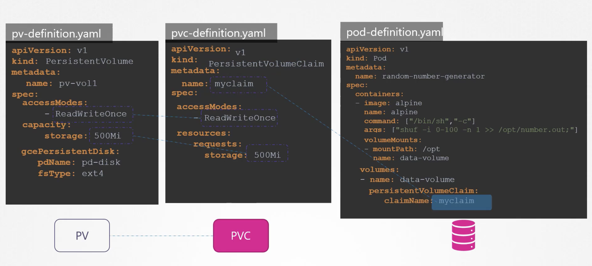
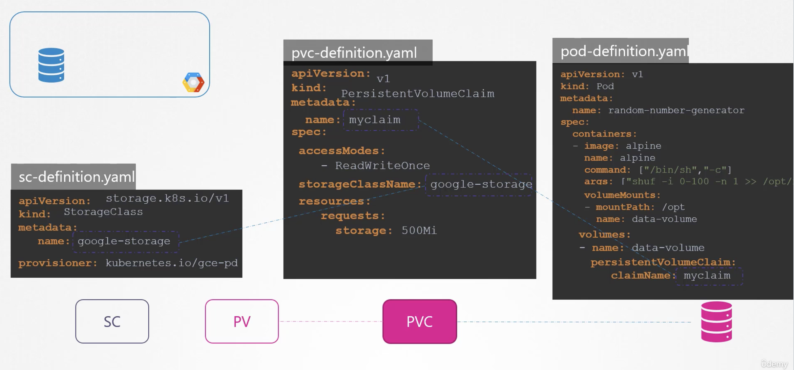

# Storage Class

### Static Provisioning Volumes  

<br><br>

문제점: PV을 생성하기 전, 구글 클라우드에 디스크를 생성해야 함

저장소가 필요할 때마다 먼저 Google 클라우드에서 수동으로 디스크를 프로비전해야 함

그 다음 생성한 디스크와 같은 이름을 사용해서, 수동으로 PersistentVolume 정의 파일을 만들어야 함

이를 Static Provisioning Volumes 라고함

<br>

### Dynamic Provisioning

Storage Class 를 사용하면 Google Storage 와 같은 provisioner를 정의할 수 있는데,

이는 자동으로 Google Cloud 에 프로비저닝되고 클레임을 생성할 때 Pod에 붙게됨

이를 Dynamic Provisioning 라고 함

StorageClass 를 정의해서 이를 구현할 수 있음

<table>
<tr>
<th>pv-definition.yaml</th>
<th></th>
<th>sc-definition.yaml</th>
</tr>
<tr>
<td>

```yaml
apiVersion: v1
kind: PersistentVolume
metadata:
  name: pv-vol1
spec:
  accessModes:
    - ReadWriteOnce
  capacity:
    storage: 500Mi
  gcePersistentDisk:
    pdName: pd-disk
    fsType: ext4
```

</td>
<td>
<center>→</center>
</td>
<td>

```yaml
apiVersion: storage.k8s.io/v1
kind: StorageClass
metadata:
  name: google-storage
provisioner: kubernetes.io/gce-pd
```

</td>
</tr></table>

이제 PV 를 생성할 필요가 없음. StorageClass 에 의해 자동 생성됨

<br><br>

<br>

**SC → PVC**

PVC가 우리가 정의한 저장소 클래스를 사용하려면 PVC 정의에서 저장소 클래스 이름을 지정해야 함

그래야 PVC가 어떤 저장소 클래스를 사용할지 알 수 있음

<br>

**PVC → Pod**

PVC가 생성되면 StorageClass는 정의된 provisioner를 통해 디스크를 요청된 사이즈에 맞게 프로비저닝함

그 다음 PersistentVolume 을 생성해 그 볼륨에 PVC를 묶음

**⚠️ 수동으로 PV를 생성할 필요가 없을 뿐, 여전히 StorageClass 에 의해 PV를 생성함**

다른 provisioner 들도 지원

- AWS EBS
- Azure File
- Azure Disk
- CephFS
- Portworx
- ScaleIO
- etc

각각의 프로비저너에 추가적인 매개 변수를 전달할 수 있는데, 가령 프로비저닝의 디스크 유형이나 Replication 유형 등

<pre><code>apiVersion: storage.k8s.io/v1
kind: StorageClass
metadata:
  name: google-storage
provisioner: kubernetes.io/gce-pd
<b>parameters:
  type: pd-standard
  replication-type: none</b>
</code></pre>

Google Peristent Disk에선 표준 또는 SSD로 유형을 지정할 수 있음

각각 다른 유형의 디스크를 사용하여 다양한 스토리지 클래스를 만들 수 있음

가령, 표준 Disk 인 실버 스토리지 클래스, SSD 드라이브가 포함된 골드 클래스, SSD 드라이브 및 복제가 포함된 플래티넘 클래스 등을 정의할 수 있음

그래서 스토리지 클래스라고 함

<table>
<tr>
<th>sc-definition.yaml</th>
<th>sc-gold-definition.yaml</th>
<th>sc-platinum-definition.yaml</th>
</tr>
<tr>
<td>

```yaml
apiVersion: storage.k8s.io/v1
kind: StorageClass
metadata:
  name: silver
provisioner: kubernetes.io/gce-pd
parameters:
  type: pd-standard
  replication-type: none
```

</td>
<td>

```yaml
apiVersion: storage.k8s.io/v1
kind: StorageClass
metadata:
  name: gold
provisioner: kubernetes.io/gce-pd
parameters:
  type: pd-ssd
  replication-type: none
```

</td>
<td>

```yaml
apiVersion: storage.k8s.io/v1
kind: StorageClass
metadata:
  name: platinum
provisioner: kubernetes.io/gce-pd
parameters:
  type: pd-ssd
  replication-type: regional-pd
```

</td>
</tr></table>

다양한 서비스 클래스를 만들 수 있음

다음에 PVC를 생성할 때 볼륨에 필요한 저장소 클래스를 지정하기만 하면 됨


---

### hands-On

```yaml

apiVersion: v1
kind: Pod
metadata:
  name: nginx
  labels:
    name: nginx
spec:
  containers:
  - name: nginx
    image: nginx:alpine
    volumeMounts:
      - name: local-persistent-storage
        mountPath: /var/www/html
  volumes:
    - name: local-persistent-storage
      persistentVolumeClaim:
        claimName: local-pvc
```