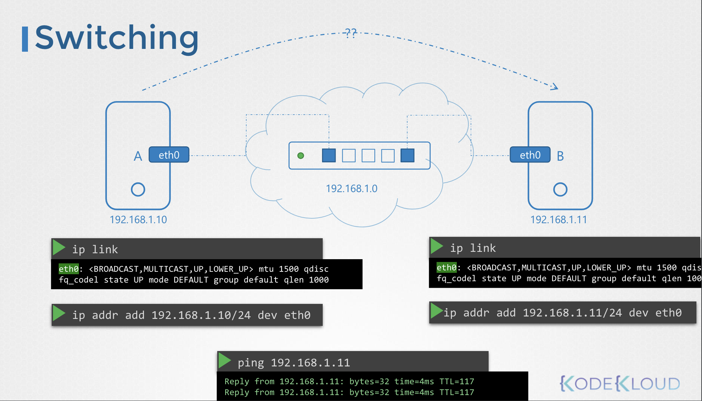
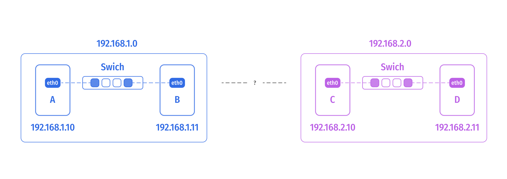
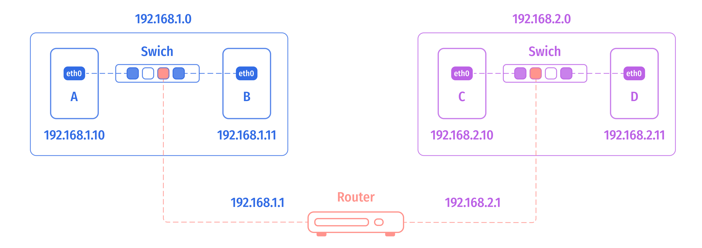
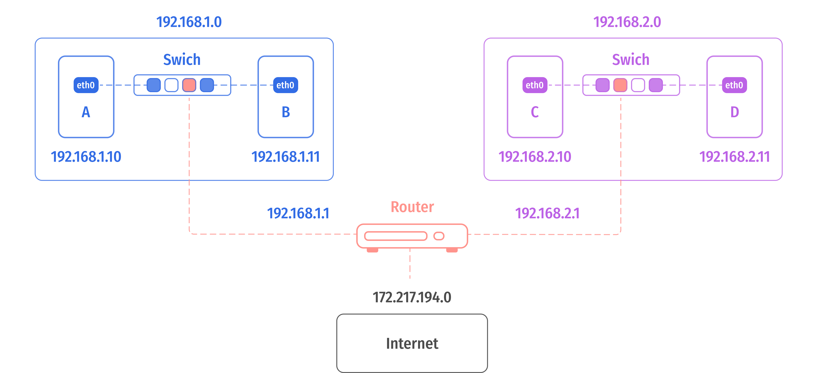

# Switching Routing

<br>

### Prerequisite::Command

<table>
<tr>
<th></th>
<th>Command</th>
</tr>
<tr>
<th>호스트의 인터페이스 목록</th>
<td><pre><code>$ ip link</code></pre></td>
</tr>
<tr>
<th>인터페이스에 할당된 IP 주소 확인</th>
<td><pre><code>$ ip addr</code></pre></td>
</tr>
<tr>
<th>임시적으로 IP 주소 설정</th>
<td>
<pre><code>$ ip addr add 192.168.1.10/24 dev eth0</code></pre>

위 명령어는 호스트를 Restart 하기 전까지만 유효함

변경 사항을 영구 유지하려면 `/etc/network/interfaces` 파일에 설정해야 함

</td>
</tr>
<tr>
<th> 라우팅 테이블 조회</th>
<td>
<pre><code>$ ip route
# or
$ route
</code></pre>
</td>
</tr>
<tr>
<th> 라우팅 테이블에 엔트리를 추가</th>
<td>
<pre><code>$ ip route add 192.168.1.0/24 via 192.168.2.1</code></pre>
</td>
</tr>
<tr>
<th> IP 포워딩이 활성화되어 있는지 확인</th>
<td>
<pre><code>$ cat /etc/sysctl.conf</code></pre>

호스트에 라우터 구성 작업을 하는 경우 사용

</td>
</tr>
</table>


<br>

### Switch

컴퓨터 A와 B가 있다고 할 때, (가령, 노트북과 데스크톱, 클라우드, VM)

A와 B를 연결하려면 두 시스템을 포함하는 네트워크를 생성하는 스위치로 두 시스템을 연결

스위치에 연결하려면 각 호스트에 인터페이스가 필요하며, 이는 호스트에 따라 물리적 또는 가상의 형식일 수 있음

<br><br>

호스트의 네트워크 인터페이스를 보기 위해서는 IP 링크 명령을 사용할 수 있음

`eth0` 이름의 인터페이스를 스위치에 연결하는 데 사용한다고 하면, 
네트워크가 `192.168.1.0` 라고 하면, 
동일한 네트워크에 위치할 `192.168.1.10` 와 `192.168.1.11` 를 각 컴퓨터의 `eth0`에 할당

- System A: `192.168.1.10`
- System B: `192.168.1.11`

이를 위해 `ip addr` 명령어 사용

```Bash
ip addr add 192.168.1.10/24 dev eth0
ip addr add 192.168.1.11/24 dev eth0
```

등록한 링크가 적용되어 IP 주소가 할당되면 두 컴퓨터는 스위치를 통해 서로 통신할 수 있음

스위치는 자신의 네트워크 내에서만 통신을 가능하게 함

즉, 네트워크 상의 호스트로부터 패킷을 받아 같은 네트워크 내의 다른 시스템으로 전달할 수 있음

<br>

### Router

다른 네트워크 `192.168.2.0`에 시스템 C와 D이 있다고 가정

- System C: `192.168.2.10`
- System D: `192.168.2.11`

아래와 같은 구조로 이루어짐

<br><br>

서로 다른 두 네트워크를 연결하려면 **라우터**를 사용해야함

라우터는 각 네트워크를 연결하도록 도와줌

<br><br>

네트워크가 하나의 방이라면, 방이 밖깥 세상과 연결될 문이 라우터

각 방은 문이 어디와 연결되어 있는지 알아야 함

현재 연결된 라우팅 설정을 확인하려면 `route` 명령어를 입력

`route` 명령어는 커널의 라우팅 테이블을 출력

```Bash
$ route
Kernel IP routing table
Destination     Gateway     Genmask     Flags Metric Ref    User Iface
```

위를 살펴보면 현재 등록된 라우팅 설정이 없음

이 경우는 시스템 B는 시스템 C애 접근할 수 없음 

시스템 B는 동일한 네트워크인 `192.168.1.0` 에만 접근할 수 있음

외부 네트워크인 `192.168.2.0` 대역에 접근하고 싶다면, 아래와 같이 설정을 추가할 수 있음

```Bash
$ ip route add 192.168.2.0/24 via 192.168.1.1
```

라우팅 설정을 다시 확인하면 아래와 같음

```Bash
# System B's routing configuration

$ route
Kernel IP routing table
Destination     Gateway         Genmask         Flags   Metric  Ref     User Iface
192.168.2.0     192.168.1.1     225.225.225.0   UG      0       0           0 eth0
```

단, 모든 시스템에 모두 이를 설정해야 함

가령, 위와 같은 경우 시스템 B에서 시스템 C까지 통신이 가능한데, 
시스템 C에서 시스템 B를 접근하기 위한 설정도 필요 

```Bash
$ ip route add 192.168.1.0/24 via 192.168.2.1
```

```Bash
# System C's routing configuration

$ route
Kernel IP routing table
Destination     Gateway         Genmask         Flags   Metric  Ref     User Iface
192.168.1.0     192.168.2.1     225.225.225.0   UG      0       0           0 eth0
```

---

이제 위 시스템을 인터넷에 연결하고 싶다고 하면,
이번엔 인터넷에 연결할 새로운 라우팅 테이블을 추가해야함

```Bash
$ ip route add 172.217.194.0/24 via 192.168.2.1
```

<br><br>

실제 인터넷에는 무수히 많은 네트워크가 존재하기 때문에
각 네트워크를 위해 모든 IP 주소를 라우팅 테이블에 추가하는 대신,
각 라우팅 설정마다 한 IP를 각각 설정하는 대신,
라우터를 미지의 네트워크에 이 라우터를 기본 게이트웨이로 사용하라고 하는 것

```Bash
$ ip route add default via 192.168.2.1
```

모든 요청은 이 라우터로 전달되어 외부의 어떤 네트워크로도 갈 수 있는 것 

이를 위해서는 단순히 단일 테이블 엔트리와 IP 주소들이 정의된 Default Gateway 만 있으면 됨

default 말고도 `0.0.0.0` 으로 명시할 수도 있음 

```Bash
Destination     Gateway         Genmask         Flags   Metric  Ref     User Iface
default         192.168.2.1     0.0.0.0         UG      0       0           0 eth0   ←--
0.0.0.0         192.168.2.1     0.0.0.0         UG      0       0           0 eth0   ←--   Same
```

게이트웨이 필드에 0.0.0.0을 입력하면 게이트웨이가 필요 없다는 의미

```Bash
Destination     Gateway     Genmask         Flags   Metric  Ref     User Iface
192.168.2.1     0.0.0.0     255.255.255.0   UG      0       0           0 eth0
```

예를 들어, 이 경우 시스템 C가 192.168.2.0 네트워크에 있는 장치에 액세스하려면
자체 네트워크에 있기 때문에 게이트웨이가 필요하지 않음

(만약 특정 요청이 인입된다면, 항상 시스템 C에 라우팅을 해주는 경로 내 - `192.168.2.0` - 에 존재하기 때문)

<br>

여러 라우터가 있을 때,
가령 하나는 인터넷과 연결된 라우터, 다른 하나는 인터널 프라이빗 네트워크와 연결된 라우터가 있을 때,
각 네트워크를 위한 서로 서로 다른 진입 경로 (Entry)가 필요함

```Bash
$ ip route add 192.168.1.0/24 via 192.168.2.2
```

만약 당신의 시스템에서 네트워크 오류가 발생한다면 인터넷 라우팅 설정과 게이트웨이를 먼저 살펴보면 좋음 

---

Linux 서버를 라우터로 사용하고 싶을 때, 


```
    🖥️   --[eth0]-- 192.168.1.0 --[eth0]--   🖥️  ---[eth1]-- 192.168.2.0 --[eth0]--   🖥️     
    A                                         B                                        C     
192.168.1.5                       192.168.1.6   192.168.2.6                       192.168.1.6  
```

A, B, C 세 호스트를 보면,
A와 B는 `192.168.1.0` 네트워크에 연결돼 있고,
B와 C는 `192.168.2.0` 네트워크에 연결돼 있음

호스트 B는 `eth0` 와 `eth1`, 두 인터페이스를 통해 양쪽 네트워크에 연결되어 있음

A에서 C로 연결하려고 하면 아래와 같은 오류가 발생

```Bash
# Host A
$ ping 192.168.2.5
Connect: Network is unreachable 
```

이를 가능하게 하기 위해선 호스트 B를 통해 접근할 수 있으며, 그 과정은 아래와 같음

<br>

**STEP 1. Setting Routing Configuration: A--B-→C**

호스트 A에서 B로 패킷을 전송할 수 있게 설정

```Bash
# command in Host A
$ ip route add 192.168.2.0/24 via 192.168.1.6
```


```
                                       ------ ✅ ------→

    🖥️   --[eth0]-- 192.168.1.0 --[eth0]--→   🖥️  ---[eth1]-- 192.168.2.0 --[eth0]-→   🖥️     
    A                                         B                                         C     
192.168.1.5                       192.168.1.6   192.168.2.6                        192.168.1.6  
```

이제 호스트 A에서 호스트 B를 통해 호스트 C로 요청이 전달할 수 있음

호스트 C에서 호스트 A로 응답을 보내려고 할 때도 연결할 수 있게 설정해야 함

<br>

**STEP 1. Setting Routing Configuration: C--B-→A**

이번엔 호스트 C에서 A로 패킷을 전달할 수 있게 설정해야 함

```Bash
# command in Host B
$ ip route add 192.168.1.0/24 via 192.168.2.6
```

```
                                       ←------  ✅ ------

    🖥️   ←--[eth0]-- 192.168.1.0 --[eth0]--   🖥️  ←--[eth1]-- 192.168.2.0 --[eth0]--   🖥️     
    A                                         B                                          C     
192.168.1.5                       192.168.1.6   192.168.2.6                         192.168.1.6  
```

여기서 ping 을 다시해보면 전송은 되지만 응답을 받을 수는 없음

Linux에서는 기본적으로, 하나의 인터페이스에서 다른 인터페이스로 포워딩 시키지 않음

다시 말해, `eth0` 로 받은 요청을 `eth1` 로 내보내지 않음

위에서도 호스트 B 의 `eth0` 인터페이스에서 수신된 패킷들은 `eth1`을 통해 다른 곳으로 전달되지 않음

이는 보안상의 이유인데, 
가령, eth0 은 Private Network에 연결되어 있고, eth1 은 Public Network 있다고 가정해보자.

명시적으로 허용하지 않는 한 Public 망에서 Private 망으로 쉽게 연결되는 건 지양하기 때문

호스트 B는 사설망 내에서 A와 C를 연결하고 싶어하기 때문에, 이를 허용하도록 명시해야함

호스트 B의 설정 수정

<br>

**임시 설정**

```Bash
$ cat /proc/sys/net/ipv4/ip_forward
0    ← No Forward
```

기본적으로 `/proc/sys/net/ipv4/ip_forward` 설정은 `0` 값으로 설정되어 있음

이를 `1`으로 설정

```Bash
$ echo 1 > /proc/sys/net/ipv4/ip_forward
1
```

<br>

**영구 설정**

```Bash
$ cat /etc/sysctl.conf 
...
net.ipv4.ip_forward
...
```

이후부터 A에서 C까지 ping 명령어가 수행되는 것을 확인할 수 있음 
