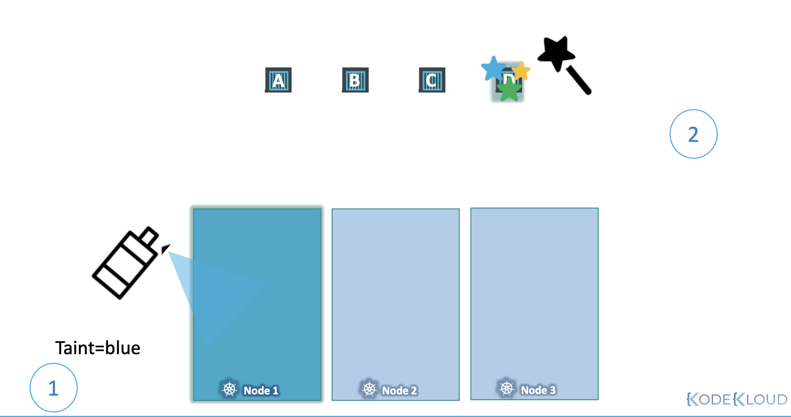
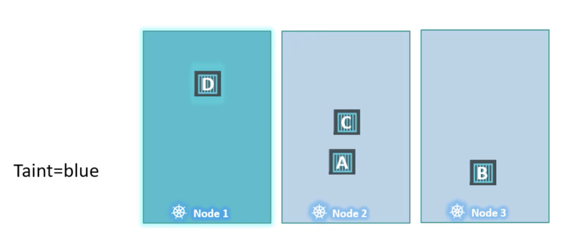
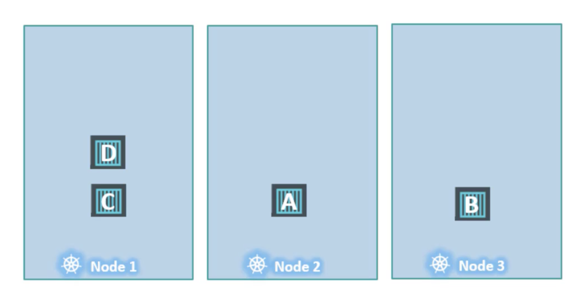

# Taints And Tolerations

_taints & tolerations: 특정 Pod를 수용할지 말지에 대한 제한_

> Node affinity is a property of Pods that attracts them to a set of nodes (either as a preference or a hard requirement). 
> Taints are the opposite -- they allow a node to repel a set of pods.


- Taint: the act or result of spoiling something or giving it an unpleasant quality
- Tolerant: having the ability to bear something unpleasant or annoying, or to keep going despite difficulties

**Example.**

벌레가 다가오지 못하게 `사람A` 에게 방충 스프레이를 뿌리면, 냄새에 견디지 못하는 벌레들이 다가오지 못하게 할 수 있음
이 때, <u>① `사람A`를 Taint 상태로 지칭</u>
해당 방충 스프레이 냄새를 견딜 수 있는 벌레가 있을 수 있어서 사람에게 닿을 수 있다면,
그 <u>② 벌레는 해당 `Tolerant` 레벨에 견딜 수 있다</u>고 할 수 있음

**쿠버네티스: 사람 → `Node`, 벌레 → `Pod`**

<br/>

### in Kubernetes

Now, taints and tolerations have nothing to do with security or intrusion on the cluster.

현재, Taint 와 Toleration는 클러스터의 보안이나 침입에 대해 아무 것도 할 수 있는 게 없음

**Taint 와 Toleration 는 어떤 Pod가 어떤 Node에 스케줄 될 때의 제한을 걸 수 있는 용도**

<br/>

#### Example.

아래 그림처럼, Worker Node 3개가 있는 클러스터가 있음

<br/><br/>

각 Node 이름은 `Node 1`, `Node 2`, `Node 3`,

각 Pod 이름은 `Pod A`, `Pod B`, `Pod C`, `Pod D`

쿠버네티스 스케줄러는 스케줄링 시, 현재로선 제한이나 한계가 없기 때문에, 모든 노드에 Pod를 균형있게 배치

<br/>

**특정 `Pod`만 `Node 1`에 배치하려면?**

<br/><br/>

`Node 1`에 `Taint`를 위치시켜서 모든 Pod가 위치되지 않도록 막음 → `taint`를 `blue`로 지정

기본적으로 Pod는 구체적으로 명시하지 않는 이상, 아무런 Toleration 이 없음 → `Node 1`에는 어떤 Pod 도 배치될 수 없음

이제, 특정 Pod가 `Node 1`의 Taint를 견딜 수 있게 (Tolerate) 지정

`Pod D`에 Tolerate 를 지정 → `Pod D` 구역은 `blue`에 대한 내성이 생김

스케줄러가 `Node 1`에 `Pod A`, `Pod B`, `Pod C`를 두려고 하면 오류와 함께 거부되어 `Node 2`, `Node 3` 에 배치됨

하지만, 스케줄러가 `Node 1`에 `Pod D`를 두려고 하면 성공 → **`Pod D`는 blue taint에 tolerate**

<br/><br/>

<br/>

### Command

```Bash
❯ kubectl taint nodes node-name key=value:taint-effect
# NoSchedule | PreferNoSchedule | NoExecute
```

`taint-effect` 는 taint에 tolerate 하지 않는 Pod에 대한 액션 설정  

- `NoSchedule`: Pod가 Node에 스케줄되지 않음
- `PreferNoSchedule`: Pod가 Node에 스케줄되지 않도록 최대한 노력하지만 보장되는 건 아님 
- `NoExecute`: 새로운 Pod는 해당 Node에 위치되지 않으며, 만약 해당 Node에 존재했던 Pod가 있다면 퇴출시킴
 
<br/>

```Bash
❯ kubectl taint nodes node1 app=blue:NoSchedule
```

가령 위 명령어 처럼, `node1` 을 키 값 쌍 `app=blue`의 키-밸류 값과 `NoSchedule` 효과로 taint 추가

만약 Pod에 `Toleraton`을 추가하고 싶으면, 설정 파일의 `.spec` 섹션 하위에 아래와 같이 설정할 수 있음

_pod-definition.yaml_

<pre><code lang="yaml">apiVersion: v1 
kind: Pod
metadata:
  name: myapp-pod
spec:
  containers:
  - name: nginx-container
    image: nginx
  <b>tolerations:
  - key: "app"
    operator: "Equal"
    value: "blue"
    effect: "NoSchedule"</b>
</code></pre>

이떄, 쌍따옴표("")로 표기해야 한다는 점 주목


### NoExecute

`NoExecute` effect는 이미 Node에 실행 중인 Pod 들을 퇴출시킴 

<br/><br/>

taint 이나 toleration이 없을 땐, 위와 같이 배치

여기에 `Node 1` 에는 특정 애플리케이션만 배치하기로 했다고 가정

가령 `Pod D` 에 해당하는 애플리케이션만을 유지하고 싶다면, 아래와 같이 진행

1. Pod D 에 taint 설정 (가령 `app=blue`)
2. `Node 1` 에 taint가 적용되는 동안, taint effect를 NoExecute 로 설정해서 원치 않는 Pod를 퇴출 - 즉 `Pod C`를 죽임 
3. 이 때, Pod D는 여전히 Node1에서 실행 (Pod D는 `app=blue`에 tolerate 이기 때문)

**⚠️ Node 1 은 오직 Pod D만 배치될 수 있지만, 반대로 Pod D가 항상 Node 1에 배치된다는 보장은 없음.

즉, taint & toleration 은 특정 노드에 배치하기 위한 설정이 아니라, 
특정 노드가 특정 Pod만을 수용한다는 것을 의미**

만약, 반대로 특정 Pod 만을 제외하고 싶은 거라면, Node Affinity 를 통해 설정 가능


### Master Node

클러스터에 존재하는 Master Node는 초기 설정 시, 
다른 Pod가 지정되지 못하도록 자동으로 taint가 설정됨

물론 해당 설정을 수정할 수는 있지만, Best Practice는 master 노드 서버에 애플리케이션 워크로드를 배포하지 않는 것

```Bash
❯ kubectl describe node kind-control-plane -n kube-system | grep Taint
Taints: node-role.kubernetes.io/master:NoSchedule
```

> 로컬에서 명령어 했을 때
> ```Bash
> ❯ kubectl describe node kind-control-plane -n kube-system | grep Taint
> Taints:             <none>
> ```

---

**아래와 같은 스팩을 가진 `bee` Pod를 제작**

- Image name: nginx
- Key: spray
- Value: mortein
- Effect: NoSchedule

```Bash
❯ kubectl run bee --image=nginx --dry-run=client -o yaml
apiVersion: v1
kind: Pod
metadata:
  creationTimestamp: null
  labels:
    run: bee
  name: bee
spec:
  containers:
  - image: nginx
    name: bee
    resources: {}
  dnsPolicy: ClusterFirst
  restartPolicy: Always
status: {}

❯ vi bee.yaml
❯ cat bee.yaml
apiVersion: v1
kind: Pod
metadata:
  creationTimestamp: null
  labels:
    run: bee
  name: bee
spec:
  containers:
  - image: nginx
    name: bee
    resources: {}
  dnsPolicy: ClusterFirst
  restartPolicy: Always
  tolerations:
  - key: spray
    value: mortein
    effect: NoSchedule
    operator: Equal
❯ kubectl get pods --watch
```

