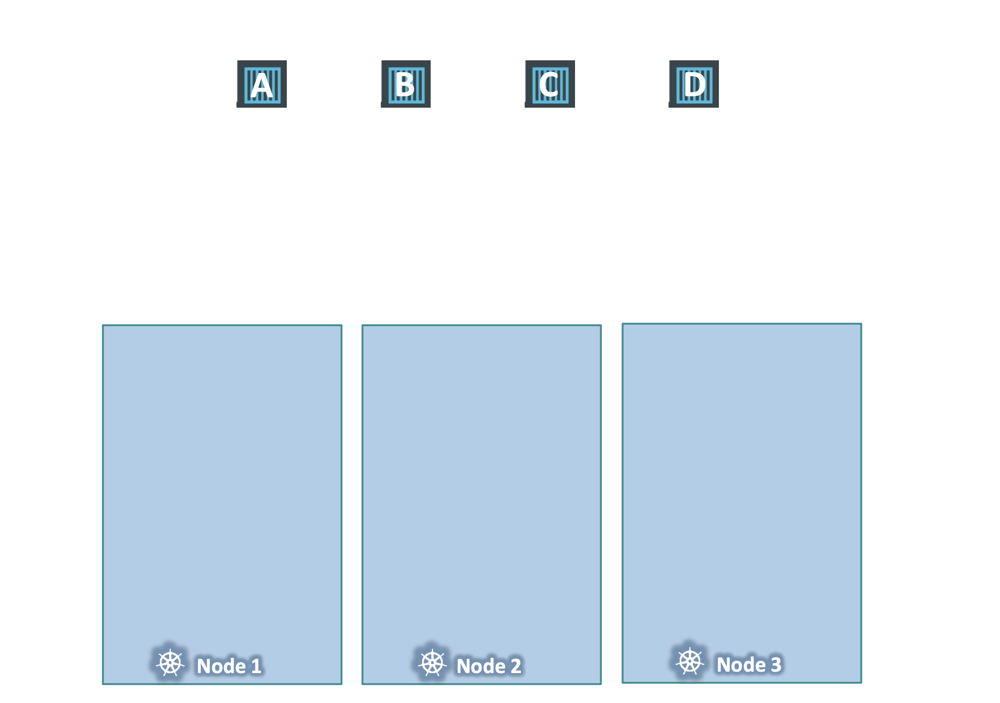

# Taints And Tolerations

> Node affinity is a property of Pods that attracts them to a set of nodes (either as a preference or a hard requirement). 
> Taints are the opposite -- they allow a node to repel a set of pods.

- Taint: the act or result of spoiling something or giving it an unpleasant quality
- Tolerant: having the ability to bear something unpleasant or annoying, or to keep going despite difficulties

**Example.**

벌레가 다가오지 못하게 `사람A` 에게 방충 스프레이를 뿌리면, 냄새에 견디지 못하는 벌레들이 다가오지 못하게 할 수 있음
이 때, <u>① `사람A`를 Taint 상태로 지칭</u>
해당 방충 스프레이 냄새를 견딜 수 있는 벌레가 있을 수 있어서 사람에게 닿을 수 있다면,
그 <u>② 벌레는 해당 `Tolerant` 레벨에 견딜 수 있다</u>고 할 수 있음

**쿠버네티스: 사람 → `Node`, 벌레 → `Pod`**

 

### in Kubernetes

Now, taints and tolerations have nothing to do with security or intrusion on the cluster.

현재, Taint 와 Toleration는 클러스터의 보안이나 침입에 대해 아무 것도 할 수 있는 게 없음

**Taint 와 Toleration 는 어떤 Pod가 어떤 Node에 스케줄 될 때의 제한을 걸 수 있는 용도**

 

#### Example.

아래 그림처럼, Worker Node 3개가 있는 클러스터가 있음

  

각 Node 이름은 `Node 1`, `Node 2`, `Node 3`,

각 Pod 이름은 `Pod A`, `Pod B`, `Pod C`, `Pod D`

쿠버네티스 스케줄러는 스케줄링 시, 현재로선 제한이나 한계가 없기 때문에, 모든 노드에 Pod를 균형있게 배치

 

**특정 `Pod`만 `Node 1`에 배치하려면?**

**첫 번째**, `Node 1`에 `Taint`를 위치시켜서 모든 Pod가 위치되지 않도록 막음

→ `taint`를 `blue`로 지정

기본적으로, Pod는 구체적으로 명시하지 않으면 아무런 Toleration 이 없기 때문에, `Node 1`에는 어떤 Pod 도 배치될 수 없음

즉, 원치 않는 Pod는 `Node 1`에 배치되지 않음

다른 하나는 특정 포드를 이 노드에 두는 거예요

다음으로, 어떤 Pod가 `Node 1`의 Taint를 견딜 수 있게 (Tolerate) 지정

`Pod D`에 Tolerate 를 지정 → `Pod D` 구역은 `blue`에 대한 내성이 생김

스케줄러가 `Node 1`에 `Pod A`, `Pod B`, `Pod C`를 두려고 하면 오류로 인해 `Node 2`, `Node 3` 에 배치

스케줄러가 `Node 1`에 `Pod D`를 둠

  

