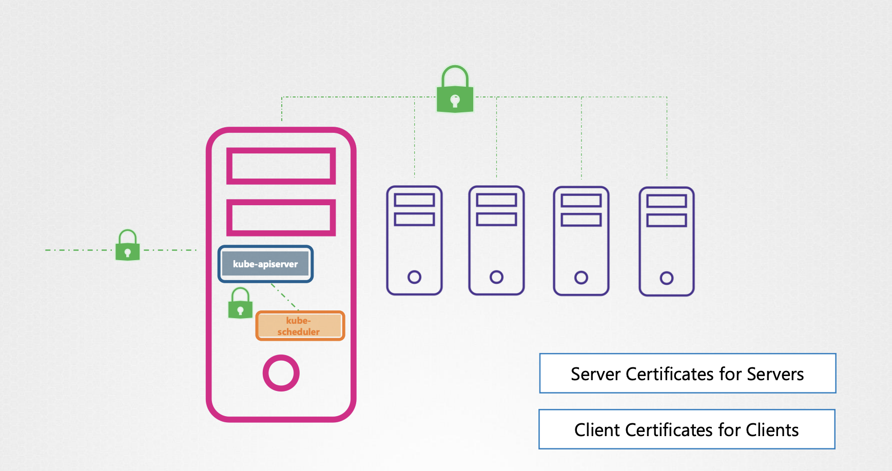
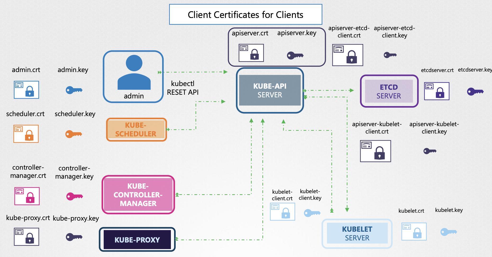
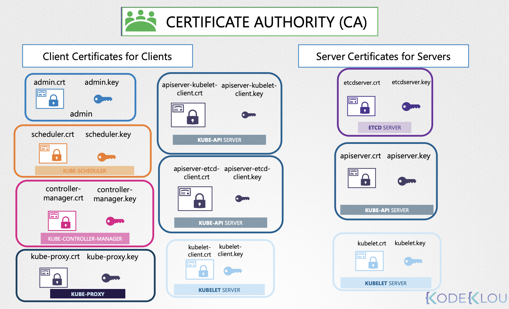

# TLS in Kubernetes

**Goals**

- What are TLS Certificates?
- How does Kubernetes use Certificates?
- How to generate them?
- How to configure them?
- How to view them?
- How to troubleshoot issues related to Certificates


---

#### STEP 1. `ssh-keygen` 명령어: 두 개의 키 생성

```Bash
❯ ssh-keygen
id_rsa  id_rsa.pub
```

- `id_rsa`: 🔑 Private Key
  - 주로 `*.key`, `*.-key.pem` 확장자를 가짐
- `id_rsa.pub`: 🔒 Public Key (엄밀히 Public Lock)
  - 주로 `*.crt`, `*.pem` 확장자를 가짐

<br>

#### STEP 2.

이후, Public Lock 을 통한 서버에 접근 이외의 모든 접근을 폐쇄하면 서버를 보호할 수 있음 

대부분, 발급한 public key를 가진 접근을 SSH authorized_keys 파일에 추가하면 끝남    

```Bash
❯ cat ~/.ssh/authorized_keys
ssh-rsa AAAAB223Fr34243Ds7aewEFSDsg7435... user1
```

누구나 `authorized_keys` 파일을 확인할 수 있지만, private key가 없이는 SSH 접근 불가


#### Public Key & Private Key

| Certificate (Public Key) <br> *format: `*.crt`, `*.pem`* | Private Key <br> *format: `*.key`, `*-key.pem`* |
|----------------------------------------------------------|-------------------------------------------------|
| server.crt                                               | server.key                                      |
| server.pem                                               | server-key.pem                                  |
| client.crt                                               | client.key                                      |
| client.pem                                               | client-key.pem                                  |

Public/Private Key에 대한 정해진 규칙은 없지만, 위와 같은 패턴 경향을 가짐

---

Certificate Authority (CA) 라는 인증 기관이
자체적으로 private과 public 세트 보관소가 존재해 서버 인증서에 서명할 때 사용할 수 있음

이를 root certificate(이하 루트 인증서) 라고 부름


- 서버가 클라이언트에게 클라이언트 인증서를 이용해 자신을 검증해달라고 요청

3가지 인증서 구성 필요

<br><br>

1. 서버: 서버 인증서
2. CA 서버: 루트 인증서
3. 클라이언트: 클라이언트 인증서


## TLS Certificates

쿠버네티스 클러스터에는 마스터 노드와 여러 개의 워커 노드로 구성됨

모든 노드들은 상호간의 통신을 할 수 있는데, 반드시 안정성을 보장해야 하고 암호화되어야 함

뿐만 아니라, 모든 클라이언트들, 모든 서비스와의 통신과도 안전해야함

가령, 쿠버네티스 클러스터와 통신하는 어드민이나 쿠버네티스 API에 직접 접근할 때도 반드시 TLS 통신이 필요 

<br><br>

따라서, 두 개의 주요 Certificate (이하 '인증서') 

클러스터 내의 모든 다양한 서비스가 **서버 인증서**를 사용하는 것과 
모든 클라이언트가 그들이 누구인지를 증명할 **클라이언트 인증서**를 사용하는 것이 필요

<br>

### kube-apiserver

API Server는 클러스터 관리를 위해 다른 컴포넌트 뿐 아니라, 외부 사용자에게도 HTTPS 서비스를 노출

그래서 버서는 이런 클라이언트와 안전하게 통신하기 위한 인증서가 필요 


```
 +----------- Kubernetes Cluster ------------+
 |  +------------+                           |
 |  |  KUBE-API  |   apiserver.crt  📜       |
 |  |   SERVER   |   apiserver.key  🗝️       |
 |  +------------+                           |
 +-------------------------------------------+
```

인증서 이름은 누가 어떤 방식으로 셋업 했는지에 따라 이름이 달라질 수 있음


```
 +----------- Kubernetes Cluster ------------+
 |  +------------+                           |
 |  |    ETCD    |   etcdserver.crt  📜      |
 |  |   SERVER   |   etcdserver.key  🗝️      |
 |  +------------+                           |
 |                                           |
 +   +---------- worker node -------------+  |
 |   |  +------------+                    |  |
 |   |  |   KUBELET  |  kubelet.crt  📜   |  |
 |   |  |   SERVER   |  kubelet.key  🗝   |  |
 |   |  +------------+                    |  |
 |   +------------------------------------+  |
 +-------------------------------------------+
```

서버 인증서가 필요한 또 다른 컴포넌트

- **ETCD**: 클러스터에 대한 모든 정보를 저장
- **kubelet**: 워커 노드에서 kube-apiserver와 통신하는 HTTPS API 노출

<br>

<br><br>

다음은 클라이언트 목록

- **Administer**: 어드민 사용자는 kube-apiserver에 인증하기 위한 인증서와 키 쌍이 필요한데, 이를 `admin.crt`, `admin.key` 라고 해보자
- **Scheduler**: 스케줄러는 kube-apiserver에 접근하는 클라이언트이기 때문에 클라이언트 TLS 인증서가 요구됨
- **Kube-controller-manager**: 컨트롤러 매니저는 kube-apiserver에 접근하는 또 다른 클라이언트로, 인증서 쌍이 필요
- **Kube-proxy**: 프록시 또한 kube-apiserver에 접근하는 클라이언트로, 인증서 쌍이 필요

사실, 이 모든 컴포넌트들은 kube-apiserver 와 통신하며, kube-apiserver은 etcd 서버와 통신하는 유일한 컴포넌트

즉, etcd의 입장에서 kube-apiserver는 클라이언트이기 때문에 kube-apiserver는 클라이언트에 해당하는 인증서가 필요

위에서 발급한 `apiserver.crt`, `apiserver.key` 페어를 사용해도 되고, 혹은
`apiserver-etcd-client.crt`, `apiserver-etcd-client.key` 와 같이 etcd 전용 키를 생성할 수도 있음

kube-apiserver는 kebelet server에도 통신을 하기 때문에 동일하게
`apiserver-kubelet-client.crt`, `apiserver-kubelet-client.key` 을 발급하는 방법이 있음

<br>

하나의 클러스터에 아래와 같이 다양한 인증서가 존재하는 것을 알 수 있음

<br><br>

하나는 클러스터의 모든 구성 요소에 대한 것이고 다른 하나는 특히 etcd에 대한 것입니다.

그 경우, API 서버 클라이언트 인증서인 etcd 서버 인증서 및 etcd 서버 클라이언트 인증서는 모두 etcd 서버 CA에 의해 서명될 것이다.

쿠버네티스 인증 시 하나 이상의 CA를 통한 인증서 발급 필수이며,

두 개 이상의 CA를 사용할 수도 있음

가령, 아래 이미지처럼 etcd 클러스터 만을 위한 CA를 따로 지정할 수 있음

<br><br>
