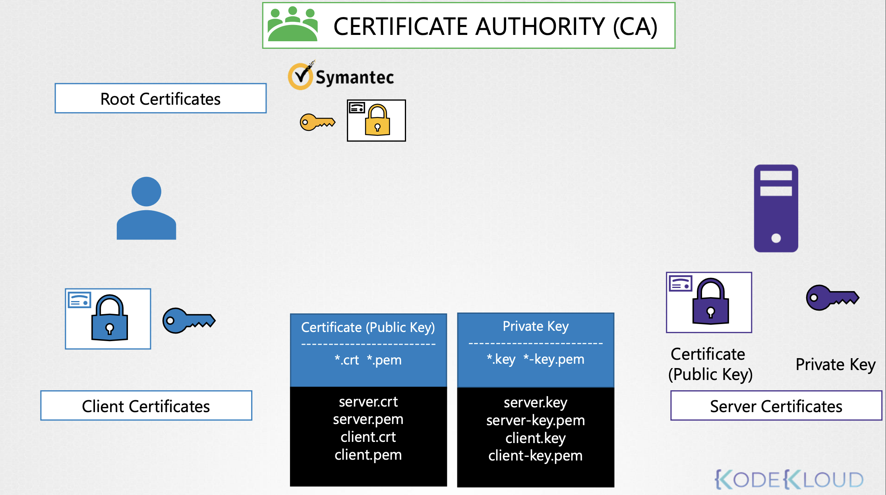

# TLS in Kubernetes

**Goals**

- What are TLS Certificates?
- How does Kubernetes use Certificates?
- How to generate them?
- How to configure them?
- How to view them?
- How to troubleshoot issues related to Certificates


---

#### STEP 1. `ssh-keygen` 명령어: 두 개의 키 생성

```Bash
❯ ssh-keygen
id_rsa  id_rsa.pub
```

- `id_rsa`: 🔑 Private Key
  - 주로 `*.key`, `*.-key.pem` 확장자를 가짐
- `id_rsa.pub`: 🔒 Public Key (엄밀히 Public Lock)
  - 주로 `*.crt`, `*.pem` 확장자를 가짐

<br>

#### STEP 2.

이후, Public Lock 을 통한 서버에 접근 이외의 모든 접근을 폐쇄하면 서버를 보호할 수 있음 

대부분, 발급한 public key를 가진 접근을 SSH authorized_keys 파일에 추가하면 끝남    

```Bash
❯ cat ~/.ssh/authorized_keys
ssh-rsa AAAAB223Fr34243Ds7aewEFSDsg7435... user1
```

누구나 `authorized_keys` 파일을 확인할 수 있지만, private key가 없이는 SSH 접근 불가


#### Public Key & Private Key

| Certificate (Public Key)       | Private Key                        |
|--------------------------------|------------------------------------|
| Format: **\*.crt**, **\*.pem** | Format: **\*.key**, **\*-key.pem** |
| server.crt                     | server.key                         |
| server.pem                     | server-key.pem                     |
| client.crt                     | client.key                         |
| client.pem                     | client-key.pem                     |

Public/Private Key에 대한 정해진 규칙은 없지만, 
위와 같은 패턴을 가짐

---


## TLS Certificates

Certificate Authority (CA) 라는 인증 기관이 
자체적으로 private과 public 세트 보관소가 존재해 서버 인증서에 서명할 때 사용할 수 있음 

이를 root certificate(이하 루트 인증서) 라고 부름


- 서버가 클라이언트에게 클라이언트 인증서를 이용해 자신을 검증해달라고 요청

3가지 인증서 구성 필요

<br><br>

1. 서버: 서버 인증서
2. CA 서버: 루트 인증서
3. 클라이언트: 클라이언트 인증서

