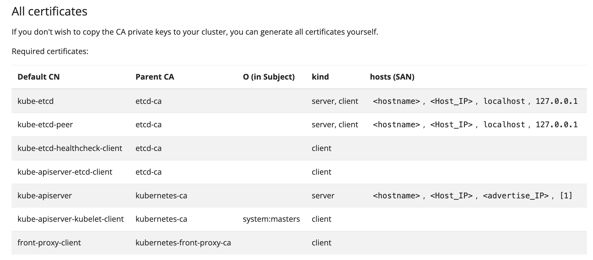
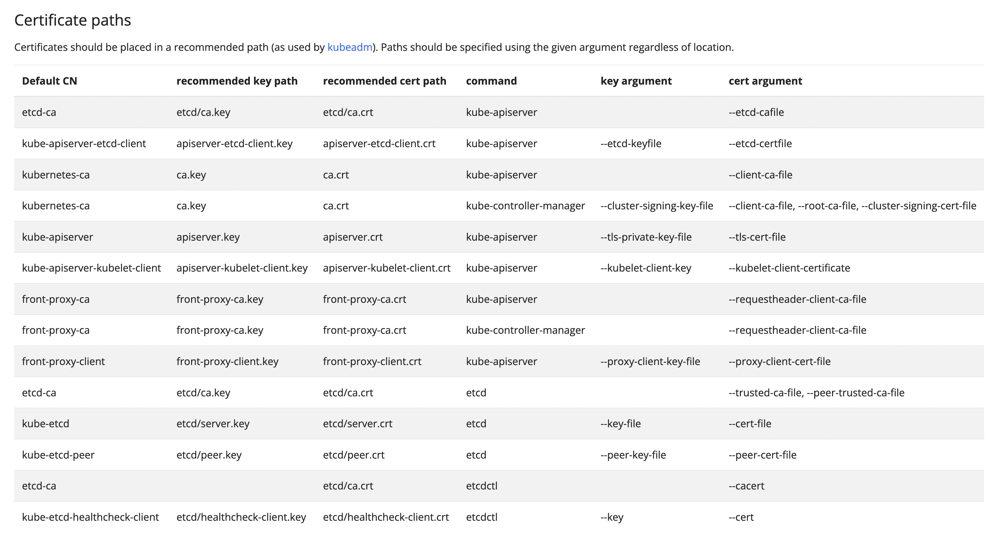
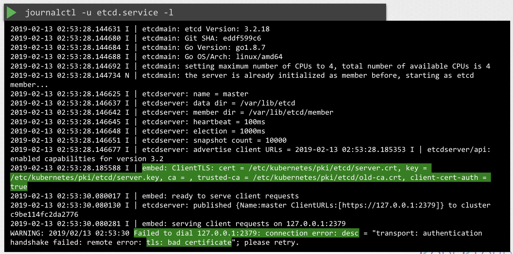
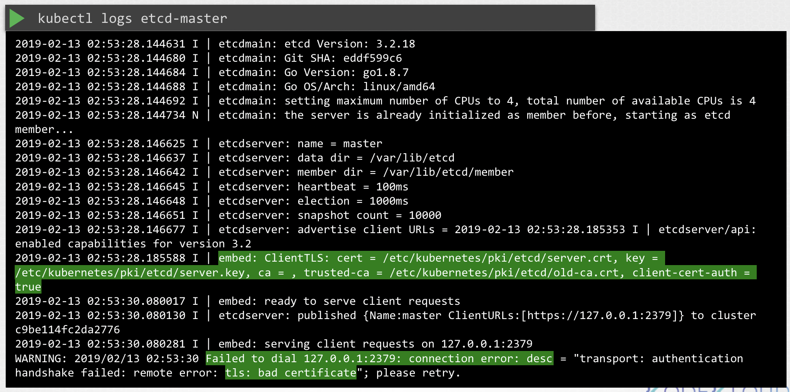

# View Certificate Details

Certificates 를 확인하는 방법에는 두 가지 존재

여기서 중요한 것은, 각 방식 별로 어디에 인증서와 키가 저장되어 있는지 알 수 있어야 트러블 슈팅이 가능 하다는 점

**CASE 1. 인증서를 각자 수동 설치**

```Bash
cat /etc/systemd/system/kibe-apiserver.service
```

**CASE 2. kubeadm 자동 설치**

먼저, kube-apiserver 정의 파일을 먼저 확인

```Bash
$ cat /etc/kubernetes/manifests/kube-apiserver.yaml
apiVersion: v1
kind: Pod
metadata:
  annotations:
    kubeadm.kubernetes.io/kube-apiserver.advertise-address.endpoint: 172.30.1.2:6443
  creationTimestamp: null
  labels:
    component: kube-apiserver
    tier: control-plane
  name: kube-apiserver
  namespace: kube-system
spec:
  containers:
  - command:
    - kube-apiserver
    - --advertise-address=172.30.1.2
    - --allow-privileged=true
    - --authorization-mode=Node,RBAC
    - --client-ca-file=/etc/kubernetes/pki/ca.crt
    - --enable-bootstrap-token-auth=true
    - --etcd-cafile=/etc/kubernetes/pki/etcd/ca.crt
    - --etcd-certfile=/etc/kubernetes/pki/apiserver-etcd-client.crt
    - --etcd-keyfile=/etc/kubernetes/pki/apiserver-etcd-client.key
    - --etcd-servers=https://127.0.0.1:2379
    - --kubelet-client-certificate=/etc/kubernetes/pki/apiserver-kubelet-client.crt
    - --kubelet-client-key=/etc/kubernetes/pki/apiserver-kubelet-client.key
    - --kubelet-preferred-address-types=InternalIP,ExternalIP,Hostname
    - --proxy-client-cert-file=/etc/kubernetes/pki/front-proxy-client.crt
    - --proxy-client-key-file=/etc/kubernetes/pki/front-proxy-client.key
    - --requestheader-allowed-names=front-proxy-client
    - --requestheader-client-ca-file=/etc/kubernetes/pki/front-proxy-ca.crt
    - --requestheader-extra-headers-prefix=X-Remote-Extra-
    - --requestheader-group-headers=X-Remote-Group
    - --requestheader-username-headers=X-Remote-User
    - --secure-port=6443
    - --service-account-issuer=https://kubernetes.default.svc.cluster.local
    - --service-account-key-file=/etc/kubernetes/pki/sa.pub
    - --service-account-signing-key-file=/etc/kubernetes/pki/sa.key
    - --service-cluster-ip-range=10.96.0.0/12
    - **--tls-cert-file=/etc/kubernetes/pki/apiserver.crt**
    - --tls-private-key-file=/etc/kubernetes/pki/apiserver.key
...
```

#### openssl x509 -in /path/to/file -text -noout 

```Bash
> openssl x509 -in /etc/kubernetes/pki/apiserver.crt -text -nnout
```

kube-apiserver 를 시작하는 데 사용된 명령은 사용하는 모든 인증서에 대한 정보를 갖고 있음

각 용도로 사용되는 **인증서 파일 확인**

가령, `/etc/kubernetes/pki/apiserver.crt` 인증서 파일을 먼저 확인하려면,
`openssl x509` 명령에 인증서 파일을 입력해 인증서를 디코딩하고 세부 사항을 확인할 수 있음

```Bash
$ openssl x509 -in /etc/kubernetes/pki/apiserver.crt -text -noout
Certificate:
    Data:
        Version: 3 (0x2)
        Serial Number: 2992238133408898708 (0x298690ba91371e94)
        Signature Algorithm: sha256WithRSAEncryption
        **Issuer: CN = kubernetes** 
        Validity
            Not Before: Apr 11 16:22:33 2024 GMT
            **Not After : Apr 11 16:27:33 2025 GMT**    # 3. Expiry Date 
        **Subject: CN = kube-apiserver**                # 1.
        Subject Public Key Info:
            Public Key Algorithm: rsaEncryption
                RSA Public-Key: (2048 bit)
                Modulus:
                    00:da:b4:08:55:8b:14:37:c3:43:ac:23:11:11:00:
                    ...
                Exponent: 65537 (0x10001)
        X509v3 extensions:
            X509v3 Key Usage: critical
                Digital Signature, Key Encipherment
            X509v3 Extended Key Usage: 
                TLS Web Server Authentication
            X509v3 Basic Constraints: critical
                CA:FALSE
            X509v3 Authority Key Identifier: 
                keyid:F3:A9:C2:A5:25:95:53:D7:6B:85:D2:E5:EF:B9:38:12:26:14:CC:46

            **X509v3 Subject Alternative Name:**        # 2.
                **DNS:controlplane, DNS:kubernetes, DNS:kubernetes.default, DNS:kubernetes.default.svc, DNS:kubernetes.default.svc.cluster.local, IP Address:10.96.0.1, IP Address:172.30.1.2**
    Signature Algorithm: sha256WithRSAEncryption
         68:93:d4:d6:9d:a5:25:b1:3f:4b:10:7b:15:98:57:53:d7:38:
         ...
```

**디버깅 가이드**

1. **Subject** Section: 인증서에 포함된 CN (Common Name) 을 확인할 수 있고, 위 경우 kube-apiserver 로 지정됨
2. **Subject Alternative Name** Section: kube-apiserver의 대체 이름은 많기 때문에 전부 다 있는지 확인해야 함
3. **Validity** Section: 만료일 확인

추가로, **Issuer** Section 에서 인증서 발급자인 증명서를 발행한 CA를 확인할 수 있음

`kubeadm`은 `Kubernetes CA` 자체로 불림

<br><br>
<br><br>

**📌 살펴볼 것**

- CN Name
- Alternative Names
- Organization
- Issuer
- Expiation

만약 위 필드 중 문제가 발생했다면, 로그를 확인

<br><br>

**CASE 1. 인증서를 각자 수동 설치**

```Bash
journalctl -u etcd.service -l
```

<br><br>

**CASE 2. kubeadm 자동 설치**

만약 kubeadm 으로 설치했다면, `kubectl logs` 를 통해 확인

<br><br>

가끔 API 서버나 Etcd 서버 같은 핵심 구성 요소가 다운되면 kubectl 명령이 작동하지 않을 수 있는데,
이 경우 Docker 에서 로그를 확인해야 함

```Bash
docker logs <<container-id>>
```

`docker ps` 명령으로 모든 컨테이너를 목록화하고 docker logs 로 로그 확인

<br>

---

<br>

### Hands-On


```Bash
controlplane ~ ➜  ll /etc/kubernetes/pki/ -R
/etc/kubernetes/pki/:
total 72
drwxr-xr-x 3 root root 4096 May  7 12:57 ./
drwxrwxr-x 1 root root 4096 May  7 12:57 ../
-rw-r--r-- 1 root root 1289 May  7 12:57 apiserver.crt
-rw-r--r-- 1 root root 1123 May  7 12:57 apiserver-etcd-client.crt
-rw------- 1 root root 1675 May  7 12:57 apiserver-etcd-client.key
-rw------- 1 root root 1675 May  7 12:57 apiserver.key
-rw-r--r-- 1 root root 1176 May  7 12:57 apiserver-kubelet-client.crt
-rw------- 1 root root 1675 May  7 12:57 apiserver-kubelet-client.key   # 
-rw-r--r-- 1 root root 1107 May  7 12:57 ca.crt
-rw------- 1 root root 1675 May  7 12:57 ca.key
drwxr-xr-x 2 root root 4096 May  7 12:57 etcd/
-rw-r--r-- 1 root root 1123 May  7 12:57 front-proxy-ca.crt
-rw------- 1 root root 1679 May  7 12:57 front-proxy-ca.key
-rw-r--r-- 1 root root 1119 May  7 12:57 front-proxy-client.crt
-rw------- 1 root root 1679 May  7 12:57 front-proxy-client.key
-rw------- 1 root root 1679 May  7 12:57 sa.key
-rw------- 1 root root  451 May  7 12:57 sa.pub

/etc/kubernetes/pki/etcd:
total 40
drwxr-xr-x 2 root root 4096 May  7 12:57 ./
drwxr-xr-x 3 root root 4096 May  7 12:57 ../
-rw-r--r-- 1 root root 1094 May  7 12:57 ca.crt
-rw------- 1 root root 1675 May  7 12:57 ca.key
-rw-r--r-- 1 root root 1123 May  7 12:57 healthcheck-client.crt
-rw------- 1 root root 1675 May  7 12:57 healthcheck-client.key
-rw-r--r-- 1 root root 1208 May  7 12:57 peer.crt
-rw------- 1 root root 1675 May  7 12:57 peer.key
-rw-r--r-- 1 root root 1208 May  7 12:57 server.crt
-rw------- 1 root root 1679 May  7 12:57 server.key
```