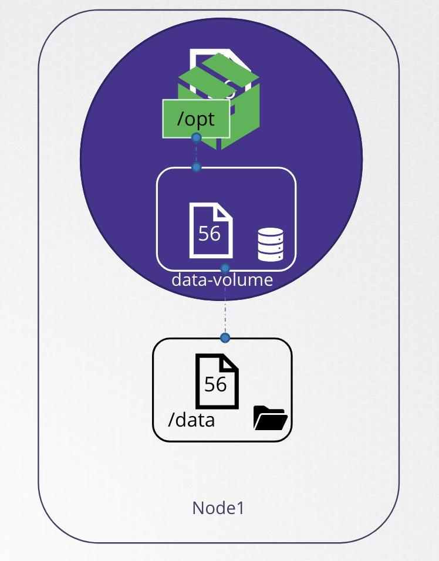
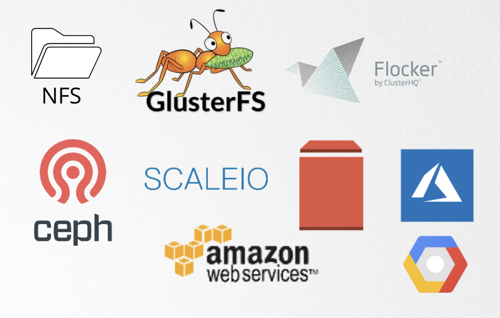

# Volumes

쿠버네티스는 Docker 와 동일하게 Pod의 수명에 상관없이 영구적으로 저장되는 데이터를 Volume에 저장할 수 있음

```yaml
apiVersion: v1
kind: Pod
metadata:
  name: random-number-generator
spec:
  containers:
    - image: alpine
      name: alpine
      command: ["/bin/sh", "-c"]
      args: ["shuf -i 0-100 -n 1 >> /opt/number.out;"]
      volumeMounts:
        - mountPath: /opt
          name: data-volume

  volumes:
    - name: data-volume
      hostPath:
        path: /data
        type: Directory
```


<br>

```
+------------ Node -----------+        +------------ Node -----------+
|                             |        |                             |    
|  +--------- Pod ---------+  |        |                             |    
|  |                       |  |        |                             |    
|  |   +-- Container --+   |  |        |                             |    
|  |   |      /opt     |   |  |        |                             |    
|  |   +-------+-------+   |  |  Pod   |                             |
|  |           |           |  |  제거   |                             |
|  |   +- data-volume -+   |  | -----→ |                             |
|  |   |       📄      |   |  |        |                             |
|  |   +-------+-------+   |  |        |                             |
|  +-----------+-----------+  |        |                             |
|              |              |        |      데이터는 여전히 남아 있음    |
|       +------+-------+      |        |       +------+-------+      |
|       |  📄 /data    |      |        |       |  📄 /data    |      |
|       +--------------+      |        |       +--------------+      |
+-----------------------------+        +-----------------------------+
```

<br>

<br><br>

---

### Volume Types

위의 예시에서는 `hostPath` 필드에 Host의 디렉터리 경로를 입력해서, 
볼륨을 위한 스토리지로 Host 디렉터리로 직접 설정했음

단일 노드에선 문제없지만, 다중 노드 클러스터에선 권장하지 않음

서버가 다르기 때문에 동일한 데이터를 사용할 수 없음

이를 위해 **외부 클러스터 저장소**를 구성할 수 있음

쿠버네테스는 다양한 유형의 저장소 솔루션을 지원

<br><br>

가령 EBS 를 사용하려면 아래와 같이 사용할 수 있음 

```yaml
...
  volumes:
    - name: data-volume
      awsElasticBlockStore:
        volumeID: <volume-id>
        fsType: ex4
```

