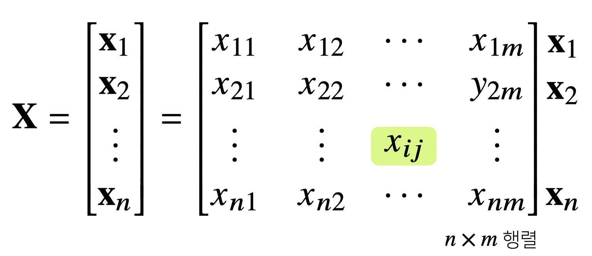
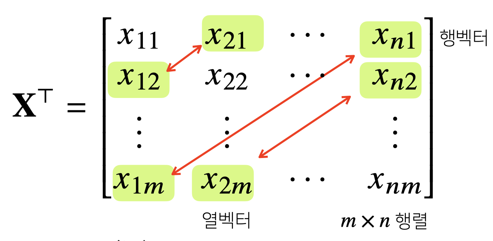
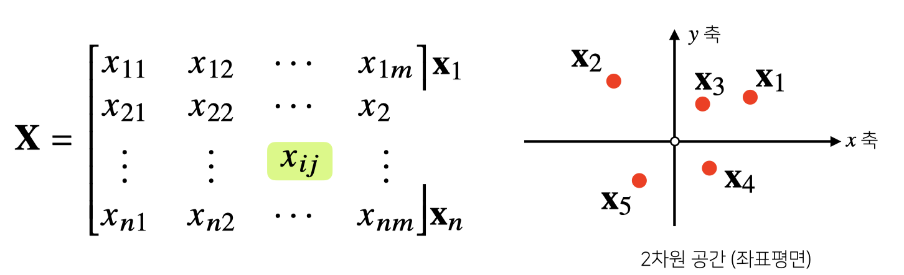
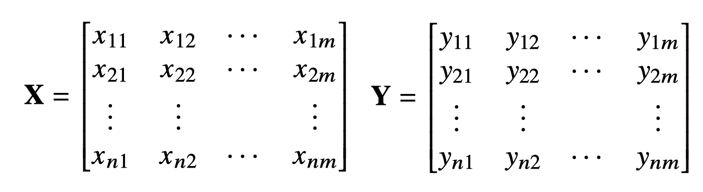
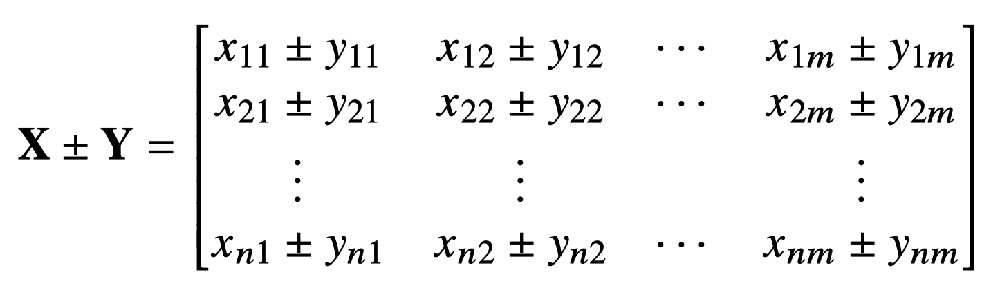
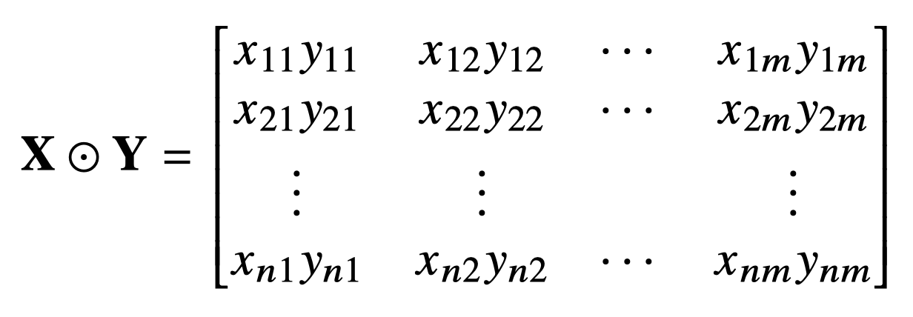
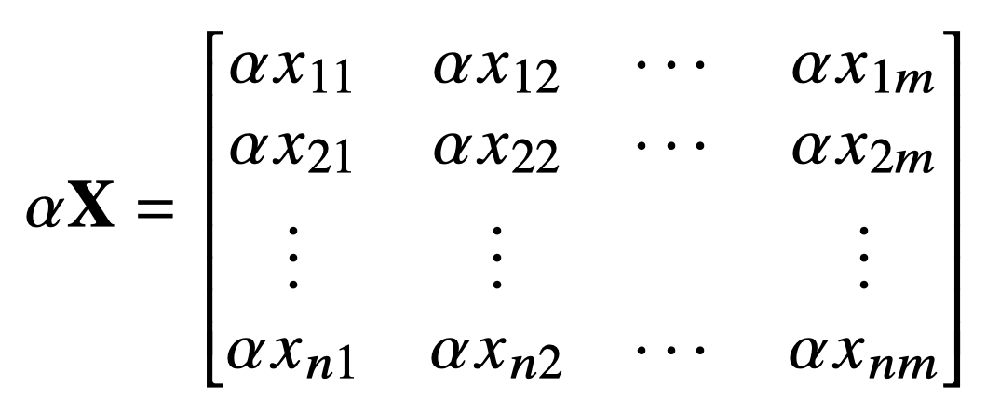
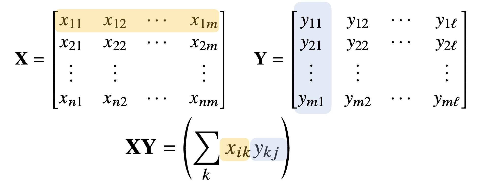

<small>Mathematics for Artificial Intelligence</small>

## Matrix

<br />

>  **행렬의 개념과 연산**, 그리고 **벡터공간에서 가지는 의미**를 설명합니다.
>
> **연립방정식 풀기**와 **선형회귀분석**에 응용하는 방법을 소개합니다.
>
>  
>
> 벡터의 확장된 개념인 행렬은 행(row)벡터를 원소로 가지는 2차원 배열로 벡터와 다르게 계산되는 연산들에 주의하셔야 합니다.
>
> 행렬연산은 딥러닝에서 가장 핵심적인 연산이라고 볼 수 있을만큼 중요하고, 자주 사용되기 때문에 행렬 연산의 메커니즘,그리고 이 때 가지는 기하학적 의미와 머신러닝에서 어떻게 사용되는지를 충분히 이해하고 넘어가시기 바랍니다.

<br />

✔️ **행렬(matrix)은 벡터를 원소로 가지는 2차원 배열**

행렬은 보통 열 벡터를 원소로 가지는 2차원 배열이라고 생각할 수 있지만, 

Numpy를 통해 행렬을 다룰 때 행 벡터를 원소로 가지는 2차원 배열이라고 생각하는 것이 구현할 때 실수를 줄일 수 있다.

행렬의 곱셈을 할 때 조금 더 명확하게 이해할 수 있음

<br />

``` python
# 3개의 행 벡터를 가지는 Numpy 행렬 X
X = np.array([[1, -1, 3],
              [7, 5, 0],
              [-2, -1, 2]])
```

<br />



$n$ 개의 행과 $m$ 개의 열을 가지는 행렬로 표현할 수 있음

<br /><br />

✔️ **행렬은 행(row)과 열(column)이라는 인덱스를 가짐**

<small>두 개의 인덱스를 가지기 때문에 순서를 명확하게 이해해야함</small>

행렬의 이름의 순서대로 **행을 먼저 적고 열을 적음**

<br />

#### 행렬과 벡터 표기

행렬과 벡터 표현법에는 여러가지가 있지만, 벡터는 소문자 볼드체 ($x_1 \sim x_n$), 행렬은 대문자 볼드체 ($X$)로 표시한다.

> 논문이나 관련 연구 내용을 읽을 때 참고하자

<br />

$X = (x_{ij})$

그래서 행렬을 표기할 때에는 대문자 볼드체인 $X$ 뿐만 아니라, $(x_{ij})$ 와 같이 표기하기도 한다.  i번째 행벡터에 있는 j번째 원소

<br /><br />

✔️ **행렬의 특정 행(열)을 고정하면 행(열)벡터라고 부름**

몇 행의 행 벡터, 몇 열의 열 벡터라는 개념으로 받아들이자

<br /><br />

🚨 행 벡터와 열 벡터 사이의 연산이 어떻게 이뤄지는 지 잘 살펴보자

<br /><br />

### 전치행렬

<small>transpose matrix</small>

**행과 열의 인덱스가 바뀐 행렬**

<br />



<br />

앞에서 봤던건 $X = (x_{ij})$ 이었고, 전치 행렬은 $X^{T} = (x_{ji})$ 

**행렬의 우측 상단에 $T$ (transpose) 기호**를 붙임, 모든 원소들에 대해 행과 열의 인덱스를 바꾸었다고 해석

원래 $n$ 개의 행과 $m$ 개의 열로 이루어진 행렬이 위의 그림과 같이 $m$ 개의 행과 $n$ 개의 열로 이루어진 행렬로 변경된다는 의미

행렬의 연산에서 많이 사용되기 때문에 잘 숙지하자

<br />

✏️ **참고, 벡터에 전치 행렬을 씌우게 되면?**

벡터도 행 벡터가 열 벡터로 변경되고, 열 벡터가 행 벡터로 변경된다

<br /><br />

#### 행렬을 이해하는 방법 - 데이터 집합

✔️ **벡터가 공간에서 한 점을 의미한다면 행렬을 여러 점들을 나타냄**

<br />



<br />

각각의 행 벡터가 하나의 데이터로 이해한다면 행렬은 이 데이터를 모은 배열로 이해

기계학습이나 통계학에서는 전체 데이터로 모아놓은 것(데이터 집합)을 표현할 때 행렬로 표현

<br />

✔️ **행렬의 행벡터 $x_{i}$  는 $i$ 번째 데이터를 의미함**

✔️ **행렬의 $x_{ij}$  는 $i$ 번째 데이터의 $j$ 번째 변수의 값을 말함**

<br /><br />

### 행렬의 연산

<br />



<br />

위의 행렬을 연산하려면 어떻게 될지 알아보자.

<br />

#### 행렬의 덧셈과 뺄셈

✔️ 행렬은 벡터를 원소로 가지는 **2차원 배열**

✔️ 행렬도 <small>벡터와 마찬가지로</small> **같은 모양을 가지면** 덧셈과 뺄셈이 가능

<br />

$X \pm Y = ( x_{ij} \pm y_{ij})$

벡터의 덧・뺄셈과 다른게 없음

위의 $X$, $Y$ 행렬의 덧・뺄셈은 아래와 같다.

<br />



<br />

Numpy를 사용할 때 숫자의 덧・뺄셈과 동일하게 연산할 수 있음

<br />

#### 행렬의 성분곱

<br />

$X \odot Y = ( x_{ij} y_{ij})$

성분곱 또한 벡터와 같다. 

**각 인덱스 위치끼리 곱** : $X$ 행렬의 $i$ 번째 행의 $j$ 번째 원소의 데이터와 $Y$ 행렬의 $i$ 번째 행의 $j$ 번째 원소의 데이터의 곱으로 연산한다

<br />




#### 행렬의 스칼라곱

<br />

$\alpha X = (\alpha x_{ij})$

스칼라곱 또한 벡터와 같다. 

<br />



<br /><br />

### 행렬 곱셈

행렬 곱셈(matrix multiplication)은 **$i$ 번째 행벡터와 $j$ 번째 열벡터 사이의 내적**을 성분으로 가지는 행렬을 계산

<br />

$XY = (\sum_k x_{ik} y_{kj} )$

<br />



<br />

행렬의 순서에 따라 결과 행렬이 달라지기 때문에 순서 중요

👉🏻 행렬곱은 $X$ 의 열의 개수와 $Y$ 의 행의 개수가 같아야 한다

<br />

``` python
X = np.array([[1, -2, 3],
              [7, 5, 0],
              [-2, -1, 2]])

Y = np.array([[0, 1],
              [1, -1],
              [-2, 1]])

# numpy에서 행렬곱셈은 @연산을 사용

print(X @ Y)
# array([[-8, 6],
#        [ 5, 2],
#        [-5, 1]])
```

1번째 행벡터의 1번째 원소는 `1・0 + (-2)・1 + 3・(-2) = -8` 로 계산됨


