<small>Mathematics for Artificial Intelligence</small>

## Vector

<br/>

> **벡터의 기본 개념과 연산**, **노름**에 대해 소개합니다.
> **두 벡터 사이의 거리와 각도**, 그리고 **내적**에 대해 설명합니다.
>
>
> 벡터는, 딥러닝에서 매우 중요한 선형대수학의 기본 단위가 되고, 앞으로 배우실 numpy에서도 굉장히 많이 사용되는 연산이기 때문에 확실하게 잡고 가셔야 할 개념입니다. 벡터간의 연산을 단순히 숫자 계산으로 끝내기보단, 공간에서 어떤 의미를 가지는지를 이해하는 것이 중요합니다.
>
> 노름이나 내적 같은 개념 또한, 그 자체로 가지는 기하학적인 성질과 이것이 실제 머신러닝에서 어떻게 사용되는지를 같이 생각해보시면서 공부하셨으면 좋겠습니다.

<br/>

벡터는 **숫자를 원소로 가지는 리스트(list) 또는 배열 (array)** 입니다.

<br/>

세로로 나열 - 열 벡터

가로로 나열 - 행 벡터

보통 행 벡터 사용!

<br/>

### Vector ? 

✔️ 벡터는 공간에서 **한 점**을 나타냄

✔️ 벡터는 원점으로부터 상대적 **위치**를 표현

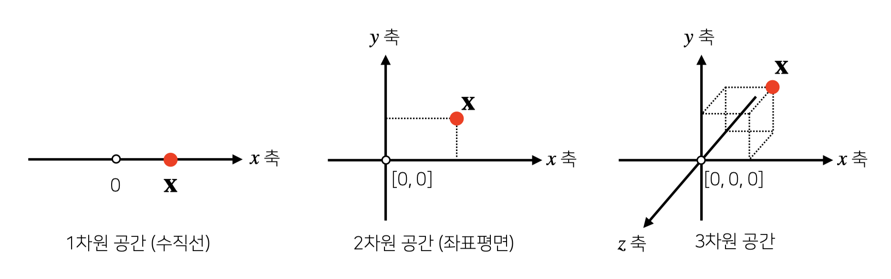

<br/>

✔️ 숫자($\alpha$)를 곱해주면 **길이**만 변함 (스칼라곱) 

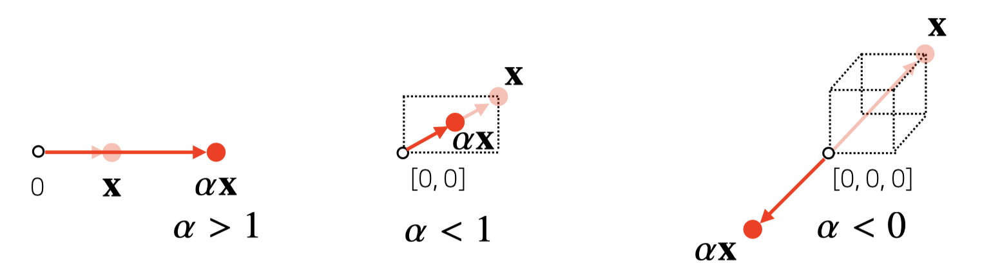


$\alpha > 1$ 일 때, 벡터의 길이는 늘어나고,  $\alpha < 1$ 일 때, 벡터의 길이는 줄어든다. 단,  $\alpha < 0$ 일 때, 벡터는 반대 방향이 된다.

<br/><br/>

### 벡터의 연산

✔️ 벡터끼리 같은 모양을 가진다면 덧셈과 뺄셈을 할 수 있음

<br/>

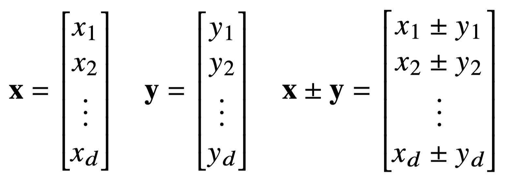

<br/><br/>

✔️ 벡터끼리 같은 모양을 가지면 성분곱(Hadamard product)

<br/>

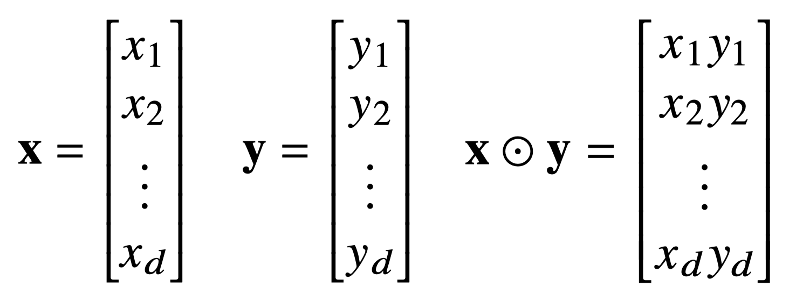

<br/><br/>

### 벡터의 노름(norm)

✔️ 벡터의 노름(norm)은 **원점에서부터의 거리**

다양한 방식으로 노름을 정의함. 임의의 차원 $d$에서 원점에서 부터의 거리

노름(norm)의 기호 : $∥ ⋅ ∥$ 

<br/>

#### $L_1\ norm$ 

각 성분의 변화량의 절대값을 모두 더함

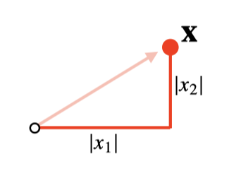

$||x||_1 = \sum_{i=i}^{d}|x_i| = L_1norm$

<br/>

``` python
# L1 numpy로 표현해보기
def l1_norm(x):
  x_norm = np.abs(x)
  x_norm = np.sum(x_norm)
  return x_norm
```

<br/><br/>

#### $L_2\ norm$ 

피타고라스 정리를 이용해 **유클리드 거리를 계산**

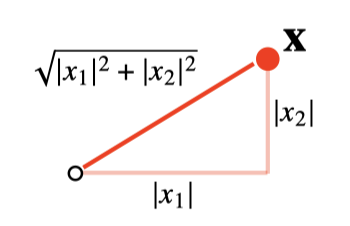

$||x||_2 = \sqrt {\sum_{i=i}^{d}|x_i|^2} = L_2norm$

<br/>

``` python
# L2 numpy로 표현해보기
def l2_norm(x):
  x_norm = x * x
  x_norm = np.sum(x_norm)
  x_norm = np.sqrt(x_norm)
  return x_norm
```

<br/><br/>

#### $L_1\ norm$  vs $L_2\ norm$ 

<br/>

노름의 종류에 따라 **기하학적 성질**이 달라진다. 

머신러닝에선 각 성질들이 필요할 때가 있으므로 **둘 다 사용**.

<br/>

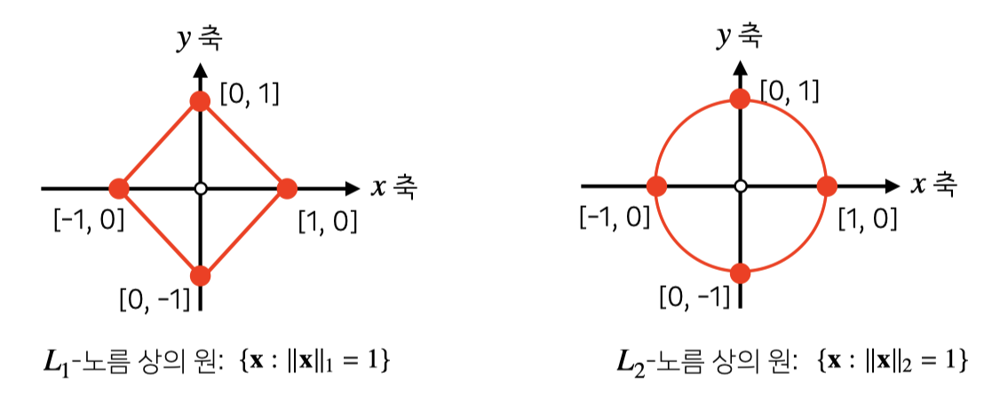

<br/>

기계학습에서 사용되는 **목적**에 따라 달라짐.

✔️ $L_1\ norm$ : $Robust$ 학습, $Lasso$ 회귀 등에 사용

✔️ $L_2\ norm$ : $Laplace$ 근사, $Ridge$ 회귀 등에 사용

<br/><br/>

### 두 벡터 사이의 거리

두 벡터 사이의 거리를 계산할 때는 벡터의 **뺄셈**을 이용

<br/>

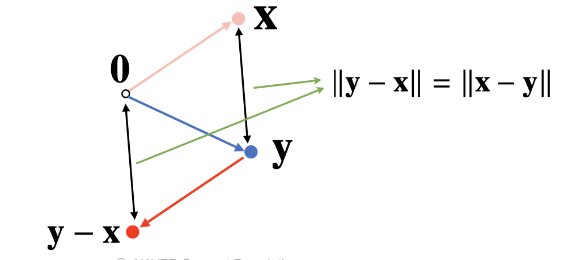

✔️ **X와 Y사이의 거리** : 두 노름의 차

<br/><br/>

### 두 벡터 사이의 각도

각도는 $L_2\ norm$에서만 연산 가능 👉🏻 $d$ 차원에서 계산할 수 있도록 사용

**제 2 코사인 법칙**에 의해 두 벡터 사이의 각도를 계산할 수 있음

분자를 쉽게 계산하는 방법이 **내적**

<br/>

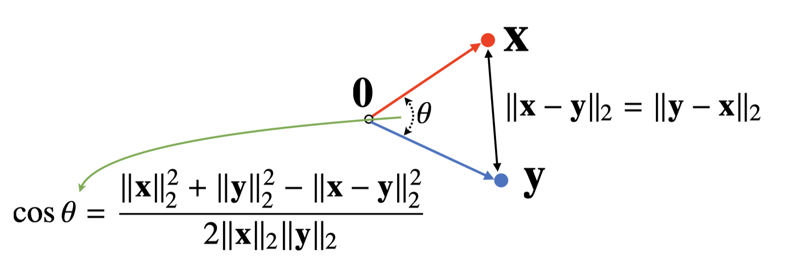

<br/>

#### 제 2 코사인 법칙

<br/>

<p align="center">

$ \overline{XY}^2 = \overline{OX}^2 + \overline{OY}^2 -2\ \overline{OX}\ \overline{OY} \cos \theta$ 

</p>

<br/>

위의 식을 $\cos \theta$ 에 대해 정리하면 아래와 같습니다.

<p align="center">

$\cos \theta = \Large{ \overline{OX}^2 + \overline{OY}^2 -\overline{XY}^2 \over 2\ \overline{OX}\ \overline{OY}}$

<br/>

즉, $\cos \theta = \Large{
{||x||_{2}^2 + ||y||_{2}^2 - ||x-y||_{2}^2 }
\over{2\ ||x||_2 ||y||_2} }$ $= \Large{{2\ \normalsize{\langle X, Y\rangle}}\over{2\ ||x||_2 ||y||_2}}$

이때, $\langle X, Y\rangle = \Large{\sum_{i=1}^{d} x_i y_i}$

</p>

``` python
def angle(x, y):
  v = np.inner(x, y) / (l2_norm(x) * l2_norm(y))
  theta = np.arcos(v)
  return theta
```

다시 한 번 강조하자면 L2 norm에서만 계산 가능하다

<br/>

#### 내적?

**정사영(orthogonal projection)된 벡터의 길이**와 관련 있음

Proj(x)는 벡터 $y$로 정사영된 벡터 $x$의  그림자를 의미하는데, **Proj(X)의 길이**는 코사인 법칙에 의해 $||x|| \ cos \theta $

<br/>

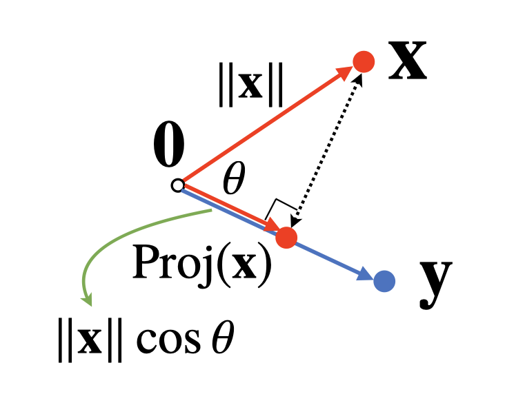


<br/>

내적은 정사영의 길이를 벡터 y의 길이 $||y||$ 만큼 조정한 값

 $\langle X, Y\rangle = ||y||Proj(x) = ||x||_2 ||y||_2 \cos \theta$

<br/>

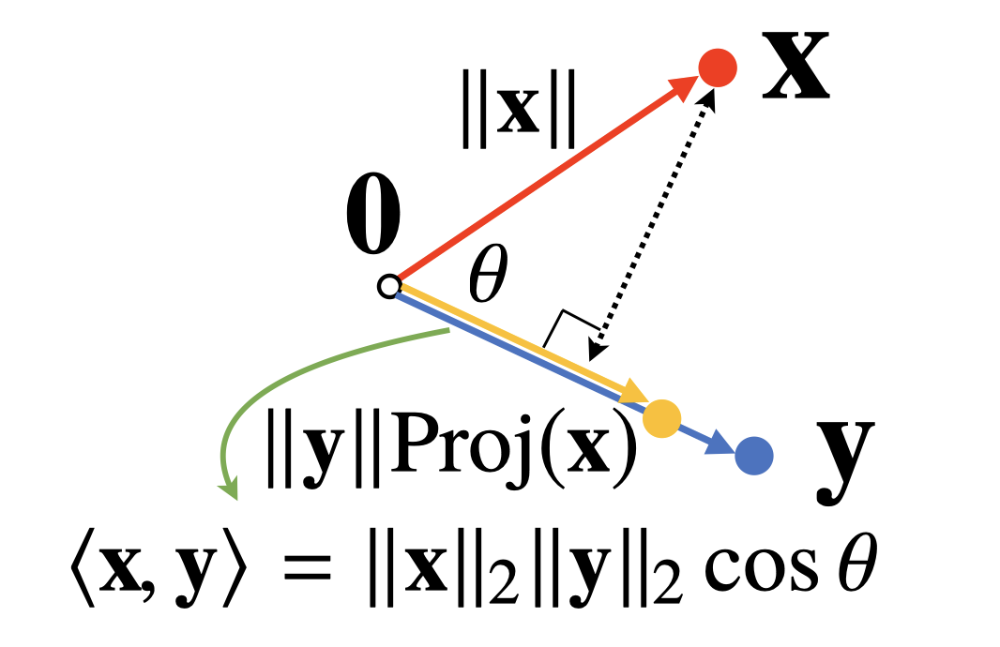

<br/>

내적은 두 벡터의 **유사도(similarity)**를 측정하는데 사용 가능하다.

머신러닝이나 딥러닝에서는 두 데이터나 두 패턴이 얼마나 유사한지를 측정하는데 사용하곤 함.

<br/><br/>

머신러닝이나 딥러닝에서 Numpy를 통해 자유자재로 사용하게될 개념이기 때문에 정확히 알고 넘어가는 것이 중요


