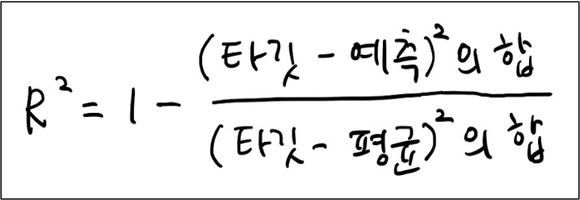

# 기계학습


## 회귀 (Regression)

지도학습 알고리즘은 분류와 회귀로 나뉘어짐.

**분류** : 몇 개의 클래스 중 하나로 분류하는 문제

**회귀** : 임의의 어떤 숫자를 예측하는 문제


### k-최근접 이웃 회귀

#### k-최근접 이웃 분류 알고리즘

예측하려는 샘플에 가장 가까운 샘플 k개를 선택.

 샘플들의 클래스를 확인하여 다수 클래스를 새로운 샘플의 클래스로 예측


#### k-최근접 이웃 회귀 알고리즘

이웃 샘플의 수치를 사용해 새로운 샘플의 타깃을 예측하는 간단한 방법은 이 수치들의 평균값을 구하는 것.


여기 생략


### 결정 계수(R^2)

score() : 분류에서는 정확도를 평가, 회귀에서는 **결정계수(coefficient determination) R^2 를 평가**한다.

- 회귀의 경우에서는 예측하는 값이나 타깃 모두 임의의 수치이기 때문에 정확한 숫자를 맞힌다는 것은 불가능. 예측이 타깃에 아주 가까워지면 (분자가 0에 가까워지기 때문에) R^2 는 1에 가까운 값이 된다.

- 타깃의 평균 정도를 예측하는 수준이라면 (분자와 분모가 비슷해져) R^2는 0에 가까워진다.





``` python
# 사이킷런에서 k-최근접 이웃 회귀 알고리즘을 구현한 클래스는 KNeighborsRegressor이다.
from sklearn.neighbors import KNeighborsRegressor

# k-최근점 이웃 회귀 모델 객체를 생성한다.
knr = KNeighborsRegressor()
# fit()는 훈련세트로 모델을 훈련시킨다.
knr.fit(train_input, train_target)

# score()는 테스트세트로 모델을 평가한다.
knr.score(test_input, test_target)
```


### 회귀 모델의 훈련과 평가 - 오차의 평균

타깃과 예측한 값 사이의 차이로 예측 범위 평가

sklearn.metrics 패키지에서 mean_absolute_error 클래스는 타깃과 예측의 절댓값 오차를 평균하여 반환


### 과대 적합 VS 과소 적합

대부분 훈련 세트의 결정 계수와 테스트 세트의 결정 계수를 비교하면 훈련 세트에서 더 좋은 점수가 나옴 (훈련 세트에서 훈련했으므로)

#### 과대 적합 overfitting

- 훈련세트에서 점수가 굉장히 좋았는데, 테스트 세트에서 점수가 굉장히 나쁘다면 **모델이 훈련 세트에 과대적합**되었다고 말함. (일반적으로 과대 적합이지만, 그 편차가 커질 경우 과대적합이라고 말함)

#### 과소 적합 underfitting

- 훈련세트보다 테스트 세트의 점수가 높거나 두 점수가 모두 너무 낮은 경우에는 **모델이 훈련세트에 과소적합**되었다고 말함.

과소적합 해결 : 모델을 조금 더 복잡하게 만들어야 함.

k-최근점 이웃 알고리즘의 모델을 더 복잡하게 만드는 방법은 **이웃의 개수 k를 줄이는 것**. (예측할 수 있는 경우를 적게 주면 더 어려워지므로. )

``` python
# 이웃의 갯수를 3으로 설정하는 방법
knr.n_neighbors = 3
```


