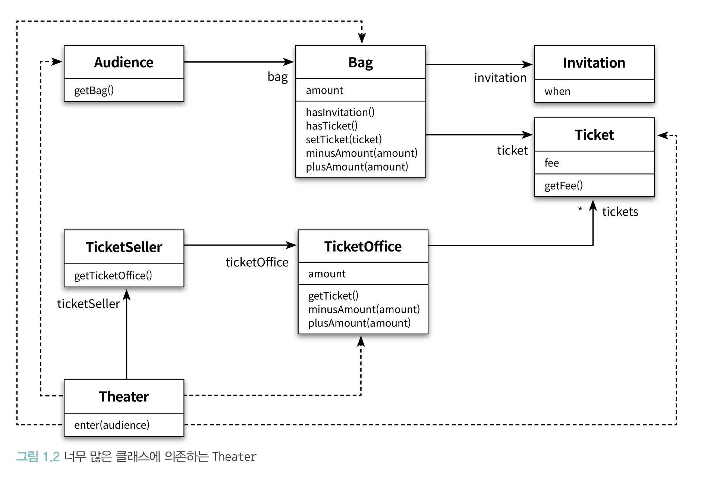

<small><i>22.05.22 SUN<i></small>

# Chapter 1. 객체, 설계


> "이론이 먼저일까, 실무가 먼저일까?"

> 실무가 어느정도 발전하고 난 다음에야 비로소 실무의 실용성을 입증할 수 잇는 이론이 서서히 그 목습을 갖춰가기 시작하고, 해당 분야가 충분히 성숙해지는 시점에 이르러서야 이론이 실무를 추워하게 된다. 
> 
> *로버트 L. 글래스*


필자는 추상적인 개념과 이론은 훌륭한 코드를 작성하는 데 필요한 도구일 뿐, **프로그래밍을 통해 개념과 이론을 배우는 것**이 개념과 이론을 통해 프로그래밍을 배우는 것보다 더 훌륭한 학습 방법이라고 주장한다.

## 1. 티켓 판매 앱 구현

**공연 입장 고객 입장 방법**

- 이벤트 당첨 : 당첨 여부 확인 후 무료 관람
- 그 외     : 티켓 판매 후 입장

chapter01의 ticket.v1 package를 구현해보자.

<br/>

<details>
<summary>ticket v1</summary>

``` java
public class Invitation {
    private LocalDateTime when;
}
```

```java
public class Ticket {
   private Long fee;

   public Long getFee() {
      return fee;
   }
}
```

```java
public class Bag {
   private Long cash;
   private Invitation invitation;
   private Ticket ticket;

   public Bag(Long cash) {
      this(cash, null);
   }

   public Bag(Long cash, Invitation invitation) {
      this.cash = cash;
      this.invitation = invitation;
   }

   public void setTicket(Ticket ticket) {
      this.ticket = ticket;
   }

   public boolean hasInvitation() {
      return invitation != null;
   }

   public boolean hasTicket() {
      return ticket != null;
   }

   public void minusCash(Long cash) {
      this.cash -= cash;
   }

   public void plusCash(Long cash) {
      this.cash += cash;
   }
}
```

```java
public class Audience {
    private Bag bag;

    public Audience(Bag bag) {
        this.bag = bag;
    }

    public Bag getBag() {
        return bag;
    }
}
```

```java
public class TicketBooth {
   private Long price;
   private List<Ticket> tickets = new ArrayList<>();

   public TicketBooth(Long price, Ticket ...tickets) {
      this.price = price;
      this.tickets.addAll(Arrays.asList(tickets));
   }

   public Ticket getTicket() {
      return this.tickets.get(0);
   }

   public void minusPrice(Long cash) {
      this.price -= cash;
   }

   public void plusPrice(Long cash) {
      this.price += cash;
   }
}
```

```java
public class TicketSeller {
    private TicketBooth ticketBooth;

    public TicketSeller(TicketBooth ticketBooth) {
        this.ticketBooth = ticketBooth;
    }

    public TicketBooth getTicketBooth() {
        return ticketBooth;
    }
}
```

```java
public class Theater {
    private TicketSeller seller;

    public Theater(TicketSeller seller) {
        this.seller = seller;
    }

    public void enter(Audience audience) {
        if (audience.getBag().hasInvitation()) {
            Ticket ticket = seller.getTicketBooth().getTicket();
            audience.getBag().setTicket(ticket);
        } else  {
            Ticket ticket = seller.getTicketBooth().getTicket();
            audience.getBag().minusCash(ticket.getFee());
            seller.getTicketBooth().plusAmount(ticket.getFee());
            audience.getBag().setTicket(ticket);
        }
    }
}
```
</details>

<br/><br/>


**✔️ 위 코드의 두 가지 문제점**
1. 예상을 빗나가는 코드
2. 변경에 취약한 코드

<br/>

### **모듈의 목적**

Robert C.Martin - ⌜클린 소프트웨어: 애자일 원칙과 패턴, 그리고 실천 방법⌟에서 소프트웨어 모듈이 가져야 하는 세 가지 기능에 관해 설명한다. 
여기서 모듈이란 크기와 상관없이 클래스나 패키지, 라이브러리와 같이 프로그램을 구성하는 임의의 요소를 의미한다.

<br/>


> 모든 소프트웨어 모듈에는 세 가지 목적이 있다.
> 
> 
> 첫 번째 목적은 실행 중에 제대로 동작하는 것이다. 이것은 모듈의 존재 이유라고 할 수 있다.
> 
> 두 번째 목적은 변경을 위해 존재하는 것이다. 대부분의 모듈은 생명주기 동안 변경되기 때문에 간단한 작업만으로도 변경이 가능해야 한다. 변경하기 어려운 모듈은 제대로 동작하더라도 개선해야 한다.
> 
> 세 번째 목적은 코드를 읽는 사람과 의사소통하는 것이다. 모듈은 특별한 훈련 없이도 개발자가 쉽게 읽고 이해할 수 있어야 한다.
> 읽는 사람과 의사소통할 수 없는 모듈은 개선해야 한다.
> 

<br/>

즉, 모듈은 제대로 실행되어야 하고, 변경에 용이하며, 이해하기 쉬워야 한다.

<br/><br/>

위의 코드에는 두 가지 문제가 있다.

<br/>

### 1. 예상을 빗나가는 코드

ticket.v1은 어떤 문제가 있을까?

실행 코드인 `Theater`의 `enter` 메소드를 살펴보면,

``` java
public void enter(Audience audience) {
   Ticket ticket = seller.getTicketBooth().getTicket();
   
   if (audience.getBag().hasInvitation()) {   
      audience.getBag().setTicket(ticket);
   } else  {
      audience.getBag().minusCash(ticket.getFee());
      seller.getTicketBooth().plusPrice(ticket.getFee());
      audience.getBag().setTicket(ticket);
   }
}
```

<br/>

관람객(audience)과 판매원(seller)이 소극장의 통제를 받은 수동적인 객체로 구현되었다는 문제가 볼 수 있다.
관람객의 입장에서 보면 자신의 가방 안의 내용물을 확인해서 돈을 가져간다.
가장 큰 문제는 이렇게 티켓을 처리하는 것이 Theater 내에서 발생한다는 것이다.

객체의 이름만 보면 TicketSeller가 표를 확인하고 계산을 해야 하며, Theater에 입장해야 한다.
하지만 v1 코드는 예상과는 다르며, **코드를 읽는 사람과 제대로 의사소통하지 못하고 있다**.

<br/>

### 2. 변경에 취약한 코드

이 코드는 의존성(dependency) 문제가 있다.

관람객이 현금과 초대장을 보관하기 위해 항상 가방을 들고 다닌다는 가정과 판매원이 매표소에서만 티켓을 판매한다고 가정한다.

<br/>



<br/>


> ##### 관람객이 가방을 들고 있다는 가정이 변경된다면?
> 
> Audience 클래스에서 bag을 제거해야 할 뿐만 아니라, Audience의 Bag에 직접 접근하는 Theater의 enter 메서드역시 수정해야 한다.
> 
> -> Theater는 관람객이 가방을 들고 있고 판매원이 매표소에서만 티켓을 판매한다는 지나치게 세부적인 사실에 의존 
> 
> **하나의 조건이라도 변경되면 해당 클래스뿐만 아니라 의존된 모든 클래스를 변경해야함**

<br/>

의존성을 완전히 없애는 게 정답인가? 아니다. 

객체지향 설계는 서로 의존하면서 협력하는 객체들의 공동체를 구축하는 것.

따라서 최소한의 의존성만 유지하고 불필요한 의존성을 제거(결합도를 낮춤)하는 것을 목표로 해야한다.

<br/>

결합도(Coupling)가 높다: 객체 사이의 의존성이 과한 경우를 의미

결합도(Coupling)가 낮다: 객체들이 합리적인 수준으로 의존할 경우

<br/>

<br/>


### 3. 설계 개선하기

V1 코드에서의 문제점 : Theater가 관람객의 가방과 판매원의 매표소에 직접 접근하기 때문에 코드를 이해하기(의사소통하기) 어려움

<br/>


```java
public class Theater {
    // ...

   public void enter(Audience audience) {
      Ticket ticket = seller.getTicketBooth().getTicket();

      if (audience.getBag().hasInvitation()) {
         audience.getBag().setTicket(ticket);
      } else  {
         audience.getBag().minusCash(ticket.getFee());
         seller.getTicketBooth().plusPrice(ticket.getFee());
         audience.getBag().setTicket(ticket);
      }
   }
   // ...
}
```
<small>문제의 코드</small>

<br/>

-> 관람객과 판매원이 각각 독자적인 일을 해야한다는 직관을 벗어난다.

-> 변경과 의사소통이라는 문제가 서로 엮여 있다는 점에 주목 (변경도 어렵고 의사소통, 즉 코드 가독성이 떨어지는데 이 둘을 밀접하다.)

<br/>

**해결법은 간단** 

Theater가 Audience가 TicketSeller에 관해 세세한 부분을 관여하지 못하도록 막자.

즉, TicketSeller가 직접 Bag과 ticketBooth에 접근하는 모든 코드를 TicketSeller내부로 숨기는 것이다.

<tr><tr><td>
<pre lang="java">
// v1
public class Theater {
    private TicketSeller seller;

    public Theater(TicketSeller seller) {
        this.seller = seller;
    }
    
    public void enter(Audience audience) {
        Ticket ticket = seller.getTicketBooth().getTicket();
    
        if (audience.getBag().hasInvitation()) {
            audience.getBag().setTicket(ticket);
        } else  {
            audience.getBag().minusCash(ticket.getFee());
            seller.getTicketBooth().plusPrice(ticket.getFee());
            audience.getBag().setTicket(ticket);
        }
    }
}
</pre>
</td><td>
<pre lang="java">
// v2
public class Theater {
    private TicketSeller seller;

    public Theater(TicketSeller seller) {
        this.seller = seller;
    }
    
    public void enter(Audience audience) {}
}
</pre>
</td></tr></div>

<br/>

<table><tr><td>
<pre lang="java">
public class TicketSeller {
    private TicketBooth ticketBooth;

    public TicketSeller(TicketBooth ticketBooth) {
        this.ticketBooth = ticketBooth;
    }
    
    public TicketBooth getTicketBooth() {
        return ticketBooth;
    }
}

</pre>
</td><td>
<pre lang="java">
public class TicketSeller {
    private TicketBooth ticketBooth;

    public TicketSeller(TicketBooth ticketBooth) {
        this.ticketBooth = ticketBooth;
    }
    
    public void sellTo(Audience audience) {
        Ticket ticket = ticketBooth.getTicket();
    
        if (audience.getBag().hasInvitation()) {
            audience.getBag().setTicket(ticket);
        } else  {
            audience.getBag().minusCash(ticket.getFee());
            ticketBooth.plusPrice(ticket.getFee());
            audience.getBag().setTicket(ticket);
        }
    }
}
</pre>
</td></tr></table>

<br/><br/>

**✔️ TicketSeller에서 getticketBooth가 삭제**

-> ticketBooth의 가시성이 private + 더 이상 접근할 필요가 없음

-> TicketSeller는 ticketBooth에서 티켓을 꺼내거나 판매 요금을 적립하는 일을 스스로 수행할 수밖에 없다. 


<pre>public class Theater {
   // ...

    public void enter(Audience audience) {
        seller.sellTo(audience);
    }
}</pre>

수정된 Theater 클래스 어디에서도 ticketBooth에 접근하지 않는다는 사실에 주목.
Theater는 ticketBooth가 TicketSeller내부에 존재한다는 사실을 알지 못한다. 
단지 ticketSeller가 sellTo 메시지를 이해하고 응답할 수 있다는 사실만 알고 있을 뿐이다.

Theater는 오직 TicketSeller의 인터페이스(interface)에만 의존한다. 
TicketSeller가 내부에 ticketBooth 인스턴스를 초함하고 있다는 사실은 구현(implementation)의 영역에 속한다.

수정된 v3 코드를 확인해보자.

<pre lang="java">
public class Theater {
    private TicketSeller seller;

    public Theater(TicketSeller seller) {
        this.seller = seller;
    }

    public void enter(Audience audience) {
        seller.sellTo(audience);
    }
}
public class TicketSeller {
    private TicketBooth ticketBooth;

    public TicketSeller(TicketBooth ticketBooth) {
        this.ticketBooth = ticketBooth;
    }

    public void sellTo(Audience audience) {
        ticketBooth.plusPrice(audience.buy(ticketBooth.getTicket()));
    }
}
public class Audience {
    private Bag bag;

    public Audience(Bag bag) {
        this.bag = bag;
    }

    public Bag getBag() {
        return bag;
    }

    public long buy(Ticket ticket) {
        if (bag.hasInvitation()) {
            bag.setTicket(ticket);
            return 0L;
        } else  {
            bag.minusCash(ticket.getFee());
            bag.setTicket(ticket);
            return ticket.getFee();
        }
    }
}
</pre>

수정 전: Theater가 Audience와 TicketSeller의 상세한 내부 구현까지 알고 있어야 했다. Theater는 Audience와 TicketSeller와 강하게 결합되어 있었고, 그 결과 Audience와 TikcetSeller의 사소한 변경에도 Theater가 영향을 받을 수 밖에 없었다.
수정 후: Theater나 TicketSeller의 내부에 직접 접근하지 않는다. Audience는 Bag 내부의 내용물을 확인하거나 추가하거나, 제거하는 작업을 스스로 처리하며 외부의 누군가에게 자신의 가방을 열어보도록 허용하지 않는다.

그 결과, 자율성을 높이고, 유연한 설계를 이루어 냈다.

<br/>

핵심? 객체 내부의 상태를 캡슐화하고 객체 간에 오직 메시지를 통해서만 상호작용하도록 만드는 것.

결론: 객체는 자신의 데이터를 스스로 처리하는 자율적이 존재여야 하며, 이 것이 객체의 응집도를 높이는 첫 걸음이고 외부의 간섭을 최대한 배제하고 메시지를 통해서만 협력하는 자율적인 객체들의 공동체를 만드는 것이 훌륭한 객체지향 설계를 얻을 수 있는 지름길인 것이다.


### 절차지향과 객체지향

절차적 프로그래밍(Procedural Programming): Theater의 enter메서드는 프로세스(Process)이며 Audience, TicketSeller, Bag, TicketBooth는 데이터(Data)이다.
모든 처리가 하나의 클래스 안에 위치하고 나머지 클래스는 단지 데이터의 역할만 수행하기 때문에 프로세스를 담당하는 Theater가 모든 데이터에 의존하고 있는 것.

절차적 프로그래밍은 너무나도 쉽게 우리의 예상을 벗어나 버리기 때문에 읽는 사람과 원활하게 의사소통하지 못한다.

더 큰 문제는 절차적 프로그래밍의 세상은 데이터의 변경으로 인한 영향을 지역적으로 고립시키기 어려움. (즉, 변경 시 단독 수정이 불가하여 다른 객체들에까지 영향을 끼친다는 것)
따라서, 절차적 프로그래밍의 세상은 변경하기 어려운 코드를 양산하는 경향이 있다.

<br>

변경하기 쉬운 설계는 한 번에 하나의 클래스만 변경할 수 있는 설계다. 절차적 프로그래밍은 프로세스가 필요한 모든 데이터에 의존해야한다는 근본적인 문제점 때문에 변경에 취약할 수 밖에 없다.


   1. 자율성을 높이자 
   2. 무엇이 개선됐는가
   3. 어떻게 한 것인가
   4. 캡슐화와 응집도
   5. 절차지향과 객체지향
   6. 책임의 이동
4. 객체지향 설계
   1. 설계가 왜 필요한가
   2. 객체지향 설계 
