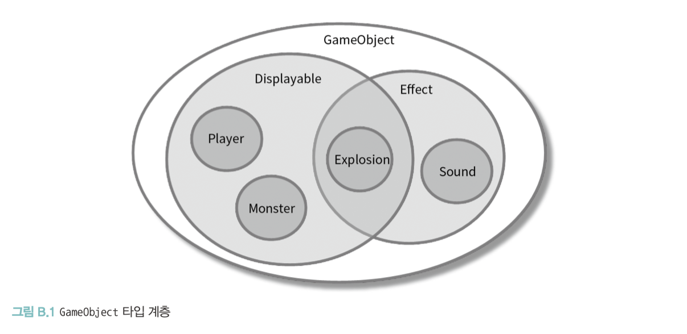
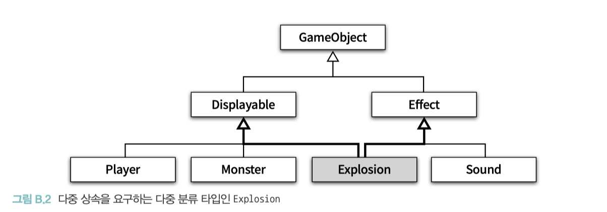
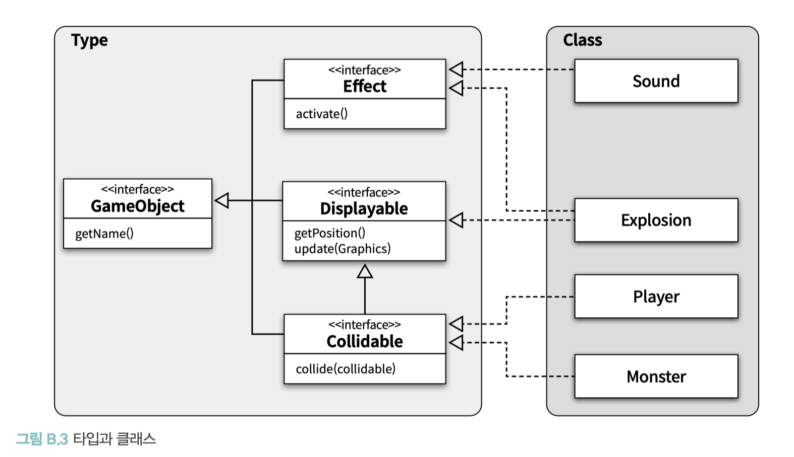

# APPENDIX B. 타입 계층의 구현

**TL;DR**

<br/>

---

<br/>

- 많은 사람들이 갖고 있는 흔한 오해는 타입과 클래스가 동일한 개념이라는 것

  - 타입: 개념의 분류
  - 클래스: 타입을 구현하는 한 가지 방법

- 이번 장을 읽을 때 염두할 두 가지 사항
- 해당 장의 모든 방법은 **타입 계층을 구현하는 방법인 동시에 다형성을 구현하는 방법**
  - 타입 계층은 동일한 메시지에 대한 행동 호환성을 전제로 하기 때문
  - 공통적으로 슈퍼타입에 대해 전송한 메시지를 서브타입별로 다르게 처리할 수 있는 방법을 제공하는데, 이 방법들은 12장에서 설명한 동적 메서드 탐색과 유사한 방식을 이용해 적절한 메서드를 검색할 것임.
- 해당 장의 방법을 이용해 타입 계층을 구현한다고 해서, 서브타이핑 관계가 보장되는 것은 아님
  - 올바른 타입 계층이 되기 위해서는 서브타입이 슈퍼타입을 대체할 수 있도록 **리스코프 치환 원칙을 준수**해야 함 (13장 참고)
  - 타입 사이에 리스코프 치환 원칙을 준수하도록 만드는 책임은 본인에게 있음.

<br/>

### 클래스를 이용한 타입 계층 구현

✔️타입은 **객체의 퍼블릭 인터페이스**를 가리키기 때문에 결과적으로 클래스는 객체의 타입과 구현을 동시에 정의하는 것과 같음

- 10장의 `Phone`과 `NightlyDiscountPhone` 코드 상속관계를 예시

→ 객체지향 언어에서 클래스를 <b>사용자 정의 타입 (user-defined data type)</b>이라고 부르는 이유

<br/>

- 퍼블릭 인터페이스는 유지하면서 새로운 구현을 가진 객체를 추가할 수 있는 가장 간단한 방법 → **상속**
- **클래스**는 타입을 구현할 수 있는 다양한 방법 중 하나일 뿐

<br/>

### 인터페이스를 이용한 타입 계층 구현

Example. 간단한 게임을 개발하고 있름

<br/><br/>

- Sound 타입: Effect 타입의 서브타입 → Effect 클래스를 상속받음
- Explosion 타입: Effect 타입인 동시에 Displyable 타입 → Effect 클래스와 Displayable 클래스를 동시에 상속
  - 다중 상속 → 대부분의 언어들이 다중 상속을 지원하지 않음

<br/><br/>

- '상속으로 인한 결합도 문제 + 다중 상속이라는 구현 제약'을 해결할 수 있는 방법 → **인터페이스를 사용**

<br/>

#### GameObject _interface_

```java
public interface GameObject {
    String getName();
}
```

<br/>

#### Displayable _interface_

- `GameObject` 타입: 게임의 많은 요소들은 화면에 표시될 필요가 있음
- 이 객체들은 화면 표시라는 동일한 행동을 제공하기 때문에 별도 의 타입으로 분류돼야 함 → `Displyable` 타입

```java
/**
 *  Displayable 타입을 GameObject 타입의 서브타입으로 정의
 */
public interface Displayable extends GameObject {
    Point getPosition();
    void update(Graphics graphics);
}
```

<br/>

#### Collidable _interface_

- 다른 요소들과의 **충돌로 인해 이동에 제약**을 받거나 **피해**를 입는 등의 처리가 필요한 객체를 위한 Collidable 타입 정의
- 충돌 체크를 위한 collideWith 오퍼레이션을 추가

```java
public interface Collidable extends Displayable {
    boolean collideWith(Collidable other);
}
```

<br/>

#### Effect

- 화면에 표시되지 않더라도 게임에 다양한 효과를 부여할 수 있는 부가적인 요소를 위한 `Effect` 타입 정의
-

```java
public interface Effect extends GameObject {
    void activate();
}
```

- `Player`는 화면에 표시돼야 할뿐만 아니라 화면 상에 표현된 다른 객체들과의 충돌을 체크해야 함
- `Collidable` 타입이 정의한 행동을 제공

-> **인터페이스**와 **클래스**를 함께 조합하면 _① 다중 상속의 딜레마에 빠지지 않을 수 있고_ _② 단일 상속 계층으로 인한 결합도 문제도 피할 수 있음_

<br/>

#### 타입 구현을 통한 장점

<br/><br/>

#### 1. 여러 클래스가 동일한 타입을 구현할 수 있음

- `Player` 와 `Monster` 클래스는 서로 다른 클래스지만, 이 두 클래스의 인스턴스들은 `Collidable` 인터페이스를 구현하고 있기 때문에 동일한 메시지에 응답할 수 있음.
- 서로 다른 클래스를 이용해서 구현됐지만 타입은 동일

#### 2. 하나의 클래스가 여러 타입을 구현할 수 있다

- `Explosion` 의 인스턴스는 Displayable 인터페이스와 동시에 Effect 인터페이스도 구현 함
- `Explosion` 의 인스턴스는 Displayable 타입인 동시에 Effect 타입이기도 함

<br/>

📌 인터페이스를 이용해 타입을 정의하고 클래스를 이용해 객체를 구현하면 클래스 상속을 사용하지 않고도 타입 계층을 구현할 수 있음

<br/>

### 추상 클래스를 이용한 타입 계층 구현

<table>
<tr>
<td>

```java
public abstract class DiscountPolicy {
    private List<DiscountCondition> conditions = new ArrayList<>();

    public DiscountPolicy(DiscountCondition ... conditions) {
        this.conditions = Arrays.asList(conditions);
    }

    public Money calculateDiscountAmount(Screening screening) {
        for(DiscountCondition each : conditions) {
            if (each.isSatisfiedBy(screening)) {
                return getDiscountAmount(screening);
            }
        }
        return screening.getMovieFee();
    }

    abstract protected Money getDiscountAmount(Screening Screening);
}
```

</td>
<td>

```java
public class AmountDiscountPolicy extends DiscountPolicy {
    private Money discountAmount;

    public AmountDiscountPolicy(Money discountAmount, DiscountCondition... conditions) {
        super(conditions);
        this.discountAmount = discountAmount;
    }

    @Override
    protected Money getDiscountAmount(Screening screening) {
        return discountAmount;
    }
}
```

</td>
</tr>
</table>

#### 구체 클래스의 타입 상속 vs 추상 클래스 타입 상속

1. 첫 번째, 의존하는 대상의 추상화 정도
   - 구체 클래스 상속: 구체적인 내부 구현에 강하게 결합 (부모 클래스가 변경되면 자식 클래스도 변경될 가능성이 큼)
   - 추상 클래스 상속: 내부 구현이 아닌 추상 메서드의 시그니처에만 의존
   - **⭐️ 모든 구체 클래스의 부모 ㅖ클래스를 항상 추상 클래스로 만들기 위해 노력하라.**
2. 두 번째, 상속을 사용하는 의도
   - `Phone` 클래스의 경우 자식 클래스인 `NightlyDiscountPhone` 의 `calculateFee` 메서드가 부모 클래스인 Phone의 `calculateFee` 메서드의 구체적인 내부 구현에 강하게 결합
     - `Phone` 클래스가 변경될 경우 자식 클래스인 `NightlyDiscountPhone` 도 함께 변경될 가능성이 높음

<br/>
<br/>
