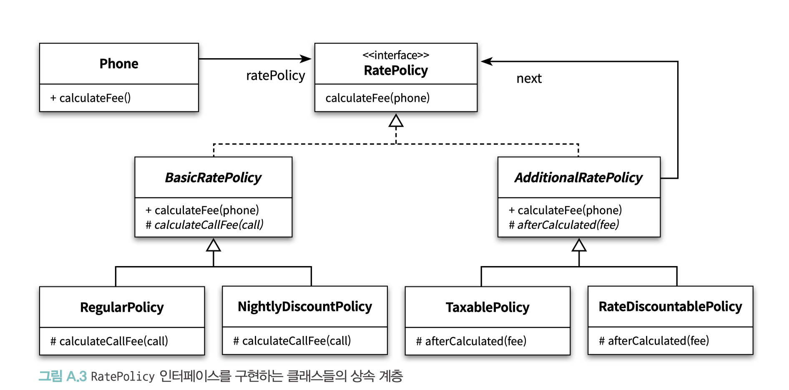

# APPENDIX A. 계약에 의한 설계

- **계약에 의한 설계(Design By Contract, DBC)**
  - > - 협력에 참여하는 각 객체는 계약으로부터 이익을 기대하고 이익을 얻기 위해 **의무를 이행** ①
    > 
    > - 협력에 참여하는 각 객체의 이익과 의무는 객체의 **인터페이스 상에 문서화** ②
    - ② 의도를 드러내는 인터페이스: 오퍼레이션이 클라이언트에게 **어떤 것을 제공하려고 하는지를 충분히 설명할 수 있음**
    - ① 계약은 여기서 한걸음 더: 위의 내용과 더불어 **협력하는 클라이언트는 정상적인 상태를 가진 객체와 협력해야 함**
  - 두 계약 당사자들에 대해, **한쪽의 의무가 반대쪽의 권리가 된다**
    - 한쪽이라도 계약서에 명시된 내용을 위반한다면 계약은 정상적으로 완료되지 않음
- **계약에 의한 설계를 구성하는 세 가지 요소**
  - **사전조건(precondition)**
    - 메서드가 정상적으로 실행되기 위해 만족해야 하는 조건
    - 메서드의 요구사항을 명시
    - 사전조건을 만족시키는 것은 메서드를 실행하는 클라이언트의 의무다.
  - **사후조건(postcondition)**
    - 메서드가 실행된 후에 클라이언트에게 보장해야 하는 조건
    - 메서드의 **인스턴스 변수의 상태**, **메서드에 전달된 파라미터의 값이 올바르게 변경됐는지**, **반환값이 올바른지**를 검증
    - 사후조건을 만족시키는 것은 서버의 의무
  - **불변식(invariant)**
    - 항상 참이라고 보장되는 서버의 조건
    - 실행 중에는 불변식을 만족시키지 못할 수도 있지만, 메서드를 실행하기 전이나 종료된 후에 불변식은 항상 참이어야 함
    - 사전조건과 사후조건에 추가되는 공통의 조건
- **리스코프 치환 원칙**을 만족시키기 위해서는 서브타입이 클라이언트와 슈퍼타입 간에 체결된 계약을 준수해야 함
  1. **계약 규칙** _contract rules_: 슈퍼타입과 서브타입 사이의 사전조건, 사후조건, 불변식에 대해 서술할 수 있는 제약에 관한 규칙
  - > - 서브타입에 더 강력한 사전조건을 정의할 수 없다.
    > - 서브타입에 더 완화된 사후조건을 정의할 수 없다.
    > - 슈퍼타입의 불변식은 서브타입에서도 반드시 유지돼야 한다.
  2. **가변성 규칙** _variance rules_: 파라미터와 리턴 타입의 변형과 관련된 규칙
  - > -서브타입의 메서드 파라미터는 반공변성을 가져야 한다.
    > - 서브타입의 리턴 타입은 공변성을 가져야 한다.
    > - 서브타입은 슈퍼타입이 발생시키는 예외와 다른 타입의 예외를 발생시켜서는 안 된다.
- **진정한 서브타이핑 관계를 만들고 싶다면,**
  - 서브타입에 **더 강화된 사전조건**이나 **더 완화된 사후조건**을 정의해서는 안 되며,
  - 슈퍼타입의 **불변식을 유지**하기 위해 항상 노력해야 하며,
  - 서브타입에서 **슈퍼 타입에서 정의하지 않은 예외를 던져서는 안됨**


<br/>

**기존의 문제점**

- 명령과 쿼리를 분리 (Chapter 6) 해도 명령으로 인해 발생하는 부수효과를 명확하게 표현하는 데 한계 존재
  - 구현이 복잡하고 부수효과를 가진 메서드들을 연이어 호출하는 코드를 분석하는 경우, 실행 결과를 예측 어려움
- 명령의 부수효과를 쉽고 명확하게 표현할 수 있는 커뮤니케이션 수단 필요

**👉🏻 계약에 의한 설계(Design By Contract, DBC)**
- 실행 가능한 검증 도구로 사용하고 명확한 커뮤니케이션 가능
  - 협력에 필요한 **다양한 제약**과 **부수효과**를 **명시적으로 정의하고 문서화**할 수 있음
  - 계약: 실행 가능 → 구현에 동기화돼 있는지 여부를 런타임에 검증할 수 있음

<br/>

## 01. 협력과 계약

### 부수효과를 명시적으로


**구현 조건:**
1. `IsSatisfied` 메서드를 호출
  - `RecurringSchedule` 의 조건을 만족 여부 확인
2. `Reschedule` 메서드를 호출

- **Interface**
  - 메서드의 순서와 관련된 제약을 설명하기 쉽지 않음
- **Code Contracts**
  - 계약에 의한 설계 라이브러리
  - IsSatisfied 메서드의 실행 결과가 true 일 때만 Reschedule 메서드를 호출할 수 있다는 사실을 명확하게 표현할 수 있음

```java
class Event {
  public bool IsSatisfied(RecurringSchedule schedule) { ... }

  public void Reschedule(RecurringSchedule schedule) {
    Contract.Requires(IsSatisfied(schedule));
    //...
  }
}
```

<br/>

#### 일반 if 문과 대표적인 차이점 👉🏻 문서화
- Code Contracts: 일반 로직과 구분할 수 있도록 제약 조건을 명시적으로 표현
  - 일반적인 정합성 체크 로직은 코드의 구현 내부에 숨겨져 있어 정확하게 파악하기가 쉽지 않음
  - 일반 로직과 조건을 기술한 로직을 구분하기도 쉽지 않음

<br/>

#### 계약

> - 각 계약 당사자는 계약으로부터 <b>이익(benefit)</b>을 기대하고 이익을 얻기 위해 <b>의무(obligation)</b>를 이행한다.
> - 각 계약 당사자의 이익과 의무는 계약서에 **문서화**된다.

👉🏻 **한쪽의 의무가 반대쪽의 권리가 된다**

두 계약 당사자 중 어느 한쪽이라도 계약서에 명시된 내용을 위반한다면 계약은 정상적으로 완료되지 않음

<br/>

**Example.** 집 리모델링을 위해 인테리어 전문가에게 작업을 위탁하고 계약을 체결한다고 가정.
- **본인의 의무**: 인테리어 전문가에게 대금을 지급하는 것 👉🏻 리모델링된 집을 얻는 것
- **인테리어 전문가의 의무**: 집을 리모델링하는 것 👉🏻 대금을 지급받는 것

→ 인테리어 전문가가 계약을 이행하는 구체적인 방식에 대해서는 간섭하지 않는다

<br/>

## 02. 계약에 의한 설계

#### 의도를 드러내는 인터페이스

오퍼레이션의 시그니처만으로도 어느 정도까지는 클라이언트와 서버가 협력을 위해 수행해야 하는 제약조건을 명시 가능

<br/>

<br/>

- 오퍼레이션이 클라이언트에게 어떤 것을 제공하려고 하는지를 충분히 설명할 수 있음
- 의도를 드러내는 인터페이스를 만들면 오퍼레이션의 시그니처만으로도 클라이언트와 서버가 협력을 위해 수행해야 하는 제약조건을 어느 정도 명시 가능

> 계약은 여기서 한걸음 더 나아감.
> 즉, 위의 내용과 더불어 **협력하는 클라이언트는 정상적인 상태를 가진 객체와 협력해야 함**

<br/>

<br/>

- 서버는 자신이 처리할 수 있는 범위의 값들을 클라이언트가 전달할 것이라고 기대함 👉🏻**사전조건(precondition)**
- 클라이언트는 자신이 원하는 값을 서버가 반환할 것이라고 예상 👉🏻 **사후조건(postcondition)**
- 클라이언트는 메시지 전송 전과 후의 서버의 상태가 정상일 것이라고 기대 👉🏻 **불변식(invariant)**

<br/>

- 사전조건: 메서드가 정상적으로 실행되기 위해 만족해야 하는 조건
- 사후조건: 메서드가 실행된 후에 클라이언트에게 보장해야 하는 조건

<br/>

### Precondition, 사전조건

:: 메서드가 정상적으로 실행되기 위해 만족해야 하는 조건

- 메서드가 호출되기 위해 만족돼야 하는 조건. 메서드의 요구사항을 명시
- 사전조건이 만족되지 않을 경우, 메서드가 실행돼서는 안 됨
- 사전조건을 만족시키는 것은 메서드를 실행하는 클라이언트의 의무


_Example._

<table>
<tr><th>메서드에 전달된 인자의 정합성을 체크하기 위해 사용</th></tr>
<tr>
<td>

```cplusplus
public Reservation Reserve(Customer customer, int audienceCount) {
    Contract.Requires(customer != null);
    Contract.Requires(audienceCount >= 1);
    return new Reservation(customer, this, 
        calculateFee(audienceCount), audienceCount);
}
```
<small>_사전 조건을 만족시킬 책임은 Reserve 메서드를 호출하는 클라이언트에게 있음_</small>

</td>
</tr>
<tr>
<td>

- customer가 null이 아니어야 하고, audienceCount 의 값은 1 보다 크거나 같음
- 이 조건을 만족시키지 못할 경우 Reserve 메서드는 실행되면 안됨

따라서 이 조건을 메서드의 **사전조건으로 정의**함으로써 **메서드가 잘못된 값을 기반으로 실행되는 것을 방지**할 수 있음

</td>
</tr>
<tr>
<td>

```java
var reservation = screening.Reserve(null, 2);  // ContractException 예외 발생
```

</td>
</tr>
</table>

<br/>

### Postcondition, 사후조건
:: 메서드가 실행된 후에 클라이언트에게 보장해야 하는 조건

- 클라이언트가 사전조건을 만족시켰다면 메서드는 사후조건에 명시된 조건을 만족시켜야 함
- 메서드의 **실행 결과가 올바른지를 검사**하고, **실행 후에 객체가 유효한 상태로 남아 있는지**를 검증
  - 인스턴스 변수의 상태가 올바른지
  - 메서드에 전달된 파라미터의 값이 올바르게 변경됐는지
  - 반환값이 올바른지
- 만약 클라이언트가 사전조건을 만족시켰는데도 사후조건을 만족시키지 못한 경우에는 클라이언트에게 예외를 던져야 함
- 사후조건을 만족시키는 것은 서버의 의무


#### 사후조건을 정의하는 것이 어려운 이유

- 한 메서드 안에서 return 문이 여러 번 나올 경우
  - 모든 return 문마다 결괏값이 올바른지 검증하는 코드를 추가해야 함.
  - _대부분의 라이브러리는 사후조건을 한 번만 기술할 수 있게 지원_
- 실행 전과 실행 후의 값을 비교해야 하는 경우
  - 다른 값으로 변경됐을 수 있기 때문에 비교하기 어려울 수 있음.
  - _대부분의 라이브러리는 실행 전의 값에 접근할 수 있는 간편한 방법을 제공._

<br/>

_Example._

<table>
<tr><th>사후조건</th></tr>
<tr>
<td>

```cplusplus
public Reservation Reserve(Customer customer, int audienceCount) {
        Contract.Requires(customer != null);
        Contract.Requires(audienceCount >= 1);
        Contract.Ensures(Contract.Result<Reservation>() != null);   // add post-condition
        return new Reservation(customer, this, calculateFee(audienceCount), audienceCount);
        }
```

- <small>`Contract.Result<T>`: 실행 결과에 접근할 수 있게 해주는 메서드. 이 메서드는 제너릭 타입으로 메서드의 반환 타입에 대한 정보를 명시할 것을 요구</small>
- <small>`Contract.Ensures`: 사후조건을 정의 메서드</small>

</td>
</tr>
<tr>
<td>

- 반환값인 Reservation 인스턴스가 null 이어서는 안 됨

```cplusplus
public string Middle(string text){
    Contract.Requires(text != null && text.Length >= 2);
    Contract.Ensures(Contract.Result<string>().Length < Contract.OldValue<string>(text).Length);
    text = text.Substring(1, text.Length - 2);
    return text.Trim();
}
```

<small>`Contract.OldValue<T>`: 메서드를 실행할 때 text의 값에 접근할 수 있음.</small>

</td>
</tr>
</table>

<br/>

### Invariant, 불변식

:: 항상 참이라고 보장되는 서버의 조건

- 메서드를 실행하기 전이나 종료된 후에 불변식은 항상 참이어야 함 (실행 중에는 불변식을 만족시키지 못할 수도 있음)
- 사전조건과 사후조건에 추가되는 공통의 조건으로 생각할 수 있음

**특성**
- 불변식은 클래스의 모든 인스턴스가 생성된 후에 만족돼야 함
  - 이것은 클래스에 정의된 모든 생성자는 불변식을 준수해야 한다는 것을 의미.
- 불변식은 클라이언트에 의해 호출 가능한 모든 메서드에 의해 준수돼야 함.
  - 메서드가 실행되는 중에는 객체의 상태가 불안정한 상태로 빠질 수 있기 때문에 불변식을 만족시킬 필요는 없지만 메서드 실행 전과 메서드 종료 후에는 항상 불변식 을 만족하는 상태가 유지돼야 한다

<br/>

#### Code Contracts
- `Contract.Invariant` 메서드를 이용해 불변식을 정의
- `ContractInvariantMethod` 애튜리뷰트가 지정된 메서드를 불변식을 체크해야 하는 모든 지점에 자동으로 추가

```java
public class Screening {
    private Movie movie;
    private int sequence;
    private DateTime whenScreened;
    
    // [ContractInvariantMethod]: Code Contracts가 적절한 타이밍에 자동으로 메서드를 호출해서 객체가 불변식을 유지하고 있는지를 검증
    
    private void Invariant() {
        Contract.Invariant(movie != null);
        Contract.Invariant(sequence >= 1);
        Contract.Invariant(whenScreened > DateTime.Now);
    }
}
```

<small>≪Thinking in Java≫ 에서 Bruce Ekel은 특별한 라이브러리를 사용하지 않고, 계약에 의한 설계 개념을 설명하기 위해 자바의 assert를 이용해 불변식을 체크하는 코드를 모든 메서드에서 직접 호출하는 예제를 소개</small>

<br/>


## 03. 계약에 의한 설계와 서브타이핑 

> 서브타입이 리스코프 치환 원칙을 만족시키기 위해서는 클라이언트와 슈퍼타입 간에 체결된 계약을 준수해야 한다.


✔️ 리스코프 치환 원칙의 규칙을 두 가지 종류로 세분화할 수 있다. _- Hall_

1. **계약 규칙** _contract rules_: 협력에 참여하는 객체에 대한 기대를 표현
   - 슈퍼타입과 서브타입 사이의 사전조건, 사후조건, 불변식에 대해 서술할 수 있는 제약에 관한 규칙
   - > - 서브타입에 더 강력한 사전조건을 정의할 수 없다.
     > - 서브타입에 더 완화된 사후조건을 정의할 수 없다.
     > - 슈퍼타입의 불변식은 서브타입에서도 반드시 유지돼야 한다.
       
2. **가변성 규칙** _variance rules_: 교체 가능한 타입
   - 파라미터와 리턴 타입의 변형과 관련된 규칙
   - > - 서브타입의 메서드 파라미터는 반공변성을 가져야 한다. 
     > - 서브타입의 리턴 타입은 공변성을 가져야 한다. 
     > - 서브타입은 슈퍼타입이 발생시키는 예외와 다른 타입의 예외를 발생시켜서는 안 된다.

<br/>

### 계약 규칙

<br/>

<br/>

RatePolicy 인터페이스를 구현하는 클래스들의 상속 계층의 클래스들이 **RatePolicy 의 서브타입이 맞는지 검증**

```java
public class Phone {
    ...
    public Bill publishBill() {
        return new Bill(this, ratePolicy.calculateFee(calls));
    }
}
```

- Bill 생성자 내의 `calculateFee`의 실행 조건
  - 사후 조건: Bill 생성자 두 번째 파라미터인 청구서의 요금은 최소한 0 원보다 크거나 같아야 하므로 calculateFee 의 반환값은 0 원보다 커야 함 
    - `assert result.isGreaterThanOrEqual(Money.ZERO);`
  - 사전 조건: 클라이언트인 Phone이 전달하는 calls가 null이 아니어야 함
    - `assert calls != null;`

<br/>

#### 결과

<table>
<tr><td>

<pre><code lang="java">public abstract class BasicRatePolicy implements RatePolicy {

    @Override
    public Money calculateFee(List<Call> calls) {
        // 사전조건
        <b>assert calls != null;</b>

        Money result = Money.ZERO;
        for(Call call : calls) {
            result.plus(calculateCallFee(call));
        }

        // 사후조건
        <b>assert result.isGreaterThanOrEqual(Money.ZERO);</b>
        return result;
    }

    protected abstract Money calculateCallFee(Call call);
}
</code></pre>

</td><td>

<pre><code lang="java">public abstract class AdditionalRatePolicy implements RatePolicy {
  private RatePolicy next;

  public AdditionalRatePolicy(RatePolicy next) {
    this.next = next;
  }

  @Override
  public Money calculateFee(List<Call> calls) {
    // 사전조건
    <b>assert calls != null;</b>

    Money fee = next.calculateFee(calls);
    Money result = afterCalculated(fee);

    // 사후조건
    <b>assert result.isGreaterThanOrEqual(Money.ZERO);</b>
    return result;
  }

  abstract protected Money afterCalculated(Money fee);
}
</code></pre>
</td></tr>
</table>


<br/>

### 📌 서브타입에 더 강력한 사전조건을 정의할 수 없다

**✔️ 사전조건을 강화시키는 경우 👉🏻 리스코프 치환 원칙을 위반함**

- **부모타입의 사전 조건**: RatePolicy는 null 을 제외한 어떤 calls 라도 받아들인다고 가정
- **서브타입에 강력한 사전조건 추가**: BasicRatePolicy에 **calls 가 빈 리스트여서는 안 된다**는 사전조건을 추가하면?

<br/>

**예제 Client 코드** 

```java
Phone phone = new Phone(new RegularPolicy(Money.wons(100), Duration.ofSeconds(10)));  // Phone 인스턴스에서 calls를 빈 리스트로 초기화
Bill bill = phone.publishBill();
```

<small>Phone을 생성한 후에 곧장 publishBill 메서드를 호출하는 앞의 예제는 사전 조건을 만족시키지 않게 되기 때문에 정상적으로 실행되지 않을 것</small>

- `Phone` 의 입장에서 더 이상 `RatePolicy` 와 `BasicRatePolicy는` 동일하지 않음.
  - 사전조건을 만족시키는 것은 클라이언트의 책임임에도 불구하고, `BasicRatePolicy` 는 사전조건에 새로운 조건을 추가함으로써 `Phone`과 `RatePolicy` 사이에 맺은 계약을 위반함 
- 클라이언트의 관점에서 `BasicRatePolicy` 는 `RatePolicy` 를 대체할 수 없기 때문에 리스코프 치환 원칙을 위반.


Q. 왜 RatePolicy에 사전조건을 정의하지 않고 모든 서브타입에서 조건을 체크했을까? 
:: default method를 구현하기 위해서는 calls 조건을 체크하는 것뿐만 아니라 해당 메소드의 기본 구현을 해야하는 것 때문인가 싶다. 기본 메소드를 생성될 메소드가 아니기 때문에 로직을 추가하는 것은 이치에 맞지 않음.

<br/>

**️✔️사전조건을 완화시키는 경우 👉🏻 리스코프 치환 원칙을 위반하지 않음**

```java
public abstract class BasicRatePolicy implements RatePolicy {

    @Override
    public Money calculateFee(List<Call> calls) {
        if (calls == null) {
            return Money.ZERO;
        }
        ...
    }
}
```

- 인자는 항상 `null`이 아님:
  - 클라이언트인 Phone이 `RatePolicy`의 `calculateFee` 오퍼레이션을 호출 시, 인자가 `null` 이 아닌 값을 전달하도록 보장
  - null을 체크하는 조건문은 무시 됨


<br/>

### 📌 서브타입에 더 완화된 사후조건을 정의할 수 없다

```java
Phone phone = new Phone(
                  new RateDiscountablePolicy(Money.wons(1000),
                  new RegularPolicy(Money.wons(100), Duration.ofSeconds(10))));
phone.call(new Call(LocalDateTime.of(2017, 1, 1, 10, 10),
            LocalDateTime.of(2017, 1, 1, 10, 11)));
Bill bill = phone.publishBill();
```

<small>**10 초당 100원을 부과**하는 일반 요금제(RegularPolicy)에 **1000원을 할인**해주는 기본 요금 할인 정책(RateDiscountablePolicy)을 적용하는 시나리오</small>


- 사후조건을 만족시킬 책임은 서버에 있음


<br/>

**️✔️사후조건을 완화시키는 경우 👉🏻 리스코프 치환 원칙을 위반함**

- 사후조건을 주석으로 처리해서 마이너스 요금이 반환되더라도 예외가 발생하지 않도록 수정

<pre><code lang="java">
public abstract class AdditionalRatePolicy implements RatePolicy {
    @Override
    public Money calculateFee(List<Call> calls) {
        assert calls != null;
        
        Money fee = next.calculateFee(calls);
        Money result = calculate(fee);
        
        // 사후조건
        <b>// assert result.isGreaterThanOrEqual(Money.ZERO);</b>
        return result;
    }

  abstract protected Money calculate(Money fee);
}
</code></pre>

AdditionalRatePolicy 가 마이너스 금액을 반환할 수 있음

- 문제점1: `Phone`과 `RatePolicy` 사이에 체결된 계약을 위반 - 서버가 클라이언트에게 제공하겠다고 보장한 계약을 충족시켜주지 못함
- 문제점2: 예외 스택 트레이스는 Bill의 생성자에서 예외가 발생했다고 명시

<br/>

**️✔️사후조건을 강화하는 경우 👉🏻 리스코프 치환 원칙을 위반하지 않음**

강화된 조건: calculateFee 메서드가 100 원보다 크거나 같은 금액을 반환

```java
public abstract class AdditionalRatePolicy implements RatePolicy {

    @Override
    public Money calculateFee(List<Call> calls) {
        ...
        // 사후조건
        assert result.isGreaterThanOrEqual(Money.wons(100));
        return result;
    }
    
    abstract protected Money calculate(Money fee);
}
```

- 0원보다 크기만 하다면 문제 없기 때문에, 클라이언트에게 아무런 영향도 미치지 않음
- 사후조건 강화는 계약에 영향을 미치지 않음

<pre>
<h3>일찍 실패하기(Fail Fast)</h3>
가능한 한 빨리 문제를 발견하게 되면 좀 더 일찍 시스템을 멈출 수 있다는 이득이 있다. 
게다가 프로그램을 멈추는 것이 할 수 있는 최선일 때가 많다.
... 
방금 불가능한 뭔가가 발생했다는 것을 코드가 발견한다면 프로그램은 더 이상 유효하지 않다고 할 수 있다. 
이 시점 이후로 하는 일은 모두 수상쩍게 된다. 
되도록 빨리 종료해야 한다. 
일반적으로, 죽은 프로그램이 입히는 피해는 절름발이 프로그램이 끼치는 것보다 훨씬 덜한 법이다

<i>- Hunt</i>
</pre>

<br/>

### 📌 슈퍼타입의 불변식은 서브타입에서도 반드시 유지돼야 한다

불변식: 메서드가 실행되기 전과 후에 반드시 만족시켜야 하는 조건

<small>AdditionalRatePolicy 불변식 조건: 모든 메서드 실행 전과 후, 생성자의 마지막 지점에서 next가 null 이어서는 안됨</small>

 
```java
public abstract class AdditionalRatePolicy implements RatePolicy {
    
    protected RatePolicy next;
    
    public AdditionalRatePolicy(RatePolicy next) {
        this.next = next;
        // 불변식: 생성자의 마지막 지점,  next가 null 이어서는 안됨
        assert next != null;
    }
    
    @Override
    public Money calculateFee(List<Call> calls) {
        // 불변식: 메서드 실행 전,  next가 null 이어서는 안됨
        assert next != null;
        // 사전조건
        assert calls != null;
        
        ...
      
        // 사후조건
        assert result.isGreaterThanOrEqual(Money.ZERO);
        
        // 불변식: 메서드 실행 후, next가 null 이어서는 안됨
        assert next != null;
        return result;
    }
}
```

- 취약점이 존재: 인스턴스 변수인 next가 protected 변수
  - AdditionalRatePolicy의 자식 클래스가 next 의 값을 수정하는 것이 가능 
  - 계약의 관점에서 캡슐화의 중요성
- 해결법: 부모 클래스의 모든 인스턴스 변수의 가시성을 `private` 으로 제한한 후, protected 메서드를 제공하여 불변식을 체크하게 해야 함

<br/><br/>

### 가변성 규칙

<small>리스코프 치환 원칙의 깊은 부 분까지 이해하기 위해서는 가변성 규칙을 이해하는 것이 좋음</small>

<br/>

### 📌 서브타입은 슈퍼타입이 발생시키는 예외와 다른 타입의 예외를 발생시켜서는 안 됨

<br/>

<table>
<tr><th>슈퍼타입</th><th>서브타입</th><th>RatePolicy와 협력하는 메서드</th></tr>
<tr><td>

```java
public class EmptyCallException extends RuntimeException { ... }

public interface RatePolicy {
    Money calculateFee(List<Call> calls) throws EmptyCallException;
}
```

</td><td>

```java
public abstract class BasicRatePolicy implements RatePolicy {

    @Override
    public Money calculateFee(List<Call> calls) {
        if (calls == null || calls.isEmpty()) {
            throw new EmptyCallException();
        }
        ...
    }
}
```

</td><td>

```java
public void calculate(RatePolicy policy, List<Call> calls) {

    try {
        return policy.calculateFee(calls);
    } catch(EmptyCallException ex) {
        return Money.ZERO;
    }
}
```

- EmptyCallException 예외가 던져질 경우 이를 캐치한 후 0원을 반환

</td></tr>
</table>

<br/>

**RatePolicy 를 구현하는 클래스가 EmptyCallException 예외가 아닌 다른 예외를 던진다면?**


<table><tr><th>AdditionalRatePolicy</th><th>Exceptions</th></tr>
<tr><td>

```java
public abstract class AdditionalRatePolicy implements RatePolicy {

    @Override
    public Money calculateFee(List<Call> calls) {
        if (calls == null || calls.isEmpty()) {
            throw new NoneElementException();
        }
        ...
    }
}
```
</td><td>

```java
public class EmptyCallException extends RuntimeException { ... }

public class NoneElementException extends EmptyCallException { ... }
```

</td></tr></table>

catch 문으로 `EmptyCallException`을 잡고 있고, `NoneElementException`은 예외 처리에서 잡히지 않음

- 클라이언트 입장에서 협력의 결과가 예상을 벗어남
- AdditionalRatePolicy는 RatePolicy를 대체할 수 없음

<br/>

**정상 동작의 예상을 벗어나는 추가 예시**: Bird - Penguin

<table><tr><th>예외로 대체</th><th>아무 동작도 하지 않음</th></tr>
<tr><td>

```java
public class Bird {
    public void fly() { ... }
}

public class Penguin extends Bird {

    @Override
    public void fly() {
        throw new UnsupportedOperationException();
    }
}
```

</td><td>

```java
public class Penguin extends Bird {

    ...
    @Override
    public void fly() {
    }
}
```
</td></tr></table>

- 클라이언트의 관점에서 부모 클래스에 대해 기대했던 것보다 더 적은 일을 수행하는 자식 클래스는 부모 클래스와 동일하지 않다는 공통점이 있음
- 부모 클래스보다 못한 자식 클래스는 서브타입이 아님

<br/>


### 📌 서브타입의 리턴 타입은 공변성을 가져야 한다

**S 가 T 의 서브타입일 때,**

- **공변성(covariance)**: S와 T 사이의 서브타입 관계가 그대로 유지 
  - 서브타입인 S가 슈퍼타입인 T 대신 사용될 수 있음 
  - 리스코프 치환 원칙은 공변성과 관련된 원칙
- **반공변성(contravariance)**: S와 T 사이의 서브타입 관계가 역전 
  - 슈퍼타입인 T가 서브타입인 S 대신 사용될 수 있음
- **무공변성(invariance)**: S와 T 사이에는 아무런 관계도 존재하지 않음. 
  - S 대신 T를 사용하거나 T 대신 S를 사용 할 수 없다.

<br/>


<br/>

<br/>

- BookStall : MagazineStore = 슈퍼 타입 : 서브 타입
- Book : Magazine의 = 슈퍼 타입 : 서브 타입

**리턴 타입 공변성**

- BookStall의 sell 메서드: Book 의 인스턴스를 리턴 
- MagazineStore의 sell 메서드: Magazine의 인스턴스를 리턴

<br/>

**Customer가 BookStall 에서 책을 구매**

```java
new Customer().order(new BookStall());
```

**MagazineStore 는 BookStall 의 서브타입이므로 BookStall을 대신할 수 있음**

```java
new Customer().order(new MagazineStore());
```

<br/>

- **리턴 타입 공변성(return type covariance)**
  - 부모 클래스에서 구현된 메서드를 자식 클래스에서 오버라이딩할 때 부모 클래스에서 선언한 반환타입의 서브타입으로 지정할 수 있는 특성
  - 리턴 타입 공변성은 메서드의 구현 계층과 리턴 타입의 계층이 동일한 방향을 가짐

<br/>

<br/>

- 리스코프 치환 원칙; 서브타입에서 메서드의 사후조건이 강화되더라도 클라이언트 입장에서는 영향이 없음
- 슈퍼타입 대신 서브타입을 반환 하는 것은 더 강력한 사후조건을 정의하는 것과 같음


<small>공변성과 반공변성의 지원 여부는 언어에 따라 다르다는 것 (C#은 리턴타입 공변성 지원 X)</small>


<br/>

### 📌서브타입의 메서드 파라미터는 반공변성을 가져야 한다

<small>자바는 파라미터 반공변성을 지원하지 않음</small>

- BookStall 의 자식 클래스인 MagazineStore 에서 sell 메서드의 파라미터를 `IndependentPublisher` → `Publisher` 로 변경할 수 있다.


```java
public class MagazineStore extends BookStall {
    
    @Override
    public Magazine sell(Publisher publisher) {
        return new Magazine(publisher);
    }
}
```

<br/>

<br/>

- 파라미터 타입 반공변성 (parameter type contravariance)
  - 오버라이딩 시, 파라미터 타입을 **부모 클래스에서 사용한 파라미터의 슈퍼타입으로 지정**할 수 있는 특성.
  - 메서드를 정의한 클래스의 타입 계층과 파라미터의 타입 계층의 방향이 반대인 경우 서브타입 관계를 만족


- 사실 객체지향 언어 중에서 파라미터 반공변성을 지원하는 언어는 거의 없음. 
- 하지만, 제네릭 프로그래밍에서는 파라미터 반공변성이 중요한 의미를 가지기 때문에 제네릭 프로그래밍을 공부하는 데 도움이 될 것

<br/>

### 함수 타입과 서브타이핑

- 이름 없는 메서드
  - 익명 함수(anonymous function)
  - 함수 리터럴(function literal)
  - 람다 표현식(lambda expression)
- 함수 타입의 서브타입을 정의할 수 있으며, 객체의 서브타입이 슈퍼타입을 대체할 수 있는 것처럼 서브타입 메서드가 슈퍼타입 메서드를 대체할 수 있다.

<br/>

**진정한 서브타이핑 관계를 만들고 싶다면,** 
- 서브타입에 더 강력한 사전조건이나 더 완화된 사후조건을 정의해서는 안 되며,
- 슈퍼타입의 불변식을 유지하기 위해 항상 노력
- 또한 서브타입에서 슈퍼 타입에서 정의하지 않은 예외를 던져서는 안됨

<br/><br/>