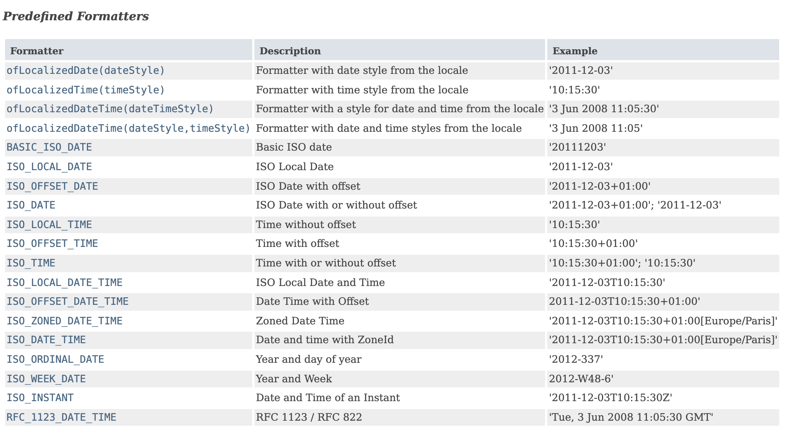

# Date & Time

# Intro

자바 8에 새로운 날짜와 시간 API가 생긴 이유

- 그전까지 사용하던 `util.Date` 클래스는 **mutable** 하기 때문에 **thead safe**하지 않다.
    
    ```java
    public class App {
        public static void main(String[] args) throws InterruptedException {
            // mutable 한 객체 -> multi-thread 환경에서 사용하기 어렵다.
            Thread.sleep(1000 * 3);
            Date after3Second = new Date();
            System.out.println(after3Second);
            after3Second.setTime(time);
            System.out.println(after3Second);
        }
    }
    
    ```
    
    두 개의 스레드가 충돌이 일어날 수 있음 → thread-safe 하지 않음
    
- 클래스 이름이 명확하지 않다. Date인데 시간까지 다룬다.
    
    ```java
    public class App {
        public static void main(String[] args) {
            // date 인데 time을 가져온다고? 
    				// 좀 이상함 n시 n분 할 때 그 시간이 아님
            Date date1 = new Date();
            long time = date1.getTime();
    
    				// 심지어 우리가 알고 있는 날짜 타입도 아님.
            System.out.println(date1);    // Tue Jan 18 15:14:29 KST 2022
            System.out.println(time);     // 1642486469960 
        }
    }
    ```
    
- 버그 발생할 여지가 많다. (타입 안정성이 없고, 월이 0부터 시작한다거나..)
    
    ```java
    Calendar gngsnBirthDay = new GregorianCalendar(1998, 8, 12);
    ```
    
    위의 코드에 버그가 있음 (...?)
    
    month가 0부터 시작해서 0이 1월이다. 8월을 적고 싶으면 7을 적어야한다.
    
    아래와 같이 수정해야 했음
    
    ```java
    Calendar gngsnBirthDay = new GregorianCalendar(1998, GregorianCalendar.AUGUST, 12);
    ```
    
- 날짜 시간 처리가 복잡한 애플리케이션에서는 보통 [Joda Time](https://www.joda.org/joda-time/)을 쓰곤했다.

**자바 8에서 제공하는 Date-Time API**

- [JSR-310 스팩](https://jcp.org/en/jsr/detail?id=310)의 구현체를 제공한다.
- 디자인 철학
    - Clear
    - Fluent
    - Immutable
    - Extensible

### 주요 API

- 기계용 시간 (machine time)과 인류용 시간(human time)으로 나눌 수 있다.
- 기계용 시간은 EPOCK (1970년 1월 1일 0시 0분 0초)부터 현재까지의 타임스탬프를 표현한다.
- 인류용 시간은 우리가 흔히 사용하는 연,월,일,시,분,초 등을 표현한다.
- 타임스탬프는 Instant를 사용한다.
- 특정 날짜(LocalDate), 시간(LocalTime), 일시(LocalDateTime)를 사용할 수 있다.
- 기간을 표현할 때는 Duration (시간 기반)과 Period (날짜 기반)를 사용할 수 있다.
- DateTimeFormatter를 사용해서 일시를 특정한 문자열로 포매팅할 수 있다.

**참고**

[all-about-java-util-date](https://codeblog.jonskeet.uk/2017/04/23/all-about-java-util-date/), [datetime overview](https://docs.oracle.com/javase/tutorial/datetime/overview/index.html), [datetime iso](https://docs.oracle.com/javase/tutorial/datetime/iso/overview.html)


<br/><br/>

# Date / Time API

## Instant

지금 이 순간을 **기계 시간**으로 표현하는 방법

- Instant**.now()**
    
    기계용 시간을 계산할 때 사용
    
    - *Code*
        
        ```java
        public class DateTimeAPI {
            public static void main(String[] args) {
                Instant instant = Instant.now();   // 기준시 UTC, GMT
                System.out.println(instant);  
        				// 2022-01-18T06:56:35.763374Z
        
                ZoneId zone = ZoneId.systemDefault();
        				System.out.println(zone);
        				// Asia/Seoul
        
                ZonedDateTime zonedDateTime = instant.atZone(zone);
                System.out.println(zonedDateTime);    
        				// 2022-01-18T15:56:35.763374+09:00[Asia/Seoul]
            }
        }
        ```
        
    
    현재 UTC (GMT)를 리턴한다.
    
    ```java
    Instant now = Instant.now();
    System.out.println(now);
    System.out.println(now.atZone(ZoneId.of("UTC")));
    
    ZonedDateTime zonedDateTime = now.atZone(ZoneId.systemDefault());
    System.out.println(zonedDateTime);
    ```
    
    - Universal Time Coordinated == Greenwich Mean Time
    
<br/><br/>

## LocalDateTime

**인류용 일시를 표현하는 방법**

```java
LocalDateTime now = LocalDateTime.now();
System.out.println(now);       // 2022-01-18T16:08:37.386460

LocalDateTime birthday = LocalDateTime.of(1998, Month.AUGUST, 12, 12, 0, 0);
System.out.println(birthday);  // 1998-08-12T12:00
```

- LocalDateTime.**now() :** 현재 시스템 Zone에 해당하는(로컬) 일시를 리턴한다.
- LocalDateTime.**of(int, Month, int, int, int, int)**: 로컬의 특정 일시를 리턴한다.
- LocalDateTime.**of(int, Month, int, int, int, int, ZoneId)**: 특정 Zone의 특정 일시를 리턴한다.

<br/><br/>

### LocalDateTime to DateTime

java.time.LocalDateTime to java.util.Date

```java
LocalDateTime localDateTime = LocalDateTime.parse("2022-05-20T15:15:30");

// 1.
Instance instance = localDateTime.atZone(ZoneId.systemDefault()).toInstance();
Date date = Date.from(instance);

// 2.
Instance instance = localDateTime.toInstance(ZoneOffset.UTC);
Date date = Date.from(instance);

// 3.
Instance instant = Timestamp.valueOf(localDateTime.format(DateTimeFormatter.ofPattern("yyyy-MM-dd HH:mm:ss"))).toInstant();
Date date = Date.from(instance);
```

<br/>

Date 인스턴스를 생성하면 millisecond 단위까지 전달할 수 있다

<br/>

```java
Timestamp timestamp = Timestamp.valueOf(localDateTime.format(DateTimeFormatter.ofPattern("yyyy-MM-dd HH:mm:ss")));
date = new Date(timestamp.getTime());
System.out.println(date);
```

→ 납득 안감 테스트해보자

<br/><br/>

### [java.util.Date](http://java.util.Date) to java.time.LocalDateTime

```java
Date date = new Date();

// 1. LocalDateTime.ofInstant()
LocalDateTime localDateTime = LocalDateTime.ofInstant(Instant.ofEpochMilli(date.getTime()), ZoneId.systemDefault());

// 2. Instant.ofEpochMilli().toLocalDateTime()
LocalDateTime localDateTime = Instant.ofEpochMilli(date.getTime()).atZone(ZoneId.systemDefault()).toLocalDateTime();
```

<br/>


[oracle date time](https://docs.oracle.com/javase/tutorial/datetime/overview/design.html)

<br/><br/>

## 파싱 또는 포매팅

- **미리 정의해둔 포맷** 참고 : [DateTimeFormatter - predefined](https://docs.oracle.com/javase/8/docs/api/java/time/format/DateTimeFormatter.html#predefined)

`DateTimeFormatter.ISO_LOCAL_DATE_TIME` **와 같이 미리 포맷을 정의해두었기 때문에 활용하면 됨




- DateTimeFormatter.**ofPattern**(*format*)

```java
DateTimeFormatter MMddyyyy = DateTimeFormatter.ofPattern("MM/dd/yyyy");
now.format(MMddyyyy);    // 01/18/2022
```

- LocalDate.**parse**(*String, DateTimeFormatter*);
    
    
    ```java
    LocalDate parse = LocalDate.parse("08/12/1998", MMddyyyy);
    System.out.println(parse);     // 1998-08-12
    ```
    
- Dateteme

```java
DateTimeFormatter formatter = DateTimeFormatter.ofPattern("MM/d/yyyy");
LocalDate date = LocalDate.parse("07/15/1982", formatter);

System.out.println(date);
System.out.println(today.format(formatter));
```

## Period / Duration

**기간을 표현하는 방법**

- Period : 날짜를 기반으로 비교. 인류용
- Duration : 기계용

### **Period.between()**

```java
Period between = Period.between(today, birthDay);
// or
Period until = today.until(thisYearBirthday);
```

```java
between.get(ChronoUnit.DAYS);
// or
between.getDays();
```

- 참고 - Total Days 구하고 싶다면
    
    ```java
    // Total Days 구하고 싶다면!
    LocalDate birthDay = LocalDate.of(1998, Month.AUGUST, 12);
    long date = ChronoUnit.DAYS.between(birthDay, today);
    System.out.println(date);
    ```
    

### **Duration.between()**

```java
Instant instantNow = Instant.now();
Instant plus = instantNow .plus(10, ChronoUnit.SECONDS);
Duration between = Duration.between(instantNow, plus);

System.out.println(between.getSeconds());
```