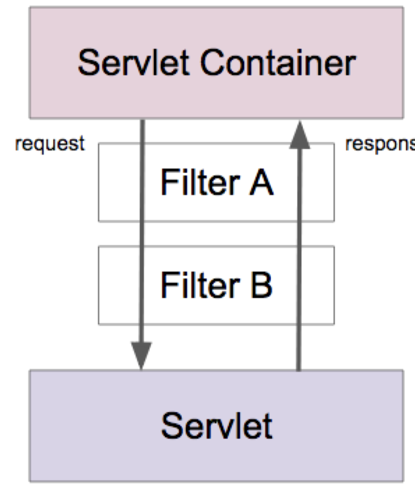

# ✍🏻 Servlet

스프링 웹 MVC : Servlet 기반의 Web Application을 만드는 프레임워크.

이때, Servlet이 무엇인지 알고가야 스프링 웹 MVC를 알 수 있겠죠❓ 

<br />

## 서블릿 (Servlet)

- 자바 엔터프라이즈 에디션은 웹 애플리케이션 개발용 스팩과 API 제공.  
- 요청 당 쓰레드 (만들거나, 풀에서 가져다가 ) 사용
- 가장 중요한 클래스중 하나가 **HttpSevlet**

- 서블릿 등장 이전에 사용하던 기술 CGI (Common Gateway Interface) 에 비해 빠름
  - 요청 당 프로세스를 만들어 사용

<br />

### 서블릿의 장점 (CGI와 비교)

- CGI에 비해 빠름
- JAVA를 사용하기 때문에 **플랫폼 독립적**
- 보안
- 이식성

<br />

Servlet은 직접 실행할 수 없음 -> Servlet Container로 실행 가능 (혹은 엔진)

### Servlet Engine or Servlet Container

- 세션 관리
- 네트워크 서비스
- MIME 기반 메시지 인코딩 디코딩
- 서블릿 생명주기 관리

<br /><br />

### Servlet의 생명주기


<br />

#### 처음

서블릿 컨테이너가 서블릿 인스턴스의 `init()` 메소드를 호출하여 초기화 한다.

- 최초 요청을 받았을 때 한번 초기화 하고 나면 그 다음 요청부터는 이 과정을 생략한다.
- 그래서 초기 접근을 하면 Servlet이 로딩되게끔 만들어 주기도 함. 그럼 다음 요청부터는 `init()` 을 호출하지 않아도 되기 때문에. 이것을 **웜업**이라고 함.

<br />

#### 진행

서블릿이 초기화 된 다음부터 클라이언트의 요청을 처리할 수 있다. 각 요청은 별도의 쓰레드로 처리하고 이때 서블릿 인스턴스의 `service()` 메소드를 호출한다.

-  이 안에서 HTTP 요청을 받고 클라이언트로 보낼 HTTP 응답을 만든다.
- `service()` 는 보통 HTTP Method에 따라 `doGet()`, ` doPost()` 등으로 처리를 위임한다.
- 따라서 보통 `doGet()` 또는 `doPost()`를 구현한다. 

<br />

#### 종료

서블릿 컨테이너 판단에 따라 해당 서블릿을 메모리에서 내려야 할 시점에 `destroy()` 를 호출한다

<br />

<br />

### 서블릿 애플리케이션 개발

file > project structure -> module -> main/java를 Source Directory로 만듦

``` java
// 서블릿 구현
public class HelloServlet extends HttpServlet {

@Override
public void init() throws ServletException {
  System.out.println("init");
}

@Override
protected void doGet(HttpServletRequest req, HttpServletResponse resp) throws ServletException, IOException {
    System.out.println("doGet");
    resp.getWriter().write("Hello Servlet");
  }

  @Override
  public void destroy() {
    System.out.println("destroy");
  }
}
```


tomcat 처음 설치했다면 `/bin` 으로 가서 .sh로 끝나는 실행파일이 있지만, 실행할 수 있는 권한이 없음. 그 때에는 `chmod +x ./*.sh` 를 입력해서 권한을 풀어줌

위의 파일을 만들어도 실행할 수 없음. web.xml에 가서 등록해주어야함

아래와 같이 적어줌

``` xml
<web-app>
  /* ... */
  <servlet>
    <servlet-name>hello</servlet-name>
    <servlet-class>me.whiteship.HelloServlet</servlet-class>
  </servlet>

  <servlet-mapping>
    <servlet-name>hello</servlet-name>
    <url-pattern>hello</url-pattern>
  </servlet-mapping>
</web-app>
```


우리가 학습할 Spring MVC가 HttpServlet을 사용한 코드(위의 실습코드)를 기반으로 만들었어요.

<br />

<br />

### 서블릿 리스너와 필터

#### 서블릿 리스너

웹 애플리케이션에서 발생하는 주요 이벤트를 감지하고 각 이벤트에 특별한 작업이 필요한 경우에 사용할 수 있다.

어떨 때 서블릿 리스너를 사용할 수 있냐면 예를 들어 서블릿 컨테이너 구동될때 데이터베이스 커넥션 맺어놓고 서블릿 애플리케이션에서 만든 서블릿에게 제공할 수 있음.

초반에 만들어놨던 커넥션을 사라질 때 가져와서 정리할 수도 있겠죠.

<br />

doGet으로 가기전에 전처리를 하고 싶을 경우나 응답에 처리를 하고 싶을 경우 서블릿 필터를 사용하게됩니다. 

여러개의 서블릿에 추가적인 작업

특정 URL패턴에도 특정 작업을 할 수 있음

<br />

아래 네개의 이벤트에 따라 구현해야할 인터페이스가 조금 다름.

- 서블릿 컨텍스트 수준의 이벤트
  -  컨텍스트 라이프사이클 이벤트
  -  컨텍스트 애트리뷰트 변경 이벤트

- 세션 수준의 이벤트
  - 세션 라이프사이클 이벤트
  - 세션 애트리뷰트 변경 이벤트

<br />

#### 서블릿 필터

- 들어온 요청을 서블릿으로 보내고, 또.서블릿이 작성한 응답을 클라이언트로 보내기 전에 특별한 처리가 필요한 경우에 사용할 수 있다.
- 체인 형태의 구조

체인구조이기 때문에 동시다발적으로 진행되는 것이 아니라, 순차적으로 (web.xml에 작성한 순서대로)진행한. 

다음체인으로 넘어가도록 코드를 작성해주어야 최종적으로 서블릿까지 가게 됨

<br />



<br />

서블릿 컨텍스트의 라이프 사이클을 감지할 수 있는 이벤트를 구현할 예정


``` java
public class myListener implements ServletContextListener {
  @Override
  public void contextInitialized(ServletContextEvent sce) {
    System.out.println("Context Initialized");
    sce.getServletContext().setAttribute("name", "gngsn");
  }
  
  @override
  public void contextDestroyed(ServletContextEvent sce) {
    System.out.println("Context Destroyed");
  }
}
```


위와 같이 만든 리스너를 등록하는 방법은 `web.xml`에서 설정

```xml
<web-app>
  
  <display-name> ... </display-name>

  <listener>
    <listener-class>me.whiteship.MyListener</listener-class>
  </listener>
  
  /* ... */
</web-app>
```


서블릿이 먼저 destroy되고 context가 destroy 되는 것을 알 수 있음


``` java
public class MyFilter implements Filter {
  @override
  public void init(FilterConfig filterConfig) throws SevletException {
    System.out.println("Filter Init");
  }
  
  @override
  public void doFilter(ServletRequest request, FilterChain chain) throws ... {
    System.out.println("Filter Init");
    // 다음 체인으로 연결시켜줌. 반드시 아래의 코드를 적어야만 체인이 연결됨
    chain.doFilter(request, response);
  }
  
  @override
  public void destroy() {
    System.out.println("Filter Destroy");
  }
}
```


필터 등록해보자


``` xml
<web-app>
  
  <display-name> ... </display-name>
  
  <filter>
    <filter-name>myFilter</filter-name>
    <filter-class>me.whiteship.MyFilter</filter-class>
  </filter>
  
  <filter-mapping>
    <filter-name>myFilter</filter-name>
    <servlet-name>hello</servlet-name>
  </filter-mapping>

  <listener>
    <listener-class>me.whiteship.MyListener</listener-class>
  </listener>
  
  /* ... */
</web-app>
```


위와 같이 적용

아무것도 안해도 Filter는 init이 된다. 그 다음으로 요청을 처리함.

서블릿 종료 -> 필터 종료 -> 컨텍스트 종료 가 되는 것을 확인할 수 있다.

