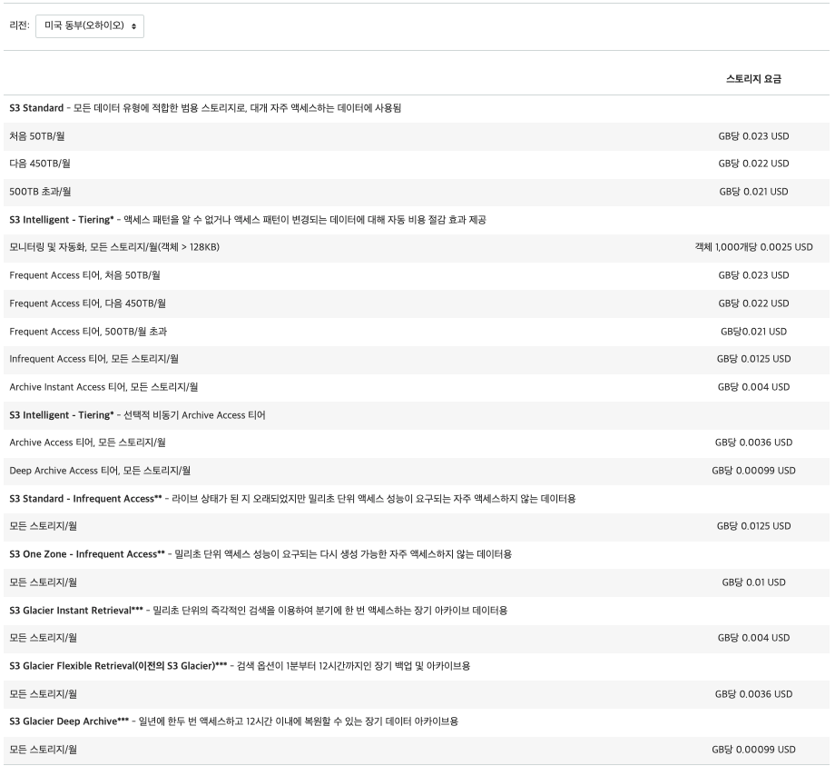

# S3

 

## S3 Pricing Tiers

 

**What makes up the cost of S3?**

- Storage
- Requests and Data Retrievals
- Data Transfer
- Management & Replication

 

**What are the different Tiers?**

- S3 Standard
- S3 - IA (Infrequent Access)
- S3 - One Zone - IA
- S3 - Intelligent Tiering
- S3 Glacier
- S3 Glacier Deep Archive

 

 

