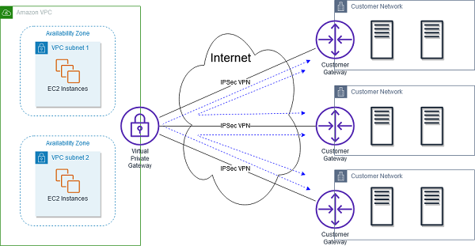

# VPC 

계정에 생성되는 VPC인 기본 VPC를 살펴봅시다 
새로운 AWS 계정은 모두 기본 VPC가 있고 바로 사용할 수 있어요 
새로운 EC2 인스턴스는 서브셋을 지정하지 않으면 기본 VPC에 실행됩니다 
어쨌든 계정을 시작하면 VPC는 하나만 생깁니다 

기본 VPC는 처음부터 인터넷에 연결돼 있어서 인스턴스가 인터넷에 액세스하고 또 내부의 EC2 인스턴스는 
공용 IPv4 주소를 얻습니다 EC2 인스턴스를 생성하자마자 연결할 수 있는 이유가 바로 이 때문입니다 
또한 EC2 인스턴스를 위한 공용 및 사설 IPv4 DNS 이름도 얻고요 

## 1. VPC
## 2. Subnet
## 3. Internet Gateway
## 4. Bastion Host
## 5. NAT Gateway

## 6. NACL

### Security Groups & Network Access Control List

**EX. 서브넷 보안 단계**

#### #1. Incoming Request
*요청이 EC2 인스턴스 내부로 이동*

**1/ 요청이 서브넷에 들어가기 전, 먼저 NACL로 이동**
- NACL에는 몇 가지의 인바운드 규칙이 정의되며 요청이 허용되지 않으면 내부로 들어갈 수 없음

**2/ 첫 번째 요청이 NACL을 통과 후 서브넷 내부에 도달**
- 보안 그룹 인바운드 규칙 검증
- 요청이 명시적으로 허용 받지 못하면 거부

**만약 요청이 보안 그룹의 인바운드 규칙을 통과하면, EC2 인스턴스에 도달**

- 다시 서브넷을 나갈 땐, 아웃바운드 규칙은 자동으로 허용 ← Security Group: Stateful

<pre>
<b>NACL</b>: Stateless. 무상태
<b>Security Groups</b>: Stateful. 상태 유지
</pre>
- 보안 그룹의 특징이 상태 유지이기 때문, 다시 말해 들어간 것은 전부 나올 수 있음

**3/ 서브넷 밖으로 이동**
- NACL 아웃바운드의 규칙이 평가 ← NACL 무상태
- 규칙이 통과하지 못하면 요청도 통과하지 못함

 

#### #2. Outgoing Request

*보안 그룹 내 EC2 인스턴스가 아웃바운드 요청*

**1/ 보안 그룹 내 EC2 인스턴스가 서브넷으로 이동**
- 보안 그룹 아웃바운드 규칙 평가

**2/ 서브넷 밖으로 이동**
- NACL 아웃바운드 규칙 검증: 규칙이 적절하고 요청이 허가될 때

<small>EC2 내에서 `www.google.com`로 ping을 보내면, 이런 식으로 평가된 요청이 `www.google.com`에 도달하고 Amazon 웹 서비스로 다시 돌아오는 것</small>

**3/ 서브넷 내로 응답이 돌아옴**
- NACL 인바운드 규칙이 평가될 수 있음 ← NACL 무상태

**서브넷에서 Security Group 내로 응답이 돌아옴**
- 보안 그룹 수준에서 서브넷의 인바운드 규칙은 무조건 허용 ← Security Group: Stateful

 

### NACL: 네트워크 액세스 제어 목록

NACL: Network Access Control List

- 서브넷을 오가는 트래픽을 제어하는 방화벽과 비슷
- One NACL per Subnet. 서브넷마다 하나의 NACL 존재. 새로운 서브넷에는 **Default NACL**이 할당됨
- NACL 규칙 정의, NACL Rules
  - 규칙에는 숫자가 있고 범위는 1 (Highest Priority) ~ 32,766 (Lowest Priority)
  - 규칙 비교 시 첫 번째 매칭만 적용 First rule match 
  - 별표(*): 일치하는 규칙이 없으면 모든 요청을 거부
  - AWS는 이 규칙을 100씩 추가하는 것을 권장 (사이에 규칙을 추가하기 용이)

- 새로 만들어진 NACL은 기본적으로 모두를 거부
- NACL의 아주 좋은 사용 사례를 들면 **서브넷 수준에서 특정한 IP 주소를 차단**하는데 적합
- NACL 위치: 서브넷 수준. 공용 서브넷 및 사설 서브넷 등에 위치

## Default NACL ⭐️⭐️⭐️

- 연결된 서브넷을 가지고 인바운드/아웃바운드의 모든 요청을 허용 → 기본 NACL은 매우 개방적
- 기본 NACL을 수정하지 않는 것 추천
  - NACL이 모든 것을 드나들도록 허용하지 않으면 AWS를 시작할 때 심각한 디버깅을 해야 함
- 사용자 정의 네트워크 ACL이 필요하다면 만들 수 있음

=> 즉, **⭐️ 기본 NACL이 기본적으로 서브넷과 연결된다면 모든 것이 드나들도록 허용된다는 뜻**

### Ephemeral Ports, 임시 포트 ⭐️⭐️⭐️

- 클라이언트와 서버가 연결되면 포트를 사용해야 함
- 클라이언트 - 규정된 포트 -> 서버 연결
  - ex. HTTP 포트는 80, HTTPS 포트는 443 SSH 포트는 22 등
- 서버 -(**임시 포트**)-> 클라이언트
  - 서버도 응답을 하려면 클라이언트에 연결해야 함
  - 클라이언트는 기본적으로 개방된 포트가 없기 때문에 클라이언트가 자체적으로 **특정 포트**를 열게 됨
  - 이 포트는 임시라서 클라이언트와 서버 간 연결이 유지되는 동안만 열려 있음

**임시 포트는 운영 체제에 따라 포트 범위가 다르고, 아래 범위 내 임시 포트로 선택**
- Windows 10: 49152 ~ 65,535
- Linux: 32,768 ~ 60,999

#### EX. 클라이언트 - 데이터베이스 연결

- Web Subnet (Public): EC2 Instance
- DB Subnet (Private): DB Instance - port 3306

**클라이언트가 데이터베이스 인스턴스에 연결을 시작하면 허용되어야 하는 규칙은?**
- 웹 NACL & DB NACL 서로 통신한다고 가정

1. Web Subnet NACL - TCP 아웃바운드 허용
   - 웹 NACL은 TCP부터 데이터베이스를 Port 3306를 통해 서브넷 CIDR까지 아웃바운드를 허용
2. DB SubnetNACL - TCP 인바운드 허용
   - 데이터베이스 측에서는 DB NACL가 웹 서브넷 CIDR에서 포트 3306으로 인입하도록 허용

*데이터베이스가 클라이언트로 요청에 회신을 할 때*

3. DB Subnet NACL - TCP 아웃바운드 허용
   - 클라이언트는 임시 포트를 가지게 되며, 요청에 대해 무작위 포트가 할당
   - DB NACL은 포트 및 임시 포트 범위: 1,024 ~ 65,535

4. Web Subnet NACL - TCP 인바운드 허용
   - 웹 NACL은 DB 서브넷 CIDR의 임시 포트 범위에서 인바운드 TCP를 허용해야 함

- ⭐️ **네트워크 ACL을 여러 서브넷과 연결할 수 있음**
  - 서브넷: NACL = N:1
  - 서브넷은 한 번에 하나의 네트워크 ACL에만 연결할 수 있으며, 네트워크 ACL을 서브넷과 연결하면 이전 연결이 제거됨
  - 즉, 다중 NACL 및 서브넷이 있다면 각 NACL 조합이 NACL 내에서 허용되어야 함
  - CIDR 사용 시, 서브넷이 고유의 CIDR을 갖기 때문
  - NACL에 서브넷을 추가하면 NACL 규칙도 업데이트해서 연결 조합이 가능한지 확인해야만 함

<a href="https://docs.aws.amazon.com/vpc/latest/userguide/vpc-network-acls.html#nacl-ephemeral-ports">
🔗 Link: nacl-ephemeral-ports
</a>

### Security Group vs. NACL

| | Security Group | NACL |
| -- | --- | --- |
| level | Instance | Subnet |
| supports | allow rules | allow rules and deny rules (특정 IP 주소 거부 가능) |
| state | **Stateful** | **Stateless** (임시 포트) |
| allow | 트래픽 허용이 될 때까지 규칙 검증 | 트래픽이 허용되는지 순서에 따라 가장 높은 우선순위로 매칭되는 룰에 검증 |
| range | EC2에 지정한 규칙이 존재할 때 검증 | NACL과 연결된 Subnet 내 모든 EC2 인스턴스에 적용 |

## 7. VPC Peering

- AWS 네트워크를 통해 프라이빗하게 연결
  - 다양한 리전과 계정에서 VPC를 생성할 수 있음
  - AWS 네트워크를 통해 연결하고 싶을 때 사용
- VPC가 모두 **같은 네트워크**에서 작동하도록 만들기 위함
- VPC 네트워크 CIDR가 겹치면 안됨
  - 연결 시 CIDR가 겹치면 통신 불가
- ⭐️⭐️⭐️ VPC 피어링은 두 VPC 간에 발생하며 **전이되지 않음, NOT transitive** 
  - 서로 다른 VPC가 통신하려면 VPC 피어링을 활성화해야 함

**VPC Peering is NOT transitive, 전이 불가**
<pre>
VPC A, B, C가 있을 때, 
A -⭕️-> B: A와 B는 Peering 연결 생성 -> 통신 가능 상태
B -⭕️-> C: B와 C는 Peering 연결 생성 -> 통신 가능 상태
A -❌-> C: A와 C의 VPC 피어링 연결을 활성화해야 둘이 통신 가능
</pre>

⚠️ 또한 VPC 피어링이 있을 때 1. 활성화, VPC 서브넷 상의 2. Root Table도 업데이트해서 EC2 인스턴스가 서로 통신할 수 있게 해야 함

### Good to know

- Cross Account / Cross Region: 가능 다른 계정 간, 리전 간에도 가능
- 동일 리전의 계정 간 Peered VPC에서 보안 그룹을 참조할 수도 있음
  - CIDR이나 IP를 소스로 가질 필요가 없고 보안 그룹을 참조할 수도 있음

## 8. VPC Endpoint
**TL;DR;**
- 모든 AWS 서비스는 공개적으로 열려 있음 (Public URL)
- VPC Endpoints(AWS의 PrivateLink 기반)는 private network를 사용하여 AWS 서비스에 연결하도록 도와줌 (public Internet이 아닌)
- 중복과 수평 확장이 가능
- AWS 서비스들에 접근할 때 IGW, NATGW의 필요성을 없앰
- 만약 이슈가 발생하면 아래 확인
  1. VPC 내의 DNS Setting Resolution 확인
  2. Route Tables 

#### Private -> Public 접근: 세 가지 시나리오

**요구사항.** AWS 서비스들에 퍼블릭 인터넷을 경유하지 않고 프라이빗 액세스를 원할 때

**Q. Public Subnet vs Private Subnet?**

1. (Public Subnet) EC2 Instance -> Internet Gateway (VPC-Public) -> (Public) Amazon SNS
   - 인터넷 게이트웨이에서 바로 Amazon SNS 서비스로
   - 비용이 많이 듦
2. (Private Subnet) EC2 Instance -> (Public Subnet) NAT Gateway -> Internet Gateway (VPC-Public) -> (Public) Amazon SNS
   - **EC2 인스턴스**에서 **NAT Gateway**를 거쳐 **인터넷 게이트웨이**로 향하도록 하고 Amazon SNS 서비스에 **퍼블릭**으로 액세스
   - 일단 NAT Gateway를 거칠 때 비용이 발생하고 그 다음 인터넷 게이트웨이에서는 비용이 발생하지 않음
   - 하지만, 허브가 여러 개 있을 테니 어쨌든 효율적이라고는 할 수 없음
3. (Private Subnet) EC2 Instance -> VPC Endpoint (VPC-Public) -> (Public) Amazon SNS
   - 퍼블릭 인터넷을 거치지 않고도, 프라이빗 AWS 네트워크만 거쳐서 인스턴스에 액세스할 수 있음
   - 네트워킹을 구성해서 프라이빗 서브넷에 있는 EC2 인스턴스를 VPC 엔드포인트를 거쳐 직접 Amazon SNS 서비스에 연결할 수 있는데 이때 **네트워크가 AWS 내에서만 이루어진다는 장점**이 있음
   - VPC 엔드포인트를 사용하면 AWS PrivateLink를 통해 프라이빗으로 액세스
   - 인터넷 게이트웨이나 NAT Gateway 없이도 AWS 서비스에 액세스 가능: 간단한 네트워크 인프라 설계 가능

### VPC 엔드포인트 유형

#### Interface Endpoint (PrivateLink를 이용)

- ENI 프로비저닝, ENI는 VPC의 Private IP 주소이자 AWS의 엔트리 포인트
  - ENI가 있으므로 반드시 보안 그룹을 연결해야 함
  - PrivateLink를 사용하는 인터페이스 유형 VPC 엔드포인트로 ENI를 통하여 이 서비스에 액세스
- 대부분의 AWS 서비스를 지원
- 청구 요금은 **시간 단위** 또는 **처리되는 데이터 GB 단위**

#### Gateway Endpoint

- 특이하게도 게이트웨이를 프로비저닝; 게이트웨이는 반드시 라우팅 테이블의 대상이 되어야 함
  - ⭐️ IP 주소를 사용하거나 보안 그룹을 사용하지 않고 라우팅 테이블의 대상이 될 뿐임
  - 라우팅 테이블 액세스일 뿐이므로 자동으로 확장
- ⭐️⭐️ Amazon S3와 DynamoDB 두 가지 사용 가능
- 무료
- 확장성이 더 높음 (라우팅 테이블만 수정하면 되기 때문에 Interface Endpoint보다 용이)

#### S3: Interface Endpoint vs. Gateway Endpoint
- 기본적으로 Gateway Endpoint가 무료이고 확장성이 높음
- 게이트웨이 엔드포인트보다 인터페이스 엔드포인트가 권장될 때?
  - 온프레미스에서 액세스해야 할 필요가 있을 때 (Site-to-Site VPN이나 직접 연결 방법)
      - 온프레미스에 있는 데이터 센터에 프라이빗으로 액세스해야 하는 경우 
  - 다른 VPC에 연결할 때

 

## 9. VPC Flow Logs

VPC Flow Logs
: VPC 흐름 로그. 인터페이스로 향하는 IP 트래픽 정보를 포착하는 것

- 연결 문제를 모니터링하고 트러블 슈팅하는 데 유용
- 로그 데이터는 Amazon S3와 CloudWatch Logs에 전송 가능
- AWS 관리형 인터페이스 정보를 포착
    - ELB, RDS, ElastiCache Redshift, Workspaces, NAT Gateway, Transit Gateway ...

**종류**
- VPC 계층 
- 서브넷 계층 
- Elastic Network Interface(ENI) 계층

### VPC Flow Logs Syntax

-> VPC를 통과하는 네트워크 패킷의 메타데이터: version, account-id, interface-id, 소스 주소(srcaddr), 대상 주소(dstaddr) 소스 포트(srcport), 대상 포트(dstport), 프로토콜(protocol), 패킷 수(packets), 바이트 수(bytes) 시작 동작(start action), 로그 상태(log-status)

- **srcaddr & dstaddr**: 문제가 있는 IP를 식별
  - 한 IP가 지속적으로 거부되면 여기서 확인 가능 
  - (문제가 있거나 특정 IP가 공격받았을 때)
- **srcport & dstport**: 문제가 있는 포트를 식별
- **action**: 요청이 수락되었는지 거부되었는지 식별
  - **보안 그룹**이나 **NACL** 계층에서 요청 성공/실패 확인

- 사용량 패턴 분석이나 악성 행동 감지 포트 스캔 등에 사용
- 흐름 로그를 쿼리 방법: 
  1. S3에서 Athena를 쓰는 방법 (Best)
  2. CloudWatch Logs Insight (스트리밍 분석을 원할 때)

#### 문제 트러블 슈팅
*이 흐름 로그를 보안 그룹과 NACL 문제 트러블 슈팅에 사용하는 방법은?*
\- **action 필드**

CASE1. action: 인바운드 REJECT가 표시된 경우
: EC2 외부에서 전송한 인바운드 요청이 거부되었다는 뜻. NACL이나 보안 그룹 중 하나가 요청 거부.

CASE2. 인바운드 ACCEPT + 아웃바운드 REJECT
: NACL 문제 (보안 그룹은 stateful, 상태 유지 중이므로)

CASE3. 아웃바운드 REJECT가 표시된 경우 (보내는 요청)
: NACL이나 보안 그룹의 문제라는 뜻

CASE4. 아웃바운드 ACCEPT 인바운드 REJECT
: 반드시 NACL가 원인

### Architectures

1/ VPC Flow Logs > CloudWatch Logs > CloudWatch Contributor Insights
: CloudWatch Logs로 전송된 흐름 로그는 CloudWatch Contributor Insights라는 기능을 사용하여, 상위 10위에 해당하는 VPC 네트워크에 가장 많이 기여하는 IP 주소나 ENI 등 식별 가능

2/ VPC Flow Logs > CloudWatch Logs > CW Alarm > Amazon SNS
: CloudWatch Logs에 흐름 로그를 보냄
    - SSH나 RDP 프로토콜에 관하여 지표 필터를 설정 가능
    - 평소보다 SSH나 RDP 프로토콜이 너무 많은 경우 CloudWatch 경보를 트리거하여 Amazon SNS 주제로 경보를 전송
    - 네트워크에 수상한 행동이 발생했을 수 있으므로

3/ VPC Flow Logs > S3 Bucket > Amazon Athena > Amazon QuickSight
: VPC 흐름 로그를 모두 S3 버킷에 전송 및 저장해서 Amazon Athena를 이용하여 SQL로 VPC 흐름 로그를 분석할 수 있음
    - Amazon QuickSight: 데이터 시각화

<pre>
<b>VPC(Virtual Private Cloud) Peering</b>
A VPC peering connection is a networking connection between two VPCs that enables you to route traffic between them using private IPv4 addresses or IPv6 addresses. Instances in either VPC can communicate with each other as if they are within the same network. You can create a VPC peering connection between your own VPCs, or with a VPC in another GCP account. The VPCs can be in different regions (also known as an inter-region VPC peering connection).

<b>VPN (Virtual Private network)</b>
VPN stands for virtual private network. A virtual private network (VPN) is a technology that creates a safe and encrypted connection over a less secure network, such as the internet. Virtual Private network is a way to extend a private network using a public network such as the internet. The name only suggests that it is Virtual “private network” i.e. the user can be the part of the local network sitting at a remote location. It makes use of tunneling protocols to establish a secure connection.
</pre>

 

## 10. Site-to-Site VPN

⭐️ ✍🏻 **온프레미스와 AWS 사이의 Site-to-Site VPN 연결을 생성하는 과정**
<small>고객 게이트웨이와 가상 프라이빗 게이트웨이를 AWS에서 생성하고 둘을 Site-to-Site VPN 연결로 연결하는 방법</small>

**Corporate Data Center**

- 공용 인터넷을 통해 사설 Site-to-Site VPN을 연결해야 함
- VPN 연결이라서 공용 인터넷을 거치지만 암호화되어 있음
- 특정 기업 데이터 센터를 AWS와 비공개로 연결하려면 기업은 고객 게이트웨이, VPC는 VPN 게이트웨이를 가져야 함

Site-to-Site VPN을 구축하려면 두 가지 Gateway가 필요: VGW, CGW

### VGW: Virtual Private Gateway
*가상 프라이빗 게이트웨이*

- Virtual Private Gateway: VPN 연결에서 AWS 측에 있는 VPN concentrator
- VGW는 생성 시 Site-to-Site VPN 연결을 생성하는 VPC에 연결
- ASN 지정 가능

### CGW: Customer Gateway
*고객 게이트웨이*

- Customer Gateway: VPN 연결에서 데이터 센터 측에 있는 고객이 갖춰야 할 소프트웨어 혹은 물리적 장치

### Site-to-Site VPN Connections ⭐️⭐️

- Customer Gateway Device
고객 게이트웨이가 있는 기업 데이터 센터와 가상 프라이빗 게이트웨이를 갖춘 VPC가 있습니다

**⭐️ IP 주소**
- **고객 게이트웨이가 공용public일 때**: 고객 게이트웨이 장치 내에 있는 IP 주소
- **고객 게이트웨이가 사설private일 때**: NAT-T를 활성화하는 NAT 장치 뒤에 있는 NAT 장치의 공용 IP 주소

**⭐️ Route Propagation**
- 서브넷의 VPC에서 라우트 전파를 활성화해야 Site-to-Site VPN 연결이 실제로 작동

**⭐️ Security Group - ICMP**
- 온프레미스에서 AWS로 EC2 인스턴스 상태를 진단할 때, 보안 그룹 인바운드 ICMP 프로토콜이 활성화됐는지 확인
  - 가령, EC2 인스턴스로 ping을 사용해 상태 체크를 하고 싶을 때
  - 비활성인 경우 연결 안 됨

### AWS VPN CloudHub ⭐️⭐️⭐️⭐️⭐️

: 여러 VPN 연결을 통해 모든 사이트 간 안전한 소통을 보장

**Example Scenario**

*VPC::**VGW** [1] ---- ? ---- [N] **CGW**::데이터 센터*

- 비용이 적게 드는 허브 및 스포크 모델(hub&spoke)로 VPN만을 활용해 서로 다른 지역 사이 기본 및 보조 네트워크 연결성에 사용
- VPC 내 CGW와 VGW 하나 사이에 Site-to-Site VPN을 생성
- VPN 연결이므로 모든 트래픽이 암호화되어 공용 인터넷을 통함 (사설 네트워크로는 연결 안됨)
- 설치 방법: 
  - VPG(가상 프라이빗 게이트웨이) 하나에 Site-to-Site VPN 연결을 여러 개 생성 -> 동적 라우팅을 활성화 -> 라우팅 테이블 구성

 

## 11. Direct Connect

Direct Connect
: 원격 네트워크로부터 VPC로의 전용 프라이빗 연결을 제공

- 사용 조건: 전용 연결(Dedicated Connection) 생성: 고객 DC - AWS Direct Connect 로케이션
- VPC에는 가상 프라이빗 게이트웨이를 설치해야 온프레미스 데이터 센터와 AWS 간 연결이 가능
- 퍼블릭 리소스(ie. Amazon S3)와 프라이빗 리소스(ie. EC2 인스턴스)를 같은 연결상에서 퍼블릭 및 프라이빗 VIF를 사용해 액세스 가능

**프라이빗 연결**
- 퍼블릭 인터넷을 거치지 않기 때문에 속도 가속
- 비용 절약
- 퍼블릭 인터넷 연결에 문제가 발생해도 Direct Connect를 사용하면 연결 상태를 유지 가능

**사용 사례**
- 대역폭 처리량이 증가할 때 큰 데이터 세트를 처리; 속도 가속, 비용 절감
- 실시간 데이터 피드를 사용하는 애플리케이션
- 하이브리드 환경 지원; 온프레미스 데이터 센터와 클라우드가 연결

*IPv4와 IPv6 둘 다 지원*

**리전을 기업 데이터 센터에 연결을 위한 AWS Direct Connect Location 요청**
- AWS Direct Connect Location: 물리적인 위치
  - AWS Cage: Direct Connect 엔드포인트
  - Customer or partner cage: 고객 혹은 파트너 라우터
- Customer router/firewall: 온프레미스 데이터 센터에는 방화벽이 있는 고객 라우터를 설치

**프라이빗 VIF를 생성**
- 목적: 프라이빗 가상 인터페이스 생성하여 VPC로 프라이빗 리소스에 액세스하기 위함
- 모든 로케이션을 연결하는 프라이빗 VIF를 생성하여 가상 프라이빗 게이트웨이에 연결 (VLAN1, 2)
- 가상 프라이빗 게이트웨이는 VPC에 연결

- 프라이빗 VIF로 EC2 인스턴스가 있는 프라이빗 서브넷에 액세스할 수 있음
- 설치만 한 달이 걸릴 수 있음
- 퍼블릭 인터넷을 전혀 지나지 않고 전부 비공개로 연결

- AWS 내 퍼블릭 서비스 (ie. Amazon Glacier, Amazon S3)에 연결할 수도 있는데 이때는 퍼블릭 가상 인터페이스 즉 퍼블릭 VIF를 설치해야 함
- 결국 같은 경로를 지나가지만 가상 프라이빗 게이트웨이로 연결되지 않고 AWS로 직접 연결

### Direct Connect Gateway
- 하나 이상의 VPC와 연결하고 싶을 때 사용

**리전이 두 개인 예시**

- 각기 다른 VPC와 CIDR가 두 개 있고 온프레미스 데이터 센터를 양쪽 VPC에 연결
- Region1: us-east-1, VPC: 10.0.0.0/16
- Region2: us-west-1, VPC: 172.16.0.0/16

1. Direct Connect 연결을 생성
2. 프라이빗 VIF를 사용해 Direct Connect Gateway에 연결
3. Direct Connect Gateway에는 프라이빗 VIF를 통해 여러 VPC와 여러 리전을 연결

### Direct Connect 유형

**Dedicated Connections(전용 연결)**
- 한도: 초당 1Gbp, 10Gbp, 100Gbp
- 고객마다 물리적 전용 이더넷 포트(Physical ethernet port dedicated)를 할당받음
- 먼저 AWS에 요청을 보내면 AWS Direct Connect 파트너가 처리

**Hosted Connections(호스팅 연결)**
- 한도: 초당 50Mbp, 500Mbp, ~10Gbp
- AWS Direct Connect 파트너를 통해 또다시 연결을 요청
- 필요하면 언제든지 용량을 추가하거나 제거하면 되므로 전용 연결보다 유연
- 선택한 로케이션에서 초당 1, 2, 5, 10Gbp 이용 가능

전용 연결/호스팅 연결: 새 연결을 만들려면 리드 타임이 한 달보다 길어질 때도 있기 때문에, 가령 일주일 안에 빠르게 데이터를 전송하고 싶다면 Direct Connect는 부적절

### Direct Connect - Encryption

- Direct Connect에는 **암호화 기능이 없음**: 데이터가 암호화되지 않음
  - 프라이빗 연결이므로 보안을 유지할 수 있음
- 따로 암호화 추가: Direct Connect + VPN을 설치 -> IPsec으로 암호화된 프라이빗 연결
  - 추가로 보안을 확보하면 좋지만, 구현이 복잡

**암호화 과정**
- Direct Connect 로케이션을 가져와 해당 연결에 VPN 연결을 구축하면 Direct Connect에 암호화가 구성됨
- 기업 데이터 센서와 AWS 간 모든 트래픽을 암호화 가능

### Direct Connect - Resiliency ⭐️⭐️⭐️⭐️⭐️

- 핵심 워크로드(Critical Workloads)의 복원력을 높이기 위해, 여러 Direct Connect를 설치하는 것이 좋음

가령, 기업 데이터 센터가 두 개 있고 Direct Connect 로케이션도 둘이라고 했을 때 두 상황:

**1. High Resiliency for Critical Workloads**

: - 프라이빗 VIF가 하나 있는데 다른 데 또 있다면, 하나의 연결을 여러 로케이션에 수립한 것 
  - Direct Connect 하나가 망가져도 다른 하나가 예비로 남아 있기 때문에 **복원력이 강해**지기 때문에 **핵심 워크로드에 적합**

**2. Maximum Resiliency for Critical Workloads**

: - 각 Direct Connect 로케이션에 독립적인 연결을 **두 개씩 수립하면 복원력을 최대**로 만들 수 있음
  - 기업 데이터 센터가 두 개라면, 각 로케이션에 네 개의 연결을 수립해서 AWS에 연결
  - 즉, 최대의 복원력을 달성하려면 여러 독립적인 연결을 하나 이상의 로케이션에서 각기 다른 장치에 도달하도록 구성

## 12. 환승 Gateway
## 13. VPC 트래픽 미러링
## 14. VPC용 IPv6
## 15. 이그레스 전용 인터넷 Gateway

