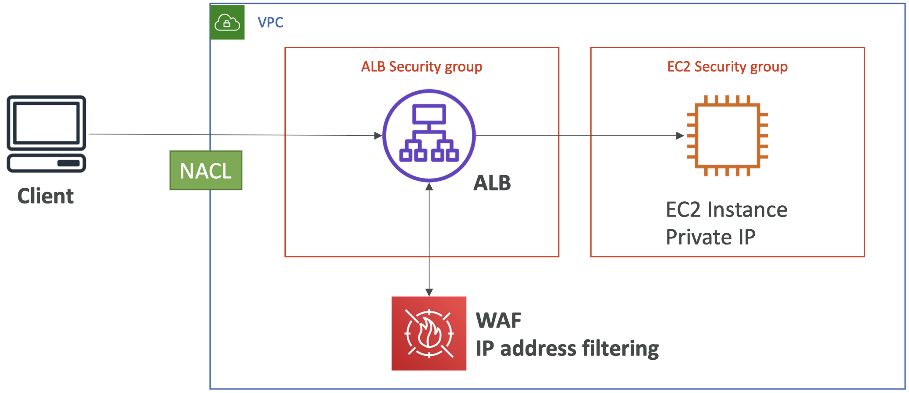
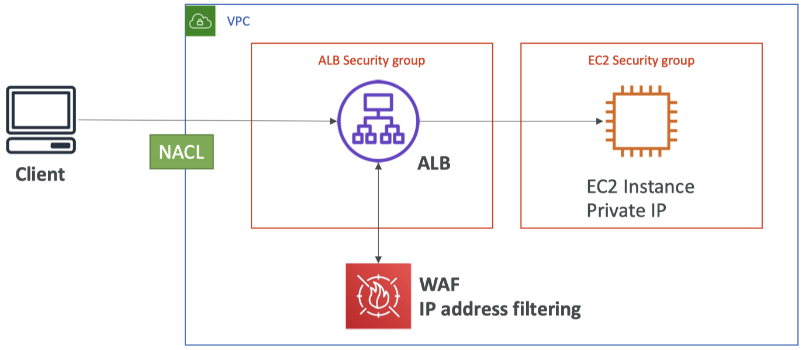

# Blocking IP Address

## 1. EC2 Instance

VPC 보안 그룹: 
인스턴스에 Public IP를 통해 공용 액세스 접근

**첫 번째 방어선.** VPC 레벨에서 VPC의 네트워크 ACL방어
**Network ACL**에서 **차단 규칙** 생성 가능
-> Simple, Fast, Cheap

**두 번째 방어선.** EC2 인스턴스의 보안 그룹
차단 규칙 X, 허용 규칙만 지정 가능
- 액세스를 허용할 클라이언트들의 서브셋을 알 때 보안 그룹에서 지정
- 글로벌이라면, IP 주소를 전부 알 수 없어 도움 X

**추가적 방어선.** 방화벽 소프트웨어를 EC2 인스턴스에서 실행해 클라이언트의 요청을 거절할 수 있음
- 만약 요청이 EC2 인스턴스에 도착했다면 처리 + 요청 처리에 **CPU 비용 발생**

## 2. ALB

두 개의 보안 그룹: ALB 보안 그룹, EC2 보안 그룹

**EC2 보안 그룹**
  - ALB의 보안 그룹을 허용하도록 구성

**ALB 보안 그룹**
  - 클라이언트 IP의 범위를 알 때 지정
  - 글로벌 애플리케이션일 경우 모두 허용
  - 방어선은 네트워크 ACL 레벨에 존재

## 3. NLB

- **이벤트 개념**: 네트워크 로드 밸런서로는 연결 종료 X
- 네트워크 로드 밸런서를 위한 보안 그룹이 없기 때문에 트래픽은 그냥 지나감 Passthrough
- 소스 IP를 안다면 EC2의 보안 그룹에서 정의
- 클라이언트로부터 IP 주소를 차단하려면 **네트워크 ACL**을 사용해야 함

EC2 인스턴스는 엣지에서 클라이언트의 공용 IP를 감지

## 4. ALB + WAF

웹 애플리케이션 방화벽을 설치해 IP를 차단할 수 있음 (WAF는 조금 비쌀 수 있음)
- IP 주소에 대한 복잡한 필터링이 가능
- 규칙을 만들어서 클라이언트로부터 동시에 많은 요청을 받지 않도록 설정
- WAF는 클라이언트와 ALB 사이에 있는 서비스가 아니라 ALB에 설치한 서비스
- 규칙을 많이 정의할 수 있음
- 그러니 또 하나의 방어선

## 5. ALB, CloudFront WAF

- ALB는 모든 엣지 로케이션으로부터 오는 CloudFront의 공용 IP를 허용, 온라인에 목록이 있음

- ALB는 클라이언트 IP를 알 수 없고 CloudFront 공용 IP만 알 수 있죠 
- 네트워크 ACL은 VPC의 경계선에 있는데 클라이언트 IP를 막는 데 도움이 되지는 않음
CloudFront로부터의 클라이언트를 막으려면 두 가지 방법이 있죠

- 국가에 의한 공격: CloudFront의 지리적 제한 기능을 이용해서 CloudFront에서 클라이언트의 국가를 차단
- 특정 IP 하나만 막고 싶다면: WAF나 웹 애플리케이션 방화벽을 사용해서 전처럼 IP 주소를 필터링

  

=> 아키텍처에 따라 IP 주소를 차단하기 위한 방어선이 달라짐, 전부 결합했을 때 작동
