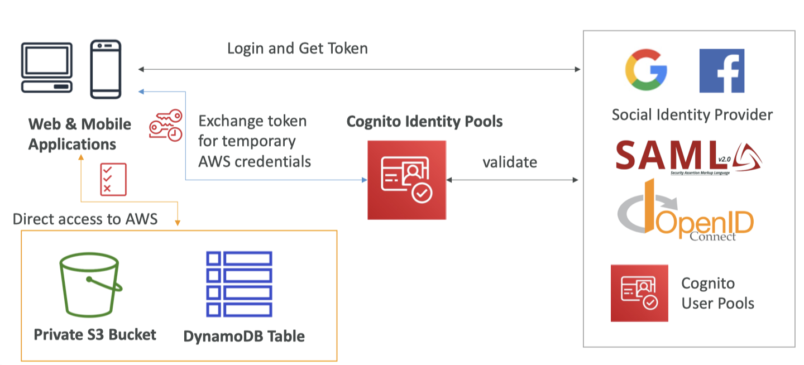

# IAM

## 01. AWS Organizations

- 글로벌 서비스
- 다수의 AWS 계정을 동시에 관리
- 조직 생성 시, 메인 계정이 관리 계정이 됨
- 멤버 계정: 조직에 가입한 기타 계정 or 조직에서 생성한 계정, 한 조직에만 소속
- 모든 계정의 비용을 통합 결제: 관리 계정에 조직 전체의 비용을 지불할 수 있으며, 집계된 사용량에 기반한 비용 할인을 받을 수 있음
- 계정 간 **예약 인스턴스, Savings Plans 할인 공유**
  - 어떤 계정에서 사용하지 않는 예약 인스턴스를 다른 계정이 해당 인스턴스를 사용할 수 있음
- 자동 계정 생성 API: 계정 쉽게 생성 가능


### Organization Unit
*OU, 조직 단위*

- 루트: 전체 계정 중 가장 외곽 OU, 관리 계정을 포함, 서브 OU를 생성 가능
  - 가령, 개발 계정 OU와 프로덕션 계정 OU을 생성하고 멤버 계정을 생성할 수 있음

### Benefit
- 보안 우수 (단일 게정의 여러 VPC보다 독립적)
- 청구 목적의 태그 기준 적용 가능
- 모든 계정의 CloudTrail을 활성화 -> 모든 로그를 중앙 S3 계정으로 전송할 수 있음
- CloudWatch Logs를 중앙 로깅 계정으로 전송 가능
- 관리 계정에서 모든 멤버 계정 관리

보안 관리에서도 큰 장점
### Security Control Policies
- SCP, 서비스 제어 정책
- 특정 OU 또는 계정에 적용되는 IAM 정책: 사용자와 역할 제한합니다
- 관리 계정(관리자 권한)에는 적용 X
- 기본적으로 모두 허용하지 않고 구체적인 허용 항목을 설정해야 함 (IAM처럼)

### SCP Hierarchy


**SCP Examples Blocklist and Allowlist strategies**
```json
{
    "Version": "2012-10-17",
    "Statement": [
        {
            "Sid": "AllowsAllActions",
            "Effect": "Allow",
            "Action": "*",
            "Resource": "*"
        },
        {
            "Sid": "DenyDynamoDB", 
            "Effect": "Deny",
            "Action": "dynamodb:*",
            "Resource": "*"
        }
    ]
}
```

## 02. Advanced IAM

<table>
<tr>
<td>
<b>aws:SourceIP</b>
<pre><code lang="json">
{
  "Version": "2012-10-17",
  "Statement": {
    "Effect": "Deny",
    "Action": "iam:*",
    "Resource": "*",
    "Condition": {
        "NotIpAddress": {
            "IpAddress": {
                "aws:SourceIp": ["192.0.2.0/24", "203.0.113.0/24"]
            }
        }
    }
  }
}
</code></pre>
클라이언트 IP 제한: 두 CIDR에 포함되지 않는 IP 주소는 모든 작업과 리소스를 거부(Deny)
</td>
<td>
<b>aws:RequestedRegion</b>
<pre><code lang="json">
{
  "Version": "2012-10-17",
  "Statement": {
    "Effect": "Deny",
    "Action": ["ec2:*", "rds:*", "dynamodb:*"],
    "Resource": "*",
    "Condition": {
        "StringEquals": {
            "aws:RequestedRegion": ["eu-central-1", "eu-west-1"]
        }
    }
  }
}
</code></pre>
API 호출 리전을 제한: 특정 리전에서 특정 서비스에 대한 액세스를 거부

-> `eu-central-1`와 `eu-west-1` 리전에서 오는 EC2, RDS, DynamoDB 호출을 제한

</td>
</tr>
</tr>
<tr>
<td>
<b>ec2:ResourceTag</b>
<pre><code lang="json">
{
  "Version": "2012-10-17",
  "Statement": {
    "Effect": "Allow",
    "Action": ["ec2:startInstances", "ec2:StopInstances"],
    "Resource": ["arn:aws:ec2:us-east-1:111122223333:instance/*"],
    "Condition": {
        "StringEquals": {
            "ec2:ResourceTag": "DataAnalytics",
            "aws:PrincipalTag/Department": "Data",
        }
    }
  }
}
</code></pre>
</td>
<tr>
<td>
<b>ec2:ResourceTag</b>
<pre><code lang="json">
{
  "Version": "2012-10-17",
  "Statement": {
    "Effect": "Allow",
    "Action": ["ec2:startInstances", "ec2:StopInstances"],
    "Resource": ["arn:aws:ec2:us-east-1:111122223333:instance/*"],
    "Condition": {
        "StringEquals": {
            "ec2:ResourceTag": "DataAnalytics",
            "aws:PrincipalTag/Department": "Data",
        }
    }
  }
}
</code></pre>
1. EC2 인스턴스의 태그가 Project가 DataAnalytics

2\. 사용자의 Department가 Data일 때 

모든 인스턴스의 시작과 종료를 허용
</td>
</tr>
</td>
<tr>
<td>
<b>aws:MultiFactorAuthPresent</b>
<pre><code lang="json">
{
  "Version": "2012-10-17",
  "Statement": {
    "Effect": "Allow",
    "Action": "ec2:*",
    "Resource": *
  },
  "Statement": {
    "Effect": "Deny",
    "Action": ["ec2:StopInstances", "ec2:TerminateInstances"],
    "Resource": *
    "Condition": {
        "BoolIfExists": {
            "aws:MultiFactorAuthPresent": false
        }
    }
  }
}
</code></pre>
멀티팩터 인증을 강제: 사용자는 EC2에서 모든 작업을 할 수 있지만 멀티팩터 인증 필수

-> MFA가 false(거짓)일 때 거부
</td>
</tr>
<table>


### S3 버킷에 대한 IAM 정책

```json
{
   "Version":"2012-10-17",
   "Statement":[
      {
         "Effect":"Allow",
         "Action": ["s3:ListBucket"],
         "Resource":"arn:aws:s3:::DOC-EXAMPLE-BUCKET1"
      },
      {
         "Effect":"Allow",
         "Action":[
            "s3:PutObject",
            "s3:GetObject",
            "s3:DeleteObject"
         ],
         "Resource":"arn:aws:s3:::DOC-EXAMPLE-BUCKET1/*"
      }
   ]
}
```

1. 목록 버킷: 버킷 수준의 권한이므로 버킷을 특정해야 함
   - `s3:::DOC-EXAMPLE-BUCKET1` ARN에 적용

2. *Object는 버킷 내의 **객체**에 적용되므로 ARN이 달라짐 ⭐️
   - 버킷 내의 모든 객체를 나타내는 <b>`/*`</b> 추가


### Resource Policies & aws:PrincipalOrgID

- **AWS 조직의 멤버 계정**에만 **리소스 정책이 적용**되도록 제한

```json
{
    "Version": "2012-10-17",
    "Statement": [
        {
            "Effect": "Allow",
            "Action": ["s3:PutObject", "s3:GetObject"],
            "Resource": "arn:aws:s3:::2018-Financial-Data/*",
            "Condition": {
                "StringEquals": {
                    "aws:PrincipalOrgID": [ "o-yyyyyyyyyy" ]
                }
            }
        }
    ]
}
```

- **PrincipleOrgID의 계정에서 API 호출이 생성된 경우**에만 PutObject, GetObject 작업 수행 가능
- 조직 내의 멤버 계정만 S3 버킷에 액세스 & 조직 외부의 사용자는 거부


## 03. IAM Roles vs Resource-Based Policies

#### EX. S3 - Cross account(교차 계정) 접근:

1. **IAM 역할이 S3 버킷에 액세스**
   - 역할을 맡으면 기존의 권한을 모두 포기하고 해당 역할에 할당된 권한을 상속하게 됨
   - **⭐️ 해당 역할에 부여된 작업은 할 수 있지만, 기존 권한은 사용할 수 없음**
2. **S3 버킷 정책이 사용자의 액세스**
   - <small><i>리소스에 resource-based policy (example: S3 bucket policy) 추가</i></small>
   - 리소스 기반 정책을 사용하면 본인이 역할을 맡지 않으므로 권한을 포기할 필요가 없음
   - 가령, **계정 A**의 사용자가 **본인 계정의 DynamoDB 테이블**을 스캔 후 **계정 B**의 **S3 버킷**에 넣을 경우
     - *DynamoDB 테이블을 스캔 + 다른 계정의 S3 버킷에 쓰기 작업* 권한 필요
     - 리소스 기반 정책을 사용하는 것이 좋음

- Amazon S3 버킷, SNS topic, SQS queue, Lambda 등에서 지원

이 차이는 Amazon EventBridge에서 사용할 때 가장 크게 드러남

### Amazon EventBridge

- Amazon EventBridge에서 원하는 작업을 하려면, 대상에 대한 권한이 요구됨
- 리소스 기반 정책: Lambda, SNS, SQS, CloudWatch Logs, API Gateway 등
- IAM 역할: Kinesis Data Streams, Systems Manager Run Command, ECS 태스크


## 04. IAM Permissions boundary

- IAM 개체의 최대 권한을 정의
- User와 Role 지원, Group은 지원 X

**Example.**
1. John에게 권한 추가(Add permissions)로 AdministratorAccess에 연결 (슈퍼 사용자)
2. John 계정에 권한 경계로 AmazonS3FullAccess를 지정

### IAM 권한 경계 + AWS Organizations SCP

유효(effective) 권한, 사용자가 주어지는 권한은 아래 세 개의 교집합

- Organizations SCP: 사용자나 그룹에 부여된 자격 증명 기반 정책
- Identity-based policy: 그룹이 아닌 사용자나 역할에만 적용되는 권한
- Permission boundary: 계정상 모든 IAM 개체에 적용되는 Organizations SCP


### IAM Policy Evaluation Logic


## 05. Amazon Cognito

Amazon Cognito를 알아보겠습니다

- **사용자에게 웹 및 모바일 앱과 상호 작용할 수 있는 자격 증명을 부여**
- 일반적으로 AWS 계정 외부 사용자 대상 (모르는 사용자들에게 자격 증명을 부여해 인식; Cognito)

#### Cognito User Pools

- 앱 사용자에게 가입 기능을 제공
- API Gateway & Application Load Balancer 원활한 통합

#### Cognito Identity Pools (Federated Identity):

- Cognito 자격 증명 풀 (페더레이션 자격 증명)
- 앱 사용자에게 임시 AWS 자격 증명을 제공해서 일부 AWS 리소스에 직접 액세스할 수 있도록 함 
- Cognito 사용자 풀과 원활히 통합

⭐️ AWS 외부의 **'수백 명의 사용자' '모바일 사용자' 'SAML을 통한 인증'** 웹과 모바일 앱 사용자를 대상


### Cognito User Pools (CUP) – User Features

- 웹 및 모바일 앱을 대상의 **서버리스 사용자 데이터베이스**
- 사용자 이름 / 이메일 / 비밀번호의 조합으로 간단한 로그인 절차를 정의
- 비밀번호 재설정 / 이메일 및 전화번호 검증 / 사용자 멀티팩터 인증 가능
- 소셜 로그인: Facebook / Google과 통합
- API Gateway / 애플리케이션 로드 밸런서와 통합

### Cognito User Pools (CUP) - Integrations

#### + API Gateway
1. 사용자는 Cognito 사용자 풀에 접속해서 토큰을 받음
2. 검증을 위해 토큰을 API Gateway에 전달
3. 검증 후 사용자 자격 증명으로 변환
4. 백엔드의 Lambda 함수로 전달
5. Lambda 함수는 처리할 사용자가 인증된 사용자 임을 인식

### + Application Load Balancer

1. Cognito 사용자 풀을 애플리케이션 로드 밸런서 위에 배치
2. 애플리케이션이 Cognito 사용자 풀에 연결
3. 애플리케이션 로드 밸런서에 전달해서 유효한 로그인인지 확인
4. 검증 후 요청을 백엔드로 리다이렉트; 사용자의 자격 증명과 함께 추가 헤더를 전송

- API Gateway나 ALB를 통해 사용자를 **한곳**에서 확실히 검증
- 검증 책임을 백엔드로에서 로드를 밸런싱하는 실제 위치(API gateway 또는 ALB)로 옮긴 것

### Cognito Identity Pools (Federated Identities)
- Cognito 자격 증명 풀 = 페더레이션 자격 증명
- API Gateway나 ALB를 통하지 않고 **임시 AWS 자격 증명**을 사용해 AWS 계정에 직접 액세스
- 사용자는 Cognito 사용자 풀 내의 사용자 or 타사 로그인
- 자격 증명에 적용되는 IAM 정책은 Cognito 자격 증명 풀 서비스에 사전 정의되어 있음
- user_id를 기반으로 사용자 정의하여 세분화된 제어 가능
- 게스트 사용자나 특정 역할이 정의되지 않은 인증된 사용자는 **기본 IAM 역할**을 상속
  - 원한다면 기본 IAM 역할을 정의할 수도 있음



조건: 웹 & 모바일 앱에서 **Cognito 자격 증명 풀을 사용**하여 S3 버킷 or DynamoDB 테이블에 직접 액세스

1. 웹, 모바일 앱 로그인으로 토큰을 받음
   - 인증 방식은 Cognito 사용자 풀 / 소셜 자격 증명 제공자 / SAML OpenID Connect
2. 토큰을 Cognito 자격 증명 풀 서비스에 전달 -> 임시 AWS 자격 증명과 교환
   - Cognito 자격 증명 풀은 전달 받은 토큰이 올바른지, 즉 유효한 로그인인지 평가
   - 해당 사용자에게 적용되는 IAM 정책을 생성
3. AWS의 S3 버킷이나 DynamoDB 테이블에 직접 액세스
   - IAM 정책이 적용된 임시 자격 증명 덕분

### Cognito Identity Pools Row Level Security in DynamoDB

Cognito 자격 증명 풀을 사용하면 DynamoDB에 행 수준 보안을 설정할 수 있음

<pre><code lang="json">
{
    "Version": "2012-10-17",
    "Statement": [
        {
            "Effect": "Allow",
            "Action": [
                "dynamodb:DeleteItem",
                "dynamodb:GetItem",
                "dynamodb:PutItem",
                "dynamodb:Query",
                "dynamodb:UpdateItem"
            ],
            "Resource": ["arn:aws:dynamodb:*:*:table/MyTable"],
            "Condition": {
                "ForAllValues:StringEquals": {
                    "dynamodb:LeadingKeys": [
                        <b>"${cognito-identity.amazonaws.com:sub}"</b>
                    ]
                }
            }
        }
    ]
}
</code></pre>

: DynamoDB의 LeadingKeys가 Cognito 자격 증명 사용자 ID와 같아야 한다는 조건

- 위 정책이 적용된 사용자는 DynamoDB 테이블의 모든 항목을 읽고 쓸 수 있는 것이 아니라, 해당 조건을 통해 액세스를 얻은 항목에만 액세스할 수 있음


## 06. AWS IAM Identity Center

## 07. AWS 디렉토리 서비스

## 08. AWS Control Tower


