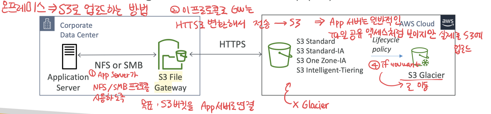

# S3 File Gateway

- S3 buckets NFS와 SMB 프로토콜을 사용해서 접근할 수 있게 설정
- File gateway에서 가장 최근에 사용된 데이터가 캐시됨
- S3 Standard, S3 Standard IA, S3 One Zone A, S3 Intelligent Tiering 지원
- Lifecycle Policy로 S3 Glacier 전환
- Bucket 접근 시 각 File Gateway 별 IAM Roles 설정
- SMB Protocol은 사용자 인증을 위한 Active Directory (AD)와 통합 가능

