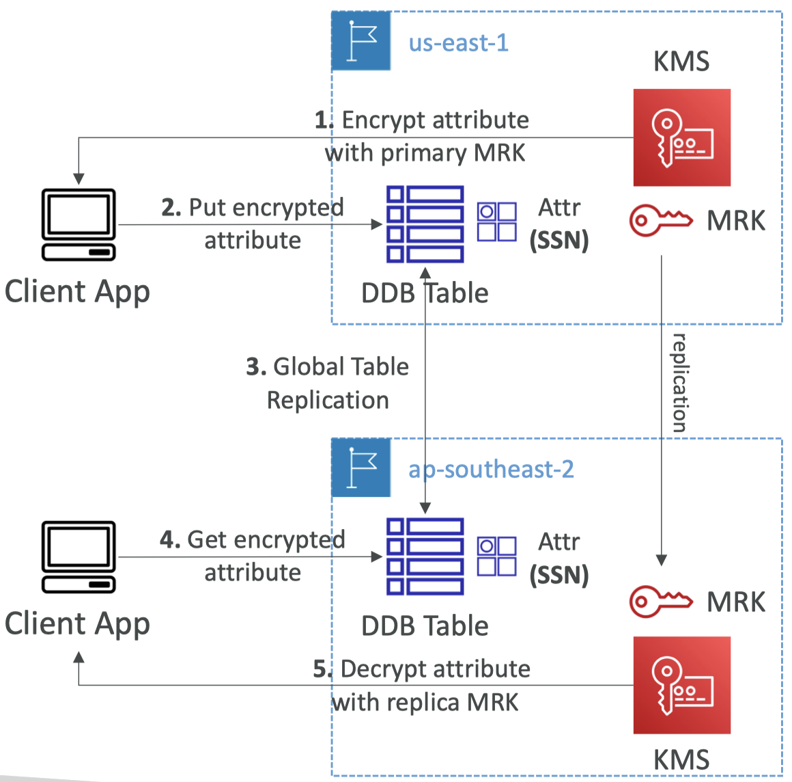

# AWS Security & Encryption

\# KMS \# Encryption SDK \# SSM Parameter Store

### 1/ SSL: Encryption in flight (전송 중 암호화)

- 데이터를 **송신 전 암호화 + 수신 후 복호화**
- SSL Certificates: HTTPS - SSL 암호화 + SSL 복호화
- 전송 중 암호화는 MITM (Man In The Middle Attack)의 안정성 보장

### 2/ Server side Encryption at rest

- 데이터를 **서버에서 수신 후 암호화 + 전송 전 복호화**
- Data Key를 통해 암호화하여 저장
- Encryption/Decryption Key는 어딘가에(ie. KMS) 관리 및 저장 서버(ie. EBS)가 접근할 수 있어야 함

### 3/ Client side Encryption

- 데이터를 **클라이언트가 전송 전 암호화 + 수신 후 복호화**
- 서버는 절대 데이터를 알 수 없음
- leverage Envelope Encryption: 봉투 암호화에 효과적


## KMS

: AWS의 키 관리 서비스

- 권한 부여를 위해 IAM 완전히 통합되고
-  KMS로 암호화한 데이터에 관한 액세스를 더 쉽게 제어

- ⭐️ CloudTrail로 모든 KMS 키 호출 API를 감사할 수 있음

- 암호화가 필요한 거의 모든 서비스에서 KMS 통합을 활성화하여 사용 가능
- 암호 데이터는 절대로 평문으로 저장하면 안되고, (특히 코드 XXX)
- API 호출, AWS CLI, SDK을 통해 KMS 사용하여 코드나 환경변수에 저장하는 게 좋은 패턴
- new name of KMS custom master key


### KMS Keys 암호화 방식

**1. Symmetric (AES-256 keys), 대칭 키**
- 데이터 암호화와 복호화에 사용하는 단일 암호화 키
- KMS와 통합된 모든 AWS 서비스가 대칭 키를 사용
- KMS 대칭 키를 생성하거나 사용하면 키 자체에는 절대로 액세스할 수 없고 키를 활용 또는 사용하려면 KMS API를 호출해야 함

**2. Asymmetric (RSA & ECC key pairs), 비대칭 키**
- 2개의 키: 퍼블릭 키(암호화) → 프라이빗 키(복호화)
- 퍼블릭 키 다운로드 가능 / 프라이빗 키는 액세스 불가 (only API 호출)
- Use Case. KMS API 키에 액세스할 수 없는 사용자가 AWS 클라우드 외부에서 암호화할 때 사용


### 세가지 유형의 KMS Keys

| Key Type | Desc | Price | Automatic Key rotation |
|--|--|--|--|
| AWS Managed Key(AWS 관리형 키) | aws/*service-name* (aws/rds, aws/ebs, ...) | Free | 1년에 한 번 자동 교체 |
| Customer Managed Keys(CMK, 고객 관리형 키) | KMS를 사용해 생성 가능 | \$1/Month per a key | 활성화 필수, 1년에 한 번 자동 교체 |
| Customer Managed Keys imported | 반드시 256-bit의 대칭키이어야 함. 자체 키 구성 요소를 KMS에 가져옴 | \$1/Month per a key | 오직 수동으로 교체, 반드시 KMS 키 별칭 사용 |

**\+** 모든 KMS 호출 API 비용: $0.03 / 10,000건
**\+** 교체 빈도 변경 불가


KMS는 리전에 따라 범위가 지정됩니다

이는 KMS 키로 암호화된 EBS 볼륨이 있고 리전은 eu-west-2라고 할 때 다른 리전으로 복사하려면 몇 가지 단계를 거쳐야 함을 의미합니다

1. 암호화된 EBS 볼륨의 스냅샷을 생성
2. 생성된 암호화된 스냅샷을 동일한 KMS 키로 암호화
3. AWS가 자동으로 다른 KMS 키를 사용해서 스냅샷을 다시 암호화
4. KMS로 스냅샷을 자체 EBS 볼륨으로 복원
5. KMS Key B를 ap-southeast-2로 복원

\* 동일한 KMS 키가 서로 다른 리전에 있을 수는 없음


### KMS 키 정책

: KMS Key 액세스 제어

- S3 버킷 정책 비슷, but 정의된 KMS Key 정책이 없으면 누구도 액세스할 수 없음

2가지 유형의 KMS 키 정책

**Default KMS Key Policy, 기본 정책**
- 사용자 지정 키 정책을 제공하지 않으면 생성
- 계정의 모든 사람의 키 액세스 허용

**Custom KMS Key Policy, 사용자 지정 키 정책**
- KMS 키에 액세스할 수 있는 users 또는 roles을 정의 
- 키 관리자 정의
- 교차 계정 액세스 시 매우 유용: 다른 계정이 KMS 키를 사용하도록 권한을 부여하기 때문
  - 교차 계정 간에 스냅샷을 복사할 때 사용

**교차 계정 간 스냅샷 복사**
1. 자체 KMS 키로 암호화한 스냅샷을 생성 (고객 관리형 키: 고객 키 정책을 연결해야 함)
2. 교차 계정 액세스 권한 부여를 위해 KMS 키 정책을 연결
3. 암호화된 스냅샷을 대상 계정에 공유
4. 대상 계정에서는 스냅샷 복제본을 생성, 해당 대상 계정에서 다른 고객 관리형 키로 암호화
5. 대상 계정의 스냅샷에서 볼륨을 생성


### Practice

**STEP1.**
```bash
# 1) encryption
aws kms encrypt --key-id alias/tutorial --plaintext fileb://ExampleSecretFile.txt --output text --query CiphertextBlob  --region eu-west-2 > ExampleSecretFileEncrypted.base64
```

1. `--key-id alias/tutorial`: alias/tutorial이라는 key-id를 지정 (콘솔에서 생성한 키)
   -  Alias(별칭) / Serial Key Number(시리얼 키 번호) / ARN ... 모든 상관없음
2. `--plaintext fileb://ExampleSecretFile.txt`: 파일 주소를 평문(plaintext)으로 전달
3. `--output text`: 출력값은 암호화된 콘텐츠를 나타내는 CiphertextBlob을 텍스트(text) 그대로 입력
4. `--query CiphertextBlob`: 쿼리(query)는 암호화된 콘텐츠 명시
5. `--region eu-west-2`: 키의 리전(region)은 `eu-west-2` 로 지정
6. `ExampleSecretFileEncrypted.base64`: 암호화된 콘텐츠를 포함하는 base64 파일을 출력

**STEP2.** : Base64 decode

```bash
# base64 decode for Linux or Mac OS 
cat ExampleSecretFileEncrypted.base64 | base64 --decode > ExampleSecretFileEncrypted

# base64 decode for Windows
certutil -decode .\ExampleSecretFileEncrypted.base64 .\ExampleSecretFileEncrypted
```

**STEP3.** : KMS decryption

```bash
# 2) decryption

aws kms decrypt --ciphertext-blob fileb://ExampleSecretFileEncrypted   --output text --query Plaintext > ExampleFileDecrypted.base64  --region eu-west-2
```


**STEP3.** : Base64 decode

```bash
# base64 decode for Linux or Mac OS 
cat ExampleFileDecrypted.base64 | base64 --decode > ExampleFileDecrypted.txt

# base64 decode for Windows
certutil -decode .\ExampleFileDecrypted.base64 .\ExampleFileDecrypted.txt
```


## KMS: Multi Region Key, 다중 리전 키


- 한 리전에 기본 키를 갖고 다른 리전에 키 구성 요소가 복제된 동일한 키를 가짐: 키 ID가 완전히 똑같음
  - *ex. us-east-1에 기본 키를 두고, 다른 리전 (ie. us-west-2, eu-west-1, ap-southeast-2)로 복제*

- ⭐️ **리전 간 교차 사용**: 한 리전에서 암호화한 후 다른 리전에서 복호화
  - ⚠️ KMS 다중 리전 키는 **전역 사용 불가**, **기본 키가 있고 복제본이 있는 것**
  - 다른 리전으로 복제할 때나 교차 리전 API 호출을 실행할 때, 데이터를 재암호화 필요 없음
- 동일한 키 ID와 동일한 키 구성 요소를 갖음
- 기본 키의 자동 교체를 활성화 시, 자동 교체 키가 다른 리전에도 복제됨

- KMS 키는 단일 리전에 제한되는 것을 선호: 특정 사례를 제외하고 다중 리전 키 사용을 권장하지 않음
  - 클라이언트 측 전역 암호화: 한 리전에서 클라이언트 측 암호화 -> 다른 리전에서 클라이언트 측 복호화
  - DynamoDB 전역 테이블 or Global Aurora 암호화


#### DynamoDB Global Tables / Aurora Global Tables + KMS Multi-Region Keys Client-Side Encryption

- ✔️ 전체 테이블뿐 아니라, 저장 데이터(테이블 속성)를 암호화
- 특정 클라이언트만 사용 가능: 데이터베이스 관리자도 사용 불가
- Amazon DynamoDB Encryption Client 사용

**Example.**



1. us-east-1의 KMS 다중 리전 키(기본 키)를 ap-southeast-2 리전에 복제(복제본)
2. 클라이언트 애플리케이션에서 DynamoDB에 데이터를 삽입하려면 먼저 속성을 암호화
3. 다중 리전 키를 사용해 암호화할 속성을 암호화

<pre>
- 대부분의 DynamoDB 테이블 필드는 클라이언트 측 암호화가 필요없지만, 가령 사회 보장 번호는 암호화 필요
- DynamoDB 테이블에 액세스할 수 있는 DBA가 '사회 보장 번호' 속성을 암호화하는 데 사용한 KMS 키에 액세스할 수 있는 권한이 없다면 해당 데이터에 액세스할 수 없음
- 데이터베이스 관리자로부터도 보호 가능
</pre>

4. DynamoDB 테이블이 전역 테이블인 경우, 해당 테이블의 데이터는 ap-southeast-2 리전으로 복제
5. ap-southeast-2 리전의 클라이언트 애플리케이션은 데이터 중 암호화된 속성이 있는지 확인한 후, API 호출을 실행해 복제된 다중 리전 키를 사용해 해당 속성을 복호화 -> 다중 리전 키로 데이터 속성을 암호화하기로 했기 때문에 가능

**Benefits**
- Low-Latency API: 지연 시간이 단축
- 클라이언트 측 암호화 기술을 사용하면 데이터의 특정 필드나 속성을 보호
- API 키 액세스 권한이 있는 클라이언트만 복호화 가능

