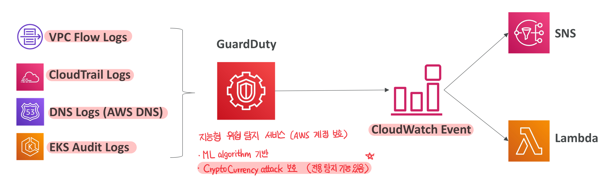

# 6. Web Application Firewall, WAF

*웹 애플리케이션 방화벽*

- AWS WAF는 Layer 7 (HTTP)에서 일반적인 웹 취약점 공격을 보호
- 웹 애플리케이션 방화벽(WAF) 적용
  - Application Load Balancer, API Gateway, CloudFront, AppSync GraphQL API, Cognito User Pool
  - NLB ❌

**웹 액세스 제어 목록(ACL) 규칙 정의**
- Filtering
  - IP 세트: IP 주소를 기반으로 필터링하는 등의 규칙, 최대 IP 주소 10,000개
  - HTTP headers 및 body, URI strings 보호 - SQL Injection -> 크로스 사이트 스크립팅(XSS) 등 공격 차단
  - 용량 제약 (ie. 최대 2MB)
  - 지역 일치(Geo-match) -> 특정 국가 허용 또는 차단
  - Rate-based 규칙: IP당 요청 수를 측정 -> 디도스 공격 차단 (ie. 특정 IP - 11 req per a sec)
- 웹 ACL은 리전에만 적용 (CloudFront는 글로벌로 정의)
- 규칙 그룹: 여러 웹 ACL에 추가할 수 있는 재사용 가능한 규칙 모음 (규칙 정리)

**WAF 유용한 사용 사례**
: 애플리케이션에 **고정 IP**를 사용하면서 **로드 밸런서**와 함께 **WAF**를 사용하고 싶을 때

- 애플리케이션 로드 밸런서는 고정 IP ❌ -> **AWS Global Accelerator**로 고정 IP 할당
- ALB에서 WAF를 활성화

# 7. AWS Shield - DDoS 보호

AWS Shield에 대해 알아봅시다

- 디도스 공격를 보호하기 위한 서비스

**AWS Shield Standard**
- 모든 AWS 고객에게 무료로 활성화되어 있는 서비스
- 고객을 SYN/UDP Floods, Reflection attacks 및 **L3/L4 공격**으로 부터 보호

**AWS Shield Advanced**

- (선택) 고급 보호가 필요한 고객을 위한 정교한 디도스 공격 완화 서비스
- 조직 당 월 3,000달러
- EC2, ELB, CloudFront, Global Accelerator, Route 53 등 보호
- DRP: DDoS response team, AWS 디도스 대응 팀이 항시 대기
- 디도스 공격으로 인한 요금 상승 방지
- 자동 애플리케이션 계층 디도스 완화를 지원하며, 자동으로 WAF 규칙을 생성, 평가, 배포함으로써 L7 공격을 완화.
  - 웹 애플리케이션 방화벽(WAF)이 L7 디도스 공격 완화 규칙을 자동으로 갖게 된다는 의미

# 8. Firewall Manager

- AWS Organization의 여러 계정의 방화벽 규칙을 동시에 관리하는 서비스
- 보안 정책(보안 규칙의 집합): 
  - 웹 애플리케이션 방화벽(WAF) (ALB, API Gateway CloudFront 등에 적용)
  - AWS Shield 어드밴스드 규칙 (ALB, CLB, NLB, Elastic IP, CloudFront)
  - 'EC2, ALB, VPC의 ENI 리소스'의 보안 그룹
  - VPC 수준의 AWS Network Firewall
  - Amazon Route 53 Resolver DNS Firewall
  - 정책은 리전 수준에서 생성
  

=> 모든 방화벽을 한 곳에서 관리할 수 있도록 지원, 조직에 등록된 모든 계정에 적용

> ✔️ 조직에서 애플리케이션 로드 밸런서에 대한 WAF 규칙을 생성한 다음 새 애플리케이션 로드 밸런서를 생성하는 경우 AWS Firewall Manager에서 **자동으로** 새 ALB에도 같은 규칙을 적용해 줌

## WAF vs. Firewall Manager vs. Shield

=> **모두 포괄적인 계정 보호를 위한 서비스**

**WAF**
- **when** 웹 ACL 규칙을 정의하는데 **리소스별 보호**를 구성할 때

**Firewall Manager**
- **when** 여러 계정에서 WAF를 사용 or WAF 구성을 가속 or 새 리소스 보호를 자동화를 구성할 때 (Firewall Manager로 WAF 규칙 관리)
- 모든 계정과 모든 리소스에 자동으로 적용
- Firewall Manager는 모든 계정에 Shield 어드밴스드를 배포에도 도움을 줌

**Shield 어드밴스드**
- WAF 기능 외 더 많은 기능 제공
  - Shield 대응 팀 지원 고급 보고서 제공
  - WAF 규칙 자동 생성
- 디도스 공격을 자주 받을 때

# 09. DDoS Protection Best Practices ⭐️

***DDoS 공격과 관련된 다양한 보호 방법을 알고 있어야 함***
- Edge Location Mitigation
- DDoS Mitigation
- Application Layer Defense
- Attack surface reduction

Q. Application Layer Defense는 공격을 받았을 때 스케일을 높이는 것으로 방지하는 것? 그럼 '방지'보다 '대책'에 더 가깝지 않나

**구성:** *EC2 인스턴스로 구성된 오토 스케일링 그룹이 있고 엘라스틱 로드 밸런서가 앞에 위치*

## Edge Location Mitigation

**✔️ Cloudfront**
- Edge Location에서 사용: 엣지 로케이션 완화
- SYN Flood나 UDP 반사 공격과 같은 DDoS 일반 공격은 Shield 설정으로 막을 수 있음
- CloudFront는 웹 애플리케이션 방화벽인 WAF 등과 연결할 수 있음 

<small>* AWS 의 CDN들의 여러 서비스들을 가장 빠른 속도로 제공(캐싱) 하기 위한 거점</small>

**✔️ Global Accelerator**

- 로드 밸런서를 Global Accelerator를 통하여 고정 IP로 노출하고 전 세계에서 애플리케이션에 액세스할 수 있음
- Global Accelerator는 Shield와 완전 통합
  - DDoS 공격 방어에 유용하게 쓰임
  - 백엔드가 CloudFront와 호환되지 않는 경우: 어떤 백엔드이던 간 CloudFront나 Global Accelerator로 AWS 엣지에 완전 분산이 가능 하며 엣지 로케이션을 DDoS 공격으로부터 보호할 수 있음

**✔️ Route 53**
- 엣지에 도메인 이름 변환을 글로벌로 설정
- DNS에도 DDoS 보호 메커니즘을 적용 가능
- 엣지에 대한 DDoS 보호를 더 확실히 할 수 있음

## DDoS Mitigation

**✔️ Infrastructure layer defense**

- EC2 인스턴스에 도달 전 높은 트래픽 관리
- Global Accelerator, Route 53, ALB은 높은 트래픽으로부터 Amazon EC2 인스턴스를 보호

**✔️ EC2 with Auto Scaling**

- 오토 스케일링 그룹이 자동으로 확장하여 더 큰 로드를 수용

**✔️ Elastic Load Balancing**
- ELB가 여러 EC2 인스턴스 간 트래픽을 자동으로 분산

## Application Layer Defense

**✔️ Detect and filter malicious web requests**
- 악성 요청을 감지 및 필터링
- **CloudFront**
  - 정적 콘텐츠 전송 시 엣지 로케이션에서 전송함으로써 백엔드를 보호
  - 특정 지역을 차단
- **WAF**
  - ALB나 CloudFront 전에 request signatures(요청 서명)에 따라 요청을 필터링 및 차단 가능
  - 특정 IP나 특정 요청 유형만 차단 가능
  - WAF의 rate-based rules(속도 기반 규칙): 악성 사용자의 IP를 자동으로 차단 가능
  - WAF의 관리형 규칙 - 평판에 따라 IP를 차단하거나 익명 IP 등을 차단할 수 있음

**✔️ Shield Advanced**

- 자동으로 WAF 규칙을 생성하여 계층 7 공격을 완화: 애플리케이션 계층 방어에 유용

## Attack surface reduction

**✔️ Obfuscating AWS resources (리소스 난독화)**
- CloudFront, API Gateway, ELB - 백엔드 리소스 숨기기

**✔️ 보안 그룹 & Network ACLs**
- 특정 IP의 트래픽을 필터링
- Elastic IP(탄력적 IP)도 AWS Shield Advanced로 보호할 수 있음

**✔️ API Endpoints**
- EC2, Lambda 등 어떤 백엔드든 숨겨 API 엔드 포인트 자체 보호
- Edge-optimized mode / CloudFront + Regional (for Global) -> DDoS 보호에 관한 제어 기능이 더 강화
- API Gateway + WAF: 모든 HTTP 요청을 필터링, 버스트 제한, 헤더 필터링, 사용자에게 API 키 사용 강제

# 11. Amazon GuardDuty

- AWS 계정을 보호를 위한 **지능형 위협 탐지 서비스**
- 머신 러닝 알고리즘을 사용하여 이상 탐지를 수행
- 타사 데이터를 이용하여 계정에 대한 공격을 탐지
- 여러 입력 데이터를 얻음
  - CloudTrail 이벤트 로그의 입력 데이터: 비정상적 API 호출과 무단 배포 등을 탐지
    - Management Event(관리 이벤트): VPC 서브넷을 만들 때, API가 계정에 호출 시
    - CloudTrail S3 데이터 이벤트 확인: get object, list objects delete object 등
  - VPC Flow Logs(흐름 로그): 비정상적인 인터넷 트래픽/IP 주소를 찾음
  - DNS 로그: DNS 쿼리에서 인코딩된 데이터를 전송할 EC2 인스턴스가 손상되었는지 확인 가능
  - Kubernetes 감사 로그를 확인: 의심스러운 활동 및 잠재적인 EKS 클러스터 손상을 감지
- CloudWatch 이벤트 규칙 설정: 탐색 결과가 나타나면 알림을 받을 수 있음
- ⭐️⭐️ **GuardDuty로 암호화폐 공격을 보호 - 전용 탐지 기능을 가짐**

# 12. Amazon Inspector

- 자동화된 보안 평가 서비스
- 실행 중인 EC2 Instances, ECR 컨테이너 이미지, Lambda 함수에서만 사용
  - Package Vulnerability: EC2, ECR, Lambda - database of CVE
  - Network Vulnerability: EC2
- 지속적인 수행
- 작업 완료 시 결과를 **AWS 보안 허브, Amazon Event Bridge**로 전송
취약성 데이터베이스, CVE

<small>*CVE(Common Vulnerabilities and Exposures): 알려진 컴퓨터 보안 결함 목록</small>

# 13. Amazon Macie

- 완전 관리형 데이터 보안 및 데이터 프라이버시 서비스

- **머신 러닝, 패턴 일치**를 사용하여 AWS의 민감한 정보를 검색하고 보호 (민감한 데이터를 경고)

- S3 버킷의 PII로 분류되는 데이터를 검색 -> CloudWatch 이벤트나 EventBridge로 검색 결과 전달

<small>*PII: Personal Identifiable Information</small>
